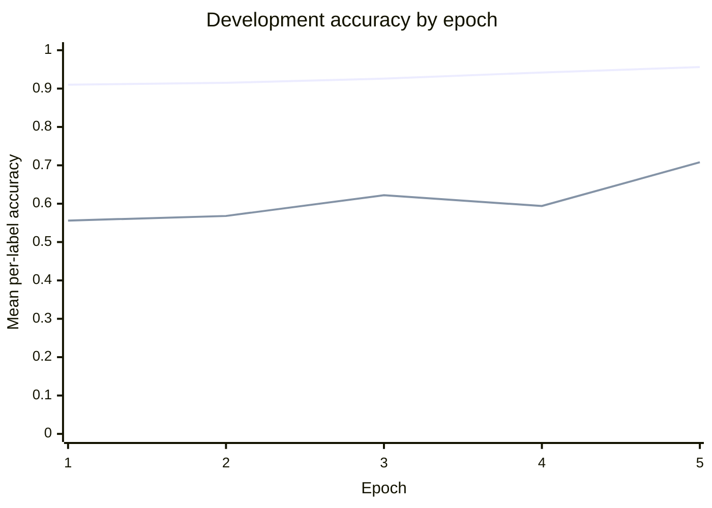
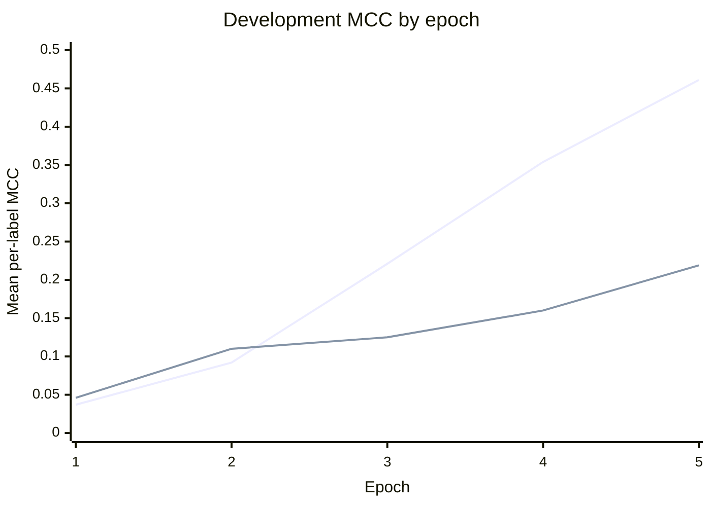

## Methodology

### Paraphrase Type Detection: Imbalance-Aware Loss Functions

#### Motivation

Paraphrase type detection is formulated as a multi-label classification problem with 26 output labels. The ETPC training split is strongly imbalanced: some paraphrase types occur in almost every example, whereas others have only a few positive examples. Across the 2,730 training examples, only 11,648 of the 70,980 binary label assignments are positive (16.410%). At the individual-label level, the number of positive examples ranges from 3 to 2,711.

This imbalance makes plain binary cross-entropy (BCE) potentially misleading. Because most label decisions are negative, a model can obtain high accuracy by favoring the majority class while still failing to identify positive examples for rare paraphrase types. This behavior is visible in the first epoch of our baseline: it reaches a development accuracy of 0.910 but an MCC of only 0.037. We therefore investigated two imbalance-aware alternatives: Weighted BCE and focal loss.

#### Baseline: Unweighted BCE

The baseline uses BART-large with a linear classification head that produces one logit for each of the 26 paraphrase types. The two sentences are concatenated with `</s>`, tokenized to a maximum length of 512, and passed through BART. The hidden state of the first token is used by the classifier. Each output is treated as an independent binary decision and optimized with `BCEWithLogitsLoss`. At evaluation time, sigmoid probabilities greater than 0.5 are mapped to positive predictions.

#### Improvement 1: Weighted BCE

For each paraphrase type $c$, we computed a positive-class weight using only the training split:

$$
w_c = \frac{N_c^-}{N_c^+},
$$

where $N_c^+$ and $N_c^-$ are the numbers of positive and negative training examples for label $c$. The resulting vector is passed to PyTorch's `BCEWithLogitsLoss` as `pos_weight`. Consequently, the positive term for a rare label receives a larger penalty:

$$
\mathcal{L}_{i,c} = -w_c y_{i,c}\log\sigma(z_{i,c})
- (1-y_{i,c})\log(1-\sigma(z_{i,c})).
$$

This calculation is implemented in `paraphrase_detection/weighted_bce.py` and is called on `train_labels` in `bart_detection.py`; no development- or test-set labels are used to calculate the weights. The observed weights range from 0.007 to 909.000. This very wide range reflects the severity of the per-label imbalance, but it also makes the objective sensitive to a few extremely rare positive examples.

#### Improvement 2: Focal Loss

We also implemented binary focal loss, adapted to the multi-label setting. For every example-label pair, the unreduced BCE loss is first computed. The loss is then multiplied by a focusing factor:

$$
\operatorname{FL}(p_t) = (1-p_t)^\gamma\operatorname{BCE}(p_t),
$$

where $p_t$ is the predicted probability of the correct binary class and $\gamma \geq 0$ is the focusing parameter. Easy, confidently classified examples receive less weight, allowing training to focus on difficult decisions. When $\gamma=0$, focal loss reduces to ordinary BCE; increasing $\gamma$ suppresses easy examples more strongly.

Our implementation in `paraphrase_detection/focal_loss.py` does not use an additional $\alpha$ class-balancing term, so the experiment isolates the effect of the focusing parameter. `bart_detection.py` accepts multiple unique gamma values through repeated `--focal_gamma` arguments and trains a separate model for every value. Focal loss can be run through the dedicated `focal` mode or included in `compare`; in `compare`, the script trains unweighted BCE, weighted BCE, and one focal-loss model for every requested gamma value.

## Experiments

### Experimental Setup

We held the model and training configuration fixed so that only the loss function changed:

| Setting | Value |
| --- | --- |
| Model | `facebook/bart-large` with a 26-output linear classifier |
| Training data | ETPC paraphrase detection training split (2,730 examples) |
| Development data | ETPC paraphrase detection development split |
| Epochs | 5 |
| Batch size | 16 |
| Optimizer | AdamW |
| Learning rate | $2\times10^{-5}$ |
| Random seed | 11711 |
| Maximum sequence length | 512 tokens |
| Prediction threshold | 0.5 |
| Checkpoint criterion | Mean development accuracy across labels |

Before every experiment, the random seed is reset so that the models start from the same initialization and see the same shuffled training order. We report both mean per-label accuracy and mean per-label Matthews correlation coefficient (MCC). Accuracy measures the fraction of correct binary decisions, while MCC is especially informative here because it accounts for all four entries of the binary confusion matrix and is less easily inflated by the majority class.

The experiments and their hypotheses were:

| Experiment | Change from baseline | Expectation |
| --- | --- | --- |
| Unweighted BCE | None | Strong overall accuracy, but a bias toward majority decisions for rare labels |
| Weighted BCE | Positive term for label $c$ multiplied by $N_c^-/N_c^+$ | Better recognition of rare positive labels and therefore higher MCC, potentially at the cost of accuracy |
| Focal loss | Easy decisions down-weighted by $(1-p_t)^\gamma$ | Greater focus on difficult labels without relying on extremely large inverse-frequency weights |

The full comparison can be reproduced on the Grete cluster with the following command. By default, `compare` runs unweighted BCE, weighted BCE, and focal loss with $\gamma=2$:

```sh
sbatch run_bart_detection.sh 5 compare --batch_size 16 --use_gpu
```

To reproduce only the two BCE experiments in a single comparison job, add `--compare_bce_only`:

```sh
sbatch run_bart_detection.sh 5 compare --compare_bce_only --batch_size 16 --use_gpu
```

A focal-loss-only run uses the dedicated mode. The `--focal_gamma` option can be repeated to evaluate several values in one job; for example, the default $\gamma=2$ run is:

```sh
sbatch run_bart_detection.sh 5 focal --batch_size 16 --focal_gamma 2.0 --use_gpu
```

### Results

#### Development Performance by Epoch

| Epoch | BCE train loss | BCE accuracy | BCE MCC | Weighted BCE train loss | Weighted BCE accuracy | Weighted BCE MCC |
| ---: | ---: | ---: | ---: | ---: | ---: | ---: |
| 1 | 0.2766 | 0.910 | 0.037 | 1.2032 | 0.556 | 0.046 |
| 2 | 0.2482 | 0.915 | 0.092 | 1.1474 | 0.568 | 0.110 |
| 3 | 0.2269 | 0.926 | 0.221 | 1.0931 | 0.622 | 0.125 |
| 4 | 0.2016 | 0.942 | 0.354 | 0.9991 | 0.594 | 0.160 |
| 5 | 0.1747 | 0.956 | 0.461 | 0.8773 | 0.708 | 0.219 |

The absolute loss values should not be compared directly because Weighted BCE rescales positive loss terms and therefore has a different numerical scale.

#### Summary

| **Paraphrase Type Detection (PTD)** | **Development accuracy** | **Development MCC** |
| --- | ---: | ---: |
| Unweighted BCE (baseline) | **0.956** | **0.461** |
| Weighted BCE | 0.708 | 0.219 |
| Difference (Weighted BCE $-$ baseline) | -0.248 | -0.242 |

Quantitative focal-loss results are not included because no completed focal runs were available for this comparison. We therefore do not claim an optimal gamma value yet.

#### Discussion

The outcome did not match our initial expectation. Weighted BCE briefly achieved a higher MCC than unweighted BCE in epoch 2 (0.110 compared with 0.092), but this advantage did not persist. By epoch 5, unweighted BCE performed substantially better in both development accuracy and MCC.

The baseline's learning curve nevertheless confirms why accuracy alone is insufficient for this dataset. Its epoch-1 accuracy is already 0.910, while its MCC is only 0.037. As training continues, MCC rises to 0.461, showing that the model gradually learns more informative positive/negative decisions rather than merely exploiting label prevalence.

A likely explanation for the poor Weighted BCE result is the aggressiveness of the raw inverse-frequency weights. A paraphrase type with only three positive training examples receives a positive weight of 909. Such rare examples can dominate individual gradient updates, while labels that are positive in most examples receive weights below one. This can shift the model toward predicting too many positives and can make a universal threshold of 0.5 poorly calibrated. This explanation is plausible from the weight distribution and learning curves, but per-label precision and recall would be needed to verify it directly.

Another limitation is that checkpoints are selected by mean development accuracy even though the loss modification is intended to improve minority-label behavior. Selecting checkpoints by MCC, or by a combination of MCC and accuracy, may provide a fairer evaluation of imbalance-aware objectives.

Overall, naive inverse-frequency Weighted BCE is not an improvement over the baseline in the reported configuration. This negative result is still informative: correcting severe label imbalance requires more than inserting uncapped class ratios. Focal loss is a motivated next comparison because it down-weights easy decisions dynamically instead of assigning a fixed weight as large as 909 to every positive example of a rare label.

### Hyperparameter Optimization

The main focal-loss hyperparameter is $\gamma$. Rather than tuning unrelated parameters simultaneously, we vary only $\gamma$ and keep the architecture, seed, optimizer, learning rate, number of epochs, batch size, and prediction threshold fixed. This isolates the effect of focusing. Small gamma values stay close to BCE, whereas larger values increasingly concentrate learning on hard examples. Each gamma receives a separate checkpoint and development evaluation.

The current evidence is insufficient to select an optimal gamma because focal-loss scores were not part of the supplied results. A final comparison should report every tested gamma using the same accuracy and MCC metrics rather than choosing a value based on accuracy alone.

### Visualizations

In each chart, the first line represents unweighted BCE and the second line represents Weighted BCE.





The curves show that unweighted BCE improves consistently on both metrics. Weighted BCE increases MCC slowly, but its accuracy is unstable between epochs 3 and 4 and remains well below the baseline after five epochs.

### References for This Extension

- Lin, T.-Y., Goyal, P., Girshick, R., He, K., and Dollár, P. (2017). [Focal Loss for Dense Object Detection](https://arxiv.org/abs/1708.02002).
- Lewis, M. et al. (2020). [BART: Denoising Sequence-to-Sequence Pre-training for Natural Language Generation, Translation, and Comprehension](https://arxiv.org/abs/1910.13461).
