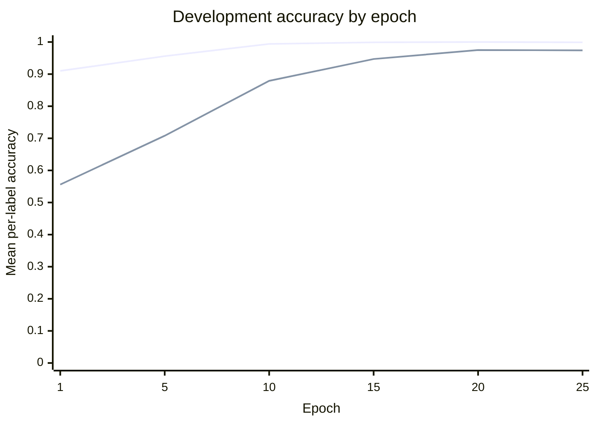
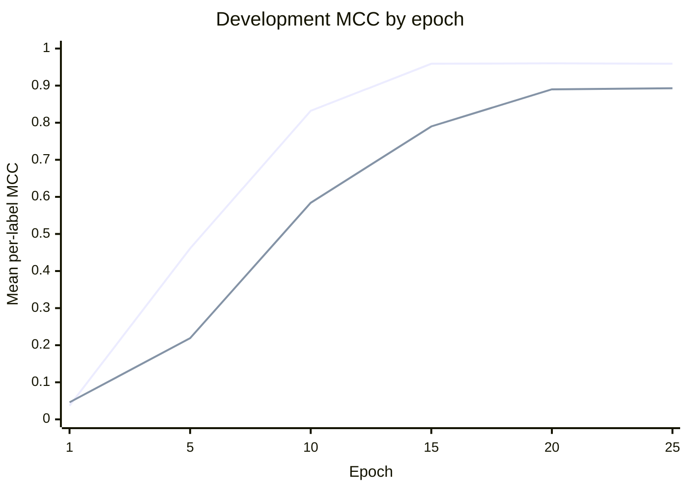

## Paraphrase Type Detection: Imbalance-Aware Loss Functions

#### Motivation
Paraphrase type detection is formulated as a multi-label classification problem with 26 output labels. The ETPC training split is strongly imbalanced: some paraphrase types occur in almost every example, whereas others have only a few positive examples. Across the 2,730 training examples, only 11,648 of the 70,980 binary label assignments are positive (16.410%). At the individual-label level, the number of positive examples ranges from 3 to 2,711.

This imbalance makes plain binary cross-entropy (BCE) potentially misleading. Because most label decisions are negative, a model can obtain high accuracy by favoring the majority class while still failing to identify positive examples for rare paraphrase types. This behavior is visible in the first epoch of our baseline: it reaches a development accuracy of 0.910 but an MCC of only 0.037. We therefore investigated two imbalance-aware alternatives: Weighted BCE and focal loss.

### Baseline: Unweighted BCE

The baseline uses BART-large with a linear classification head that produces one logit for each of the 26 paraphrase types. The two sentences are concatenated with `</s>`, tokenized to a maximum length of 512, and passed through BART. The hidden state of the first token is used by the classifier. Each output is treated as an independent binary decision and optimized with `BCEWithLogitsLoss`. At evaluation time, sigmoid probabilities greater than 0.5 are mapped to positive predictions.

### Improvement 1: Weighted BCE (naive approach)

#### Idea
For each paraphrase type $c$, we computed a positive-class weight using only the training split:

$$
w_c = \frac{N_c^-}{N_c^+},
$$

where $N_c^+$ and $N_c^-$ are the numbers of positive and negative training examples for label $c$. The resulting vector is passed to PyTorch's `BCEWithLogitsLoss` as `pos_weight`, yielding

$$
\mathcal{L}_{i,c} = -w_c y_{i,c}\log\sigma(z_{i,c})
- (1-y_{i,c})\log(1-\sigma(z_{i,c})).
$$

This calculation is implemented in `paraphrase_detection/weighted_bce.py` and is called on `train_labels` in `bart_detection.py`; no development- or test-set labels are used to calculate the weights.

#### Methodology

##### Description
We compared unweighted BCE with the aggressive inverse-frequency Weighted BCE for 25 epochs using a batch size of 16. The comparison is reproduced with:

```sh
sbatch run_bart_detection.sh 25 compare \
    --compare_bce_only \
    --batch_size 16 \
    --use_gpu
```

##### Training-Set Class Weights

| Label ID | Positive | Negative | `pos_weight` |
| ---: | ---: | ---: | ---: |
| 1 | 366 | 2,364 | 6.4590 |
| 2 | 126 | 2,604 | 20.6667 |
| 3 | 124 | 2,606 | 21.0161 |
| 4 | 369 | 2,361 | 6.3984 |
| 5 | 479 | 2,251 | 4.6994 |
| 6 | 1,753 | 977 | 0.5573 |
| 7 | 316 | 2,414 | 7.6392 |
| 8 | 145 | 2,585 | 17.8276 |
| 9 | 3 | 2,727 | 909.0000 |
| 10 | 8 | 2,722 | 340.2500 |
| 11 | 560 | 2,170 | 3.8750 |
| 13 | 28 | 2,702 | 96.5000 |
| 14 | 115 | 2,615 | 22.7391 |
| 15 | 13 | 2,717 | 209.0000 |
| 16 | 47 | 2,683 | 57.0851 |
| 17 | 34 | 2,696 | 79.2941 |
| 18 | 302 | 2,428 | 8.0397 |
| 21 | 534 | 2,196 | 4.1124 |
| 22 | 49 | 2,681 | 54.7143 |
| 24 | 218 | 2,512 | 11.5229 |
| 25 | 2,096 | 634 | 0.3025 |
| 26 | 521 | 2,209 | 4.2399 |
| 28 | 240 | 2,490 | 10.3750 |
| 29 | 2,711 | 19 | 0.0070 |
| 30 | 431 | 2,299 | 5.3341 |
| 31 | 60 | 2,670 | 44.5000 |

The weights range from 0.007 to 909.000, which is too extreme for naive inverse-frequency reweighting to be stable. For label 9, one positive loss term is multiplied by 909, but this estimate is based on only three positive examples. Labels 10, 15, and 13 are similarly unreliable: 8, 13, and 28 positive examples yield weights of 340.2500, 209.0000, and 96.5000, respectively. The ETPC dataset contains genuinely rare paraphrase types, so estimates and evaluation scores for these labels are inherently noisy.

Weighted BCE also changes the effective decision boundary. If $p$ is the unweighted posterior probability and $q$ is the probability learned under the weighted objective, the optimum satisfies

$$
q = \frac{w p}{w p + (1-p)}.
$$

Using the unchanged prediction rule $q > 0.5$ is therefore equivalent to

$$
p > \frac{1}{1+w}.
$$

For label 9, $w=909$, so an unweighted posterior as small as $1/910 \approx 0.0011$ is sufficient to predict the label as positive. In contrast, label 29 has $w=0.007$, so its posterior must exceed $1/1.007 \approx 0.993$ to be predicted as positive. Thus, raw weighting strongly encourages additional positive predictions for rare labels and strongly suppresses positive predictions for very frequent labels. With a fixed 0.5 threshold, this likely introduces many false positives for rare types; per-label precision and recall would be needed to confirm the error distribution.

For this reason, the weighted objective did not improve on unweighted BCE in our experiment. Its training loss must not be compared numerically with the BCE loss because the positive terms are rescaled; for example, a Weighted BCE loss of 0.0603 is not directly comparable to a BCE loss of 0.0073.

#### Results

##### The best checkpoint:

| Model | Development accuracy | Development MCC |
| --- | ---: | ---: |
| Unweighted BCE | **1.000** | **0.962** |
| Aggressive Weighted BCE | 0.979 | 0.896 |

##### Epoch display

| Epoch | Unweighted BCE accuracy | Unweighted BCE MCC | Aggressive Weighted BCE accuracy | Aggressive Weighted BCE MCC |
| ---: | ---: | ---: | ---: | ---: |
| 1 | 0.910 | 0.037 | 0.556 | 0.046 |
| 5 | 0.956 | 0.461 | 0.708 | 0.219 |
| 10 | 0.994 | 0.832 | 0.879 | 0.584 |
| 15 | 0.999 | 0.959 | 0.947 | 0.790 |
| 20 | 1.000 | 0.960 | 0.975 | 0.890 |
| 25 | 0.999 | 0.959 | 0.974 | 0.893 |

xychart-beta
    title "Dev Accuracy vs Epochs"
    x-axis "Epoch" [1, 2, 3, 4, 5, 6, 7, 8, 9, 10, 11, 12, 13, 14, 15, 16, 17, 18, 19, 20, 21, 22, 23, 24, 25]
    y-axis "Dev Accuracy" 0.5 --> 1.0
    line [0.910, 0.915, 0.926, 0.942, 0.956, 0.964, 0.980, 0.987, 0.989, 0.994, 0.997, 0.997, 0.999, 0.999, 0.999, 0.999, 0.999, 1.000, 0.999, 1.000, 1.000, 1.000, 1.000, 1.000, 0.999]
    line [0.556, 0.568, 0.622, 0.594, 0.708, 0.779, 0.793, 0.838, 0.855, 0.879, 0.899, 0.910, 0.927, 0.937, 0.947, 0.951, 0.958, 0.961, 0.966, 0.975, 0.973, 0.974, 0.979, 0.976, 0.974]


Thus, aggressive Weighted BCE did not improve either reported metric. It eventually approached the baseline, but the unweighted objective remained stronger by 0.021 accuracy points and 0.066 MCC points.

#### Improvement 2: Weighted BCE (smoothed weights approach)
To mitigate this effect we tried 3 smoothing techniques:
1. **Square-root weighting**   
   \[
   w_c = \sqrt{\frac{N_c^-}{N_c^+}}
   \]

2. **Logarithmic weighting**  
   \[
   w_c = \log\left(1 + \frac{N_c^-}{N_c^+}\right)
   \]

3. **Capped inverse-frequency weighting**  
   \[
   w_c = \min\left(\frac{N_c^-}{N_c^+}, w_{\max}\right)
   \]
   

#### Improvement 3: Focal Loss

We also implemented binary focal loss, adapted to the multi-label setting. For every example-label pair, the unreduced BCE loss is first computed. The loss is then multiplied by a focusing factor:

$$
\operatorname{FL}(p_t) = (1-p_t)^\gamma\operatorname{BCE}(p_t),
$$

where $p_t$ is the predicted probability of the correct binary class and $\gamma \geq 0$ is the focusing parameter. Easy, confidently classified examples receive less weight, allowing training to focus on difficult decisions. When $\gamma=0$, focal loss reduces to ordinary BCE; increasing $\gamma$ suppresses easy examples more strongly.

Our implementation in `paraphrase_detection/focal_loss.py` does not use an additional $\alpha$ class-balancing term, so the experiment isolates the effect of the focusing parameter. `bart_detection.py` accepts multiple unique gamma values through repeated `--focal_gamma` arguments and trains a separate model for every value. Focal loss can be run through the dedicated `focal` mode or included in `compare`; in `compare`, the script trains unweighted BCE, aggressive Weighted BCE, and one focal-loss model for every requested gamma value.

## Experiments

### Experimental Setup

We held the model and training configuration fixed so that only the loss function changed:

| Setting | Value |
| --- | --- |
| Model | `facebook/bart-large` with a 26-output linear classifier |
| Training data | ETPC paraphrase detection training split (2,730 examples) |
| Development data | ETPC paraphrase detection development split |
| Epochs | 25 for the BCE comparison; 5 for focal-loss sweeps |
| Batch size | 16 |
| Optimizer | AdamW |
| Learning rate | $2\times10^{-5}$ |
| Random seed | 11711 |
| Maximum sequence length | 512 tokens |
| Prediction threshold | 0.5 |
| Checkpoint criterion | Mean development accuracy across labels |

Before every experiment, the random seed is reset so that the models start from the same initialization and see the same shuffled training order. We report both mean per-label accuracy and mean per-label Matthews correlation coefficient (MCC). Accuracy measures the fraction of correct binary decisions, while MCC is especially informative here because it accounts for all four entries of the binary confusion matrix and is less easily inflated by the majority class.

The experiments and their hypotheses were:

| Experiment | Change from baseline | Expectation |
| --- | --- | --- |
| Unweighted BCE | None | Strong overall accuracy, but a bias toward majority decisions for rare labels |
| Weighted BCE | Positive term for label $c$ multiplied by $N_c^-/N_c^+$ | Better recognition of rare positive labels and therefore higher MCC, potentially at the cost of accuracy |
| Focal loss | Easy decisions down-weighted by $(1-p_t)^\gamma$ | Greater focus on difficult labels without relying on extremely large inverse-frequency weights |

The full comparison can be reproduced on the Grete cluster with the following command. By default, `compare` runs unweighted BCE, weighted BCE, and focal loss with $\gamma=2$:

```sh
sbatch run_bart_detection.sh 5 compare --batch_size 16 --use_gpu
```

To reproduce only the two BCE experiments in a single comparison job, add `--compare_bce_only`:

```sh
sbatch run_bart_detection.sh 25 compare --compare_bce_only --batch_size 16 --use_gpu
```

A focal-loss-only run uses the dedicated mode. The `--focal_gamma` option can be repeated to evaluate several values in one job; for example, the default $\gamma=2$ run is:

```sh
sbatch run_bart_detection.sh 5 focal --batch_size 16 --focal_gamma 2.0 --use_gpu
```

### Results

#### Development Performance by Epoch

The full run contains 25 epochs; the table reports the first epoch and every fifth epoch thereafter.

| Epoch | BCE train loss | BCE accuracy | BCE MCC | Weighted BCE train loss | Weighted BCE accuracy | Weighted BCE MCC |
| ---: | ---: | ---: | ---: | ---: | ---: | ---: |
| 1 | 0.2766 | 0.910 | 0.037 | 1.2032 | 0.556 | 0.046 |
| 5 | 0.1747 | 0.956 | 0.461 | 0.8773 | 0.708 | 0.219 |
| 10 | 0.0600 | 0.994 | 0.832 | 0.4365 | 0.879 | 0.584 |
| 15 | 0.0217 | 0.999 | 0.959 | 0.2154 | 0.947 | 0.790 |
| 20 | 0.0119 | 1.000 | 0.960 | 0.1042 | 0.975 | 0.890 |
| 25 | 0.0073 | 0.999 | 0.959 | 0.0603 | 0.974 | 0.893 |

The absolute loss values should not be compared directly because Weighted BCE rescales positive loss terms and therefore has a different numerical scale.

#### Summary

| **Paraphrase Type Detection (PTD)** | **Development accuracy** | **Development MCC** |
| --- | ---: | ---: |
| Unweighted BCE (baseline) | **1.000** | **0.962** |
| Weighted BCE | 0.979 | 0.896 |
| Difference (Weighted BCE $-$ baseline) | -0.021 | -0.066 |

Quantitative focal-loss results are not included because no completed focal runs were available for this comparison. We therefore do not claim an optimal gamma value yet.

#### Discussion

The outcome did not match our initial expectation. Weighted BCE has a slightly higher MCC in epoch 1 (0.046 compared with 0.037), but it learns much more slowly thereafter. It narrows the gap during the 25-epoch run, reaching 0.979 development accuracy and 0.896 MCC at its selected checkpoint, but it does not surpass unweighted BCE (1.000 accuracy and 0.962 MCC).

The baseline's first epoch confirms why accuracy alone is insufficient for this dataset: it already reaches 0.910 accuracy while its MCC is only 0.037. However, unweighted BCE continues to improve substantially, reaching an MCC close to 0.96 after 15 epochs. Weighted BCE also improves steadily, but the raw class-ratio weights trade off too much performance on frequent labels for sensitivity to rare labels.

The threshold transformation above explains this trade-off more precisely than class imbalance alone. Inverse-frequency `pos_weight` does not merely increase the importance of rare positives; it changes the calibrated probabilities learned by the model. Applying the original universal threshold of 0.5 after that change is inappropriate for the most extreme weights. The result is consistent with excessive rare-label positive predictions, although per-label precision, recall, and confusion matrices are required to verify this directly.

Fine-grained ETPC type detection is substantially harder than ordinary binary paraphrase detection, and very small class counts make exact development results sensitive to the split. We therefore treat the near-perfect unweighted development score cautiously and evaluate Weighted BCE by its relative performance under the same split rather than claiming it improves generalization.

Overall, uncapped inverse-frequency Weighted BCE is not an improvement over the baseline in the reported configuration. We therefore implemented three less aggressive variants as separate experiments: square-root weights $\sqrt{N_c^- / N_c^+}$, logarithmic weights $\log(1 + N_c^- / N_c^+)$, and capped inverse-frequency weights $\min(N_c^- / N_c^+, 20)$. The `compare_non_aggressive_weighted` mode runs these three variants in one job. Their results must be reported separately once training is complete. Other follow-up options include per-label threshold tuning on the development set, checkpoint selection using MCC, and focal loss, which down-weights easy examples without assigning a fixed weight of 909 to every positive instance of label 9.

### Hyperparameter Optimization

The main focal-loss hyperparameter is $\gamma$. Rather than tuning unrelated parameters simultaneously, we vary only $\gamma$ and keep the architecture, seed, optimizer, learning rate, number of epochs, batch size, and prediction threshold fixed. This isolates the effect of focusing. Small gamma values stay close to BCE, whereas larger values increasingly concentrate learning on hard examples. Each gamma receives a separate checkpoint and development evaluation.

The current evidence is insufficient to select an optimal gamma because focal-loss scores were not part of the supplied results. A final comparison should report every tested gamma using the same accuracy and MCC metrics rather than choosing a value based on accuracy alone.

### Visualizations

In each chart, the first line represents unweighted BCE and the second line represents Weighted BCE.





The curves show that both objectives improve over 25 epochs, but unweighted BCE reaches strong accuracy and MCC much earlier. Weighted BCE narrows the gap late in training without exceeding the baseline, consistent with overly aggressive inverse-frequency reweighting rather than a beneficial improvement.

### References for This Extension

- Lin, T.-Y., Goyal, P., Girshick, R., He, K., and Dollár, P. (2017). [Focal Loss for Dense Object Detection](https://arxiv.org/abs/1708.02002).
- Lewis, M. et al. (2020). [BART: Denoising Sequence-to-Sequence Pre-training for Natural Language Generation, Translation, and Comprehension](https://arxiv.org/abs/1910.13461).
