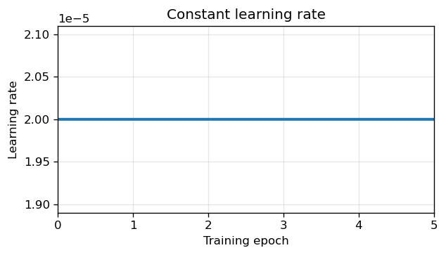
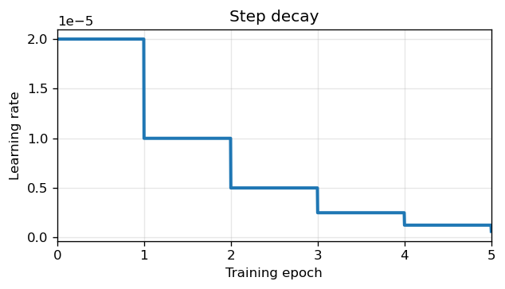
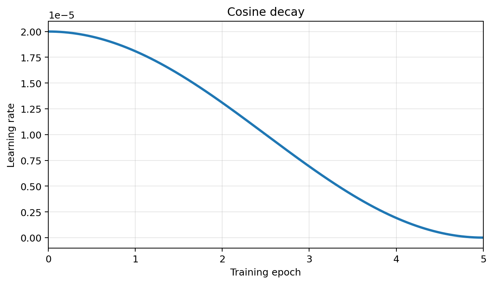
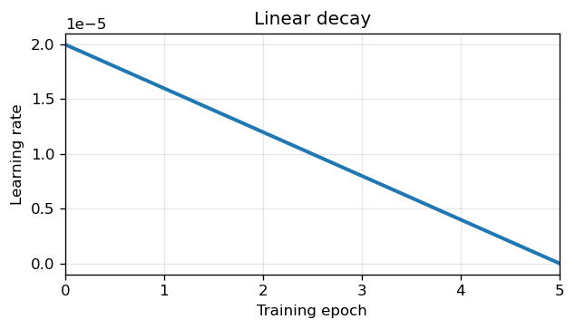
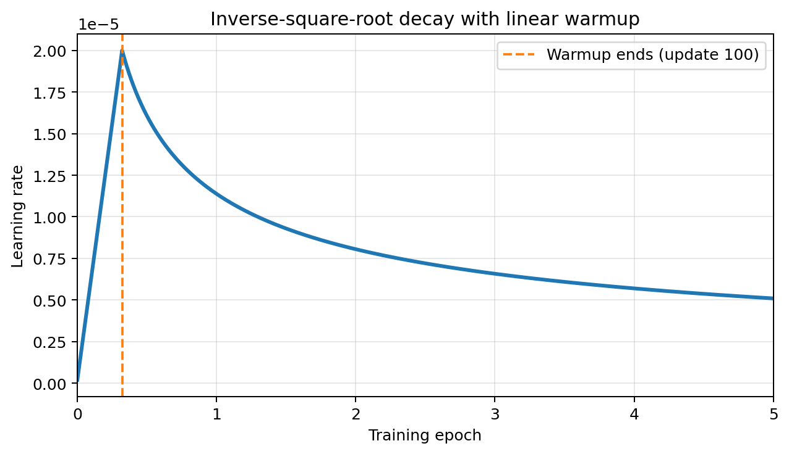
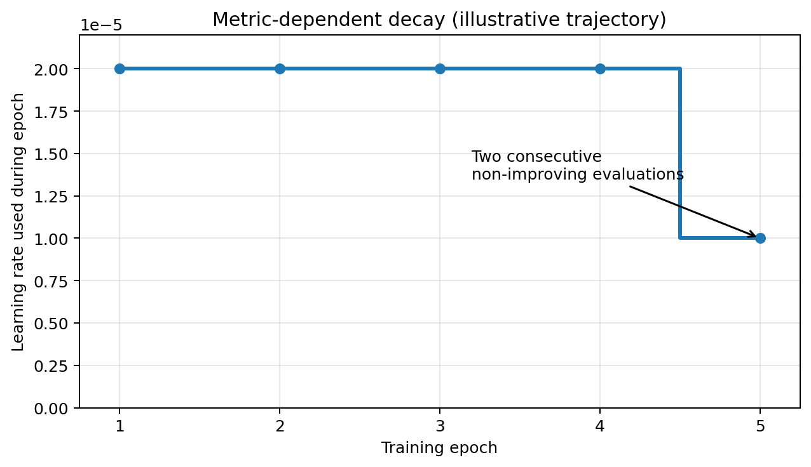

# ETPC BART Generation: Learning-Rate Scheduler Experiments

## Task, Baseline, and Contribution

ETPC paraphrase generation is formulated as a conditional sequence-to-sequence task. Given `sentence1`, its marked segment location, and the requested paraphrase-type IDs, the model generates `sentence2`. Following the course-provided generation setup, the baseline fine-tunes `facebook/bart-large` with token-level sequence-generation loss and the project's `AdamW` implementation. The repository setup already downloads this checkpoint, and `bart_generation.py` uses the corresponding Hugging Face tokenizer and conditional-generation model. This extension retains the provided model, input representation, objective, optimizer, and decoding procedure; it changes only how the optimizer learning rate evolves during fine-tuning.

A constant learning rate applies the same update scale throughout training, although different stages of BART fine-tuning may benefit from different behavior. Large early updates can disrupt useful pretrained representations, while an unchanged rate late in training can prevent stable refinement around a promising solution. We therefore compare the constant-rate baseline with step, cosine, linear, inverse-square-root, and development-metric-dependent schedules.

The original ETPC training CSV contains all 273 development examples. Before tokenization, the pipeline normalizes ETPC `id` values and removes these overlapping rows, leaving 2,457 training examples and 273 non-overlapping held-out development examples. Every comparison run uses this same cleaned split and initializes a fresh `facebook/bart-large` model with the same random seed.

## Research Questions and Hypotheses

1. **Final held-out performance:** Does a non-constant learning-rate schedule improve checkpoint-selected penalized development BLEU over the constant-rate baseline under the same training budget?
2. **Generation quality and novelty:** Can a schedule improve reference BLEU while controlling input BLEU, rather than increasing the penalized score through only one side of its quality-versus-copying tradeoff?
3. **Training efficiency and stability:** Does warmup, smooth decay, or metric-dependent reduction reach a strong held-out score earlier or avoid damaging updates more effectively than a fixed learning rate?

| Method | Change from baseline | Hypothesis |
| --- | --- | --- |
| Constant learning rate | None: $\alpha_t = \alpha_0$ | A simple and competitive baseline, but potentially too aggressive late in training and insufficiently protective at initialization |
| Step decay | Apply $\alpha_t = \max(\alpha_{min}, \alpha_0\gamma^{\lfloor t/s\rfloor})$, where `s` is configured in epochs | Preserve larger exploratory updates early and permit finer later updates, although performance may be sensitive to abrupt drops and the chosen interval |
| Cosine decay | Smoothly interpolate from $\alpha_0$ to $\alpha_{min}$ over all optimizer updates | Combine substantial early progress with increasingly conservative refinement, improving final held-out BLEU without abrupt rate changes |
| Linear decay | Linearly interpolate from $\alpha_0$ to $\alpha_{min}$ over all optimizer updates | Provide predictable annealing and stable late optimization, but risk reducing the rate too quickly for the available epoch budget |
| Inverse-square-root decay | Optionally warm up linearly to $\alpha_0$, then decay proportionally to $1/\sqrt{t}$ | Protect pretrained parameters from large early updates while retaining a longer high-learning-rate tail than linear or cosine decay |
| Metric-dependent decay | Multiply the current rate by `metric_factor` after penalized development BLEU fails to improve for more than `metric_patience` epochs | Keep the rate high while held-out performance improves and reduce it only on a plateau, adapting decay timing to observed model behavior |

### Data Leakage and the Baseline Result

The previously reported penalized development BLEU of approximately 39 was inflated by train–development leakage. All 273 development IDs were also present in the original training CSV, so the model had been optimized on the same examples used for development evaluation. Consequently, that score was not a valid estimate of performance on unseen data.

After removing every training row whose normalized ETPC `id` occurs in the development set, the training split contains 2,457 examples and the development split remains at 273 genuinely held-out examples. Under this corrected protocol, the constant-learning-rate baseline achieves a penalized development BLEU of approximately 17. The decrease from 39 to 17 should therefore not be interpreted as a model regression: it is the result of eliminating leakage and measuring generalization on a non-overlapping split. All scheduler comparisons use 17—not the leaked score of 39—as the valid baseline.

## Learning schedulers

The plots use the default initial learning rate $\alpha_0=2\times10^{-5}$, minimum learning rate $\alpha_{\min}=0$, five epochs, and batch size 8. With 2,457 cleaned training examples, there are $\lceil2457/8\rceil=308$ optimizer updates per epoch and $T=1540$ updates in total. They can be regenerated with:

```sh
python paraphrase_generation/plotter.py
```

The plots illustrate the default schedules; the commands below instead reproduce the parameter grids in the results tables. Submit from the repository root after the training environment and local BART cache are set up. Create the SLURM log directory before submitting:

```sh
mkdir -p slurm_files
```

Each command runs its experiments sequentially within one job. The wrapper requests two hours by default; for larger grids, choose a cluster-permitted wall-time override using `sbatch --time=...` before the script name. Run grids separately and archive their outputs before the next job, since runs share output locations and reruns can overwrite checkpoints. Table IDs are persistent CSV identifiers, not the per-job checkpoint indices.

### Constant Learning Rate

#### Idea

The baseline uses the same learning rate for every optimizer update $t$:

$$
\alpha_t=\alpha_0.
$$

It provides no warmup or decay, making it the control condition for determining whether changing the learning rate over time improves generation.

**Plot description.** The horizontal line remains at $2\times10^{-5}$ throughout all five epochs, showing that every optimizer update uses the same learning rate.



#### Methodology

Run the parameter grid recorded below: **13 experiments**, five epochs each. Space-separated option values form a Cartesian product.

```sh
sbatch run_bart_generation.sh 5 constant \
    --batch_size 8 \
    --learning_rate 1e-3 1e-4 2e-4 5e-4 1e-5 5e-5 2e-5 3e-5 4e-5 7e-5 9e-5 1.1e-4 1.25e-4 \
    --min_lr 0 \
    --use_gpu
```

#### Results

Source: [run_5epoch_results.csv](paraphrase_generation/run_5epoch_results.csv), filtered to `Constant learning rate`. Sorted by descending penalized BLEU (ties by ascending ID). BLEU scores are rounded to four decimal places.

| ID | LR | Dev reference BLEU | Dev input BLEU | Dev penalized BLEU |
| ---: | ---: | ---: | ---: | ---: |
| 74 | 9e-5 | 42.6154 | 73.2415 | 21.9293 |
| 65 | 1e-4 | 42.1565 | 73.1281 | 21.7851 |
| 75 | 1.1e-4 | 42.8679 | 74.3334 | 21.1591 |
| 76 | 1.25e-4 | 44.3238 | 75.5372 | 20.8516 |
| 73 | 7e-5 | 44.4819 | 76.9212 | 19.7421 |
| 70 | 2e-5 | 46.2204 | 79.9772 | 17.7973 |
| 69 | 5e-5 | 45.8548 | 80.5357 | 17.1641 |
| 72 | 4e-5 | 45.1790 | 80.6597 | 16.8034 |
| 71 | 3e-5 | 46.5307 | 81.7639 | 16.3180 |
| 68 | 1e-5 | 48.1365 | 88.2866 | 10.8431 |
| 66 | 2e-4 | 0.7036 | 1.0939 | 1.3382 |
| 67 | 5e-4 | 0.0082 | 0.0079 | 0.0158 |
| 64 | 1e-3 | 0.0042 | 0.0040 | 0.0081 |

**Training dynamics.** IDs 74 and 65 are compared with the constant `2e-5` baseline (ID 70, dashed black line).


### Step Decay

#### Idea

Step decay multiplies the learning rate by $\gamma$ after every $s$ optimizer updates, subject to a lower bound:

$$
\alpha_t=\max\left(\alpha_{\min},\alpha_0\gamma^{\left\lfloor t/s\right\rfloor}\right).
$$

For the default experiment, $\gamma=0.5$ and the decay interval is one epoch, so $s=308$. The rate is therefore halved at the end of each epoch.

**Plot description.** The staircase curve holds the learning rate constant within each epoch and drops it abruptly by half at every epoch boundary, from $2\times10^{-5}$ initially to $1.25\times10^{-6}$ in the fifth epoch.



#### Methodology

Run the parameter grid recorded below: **27 experiments**, five epochs each. Space-separated option values form a Cartesian product.

```sh
sbatch run_bart_generation.sh 5 step \
    --batch_size 8 \
    --learning_rate 1e-3 1e-4 1e-5 \
    --min_lr 1e-7 \
    --step_decay_epochs 1 2 3 \
    --step_gamma 0.5 0.2 0.1 \
    --use_gpu
```

#### Results

Source: [run_5epoch_results.csv](paraphrase_generation/run_5epoch_results.csv), filtered to `Step decay`. Sorted by descending penalized BLEU (ties by ascending ID). BLEU scores are rounded to four decimal places.

| ID | LR | Min LR | Decay interval (epochs) | Step size (updates) | Gamma | Dev reference BLEU | Dev input BLEU | Dev penalized BLEU |
| ---: | ---: | ---: | ---: | ---: | ---: | ---: | ---: | ---: |
| 16 | 1e-4 | 1e-7 | 3 | 924 | 0.5 | 42.1565 | 73.1281 | 21.7851 |
| 17 | 1e-4 | 1e-7 | 3 | 924 | 0.2 | 42.1565 | 73.1281 | 21.7851 |
| 18 | 1e-4 | 1e-7 | 3 | 924 | 0.1 | 42.1565 | 73.1281 | 21.7851 |
| 13 | 1e-4 | 1e-7 | 2 | 616 | 0.5 | 44.5942 | 76.5706 | 20.0926 |
| 10 | 1e-4 | 1e-7 | 1 | 308 | 0.5 | 46.1225 | 79.6345 | 18.0636 |
| 14 | 1e-4 | 1e-7 | 2 | 616 | 0.2 | 46.7597 | 81.2418 | 16.8678 |
| 15 | 1e-4 | 1e-7 | 2 | 616 | 0.1 | 46.5604 | 82.0296 | 16.0905 |
| 11 | 1e-4 | 1e-7 | 1 | 308 | 0.2 | 47.3100 | 84.5849 | 14.0248 |
| 12 | 1e-4 | 1e-7 | 1 | 308 | 0.1 | 47.8621 | 86.2523 | 12.6537 |
| 25 | 1e-5 | 1e-7 | 3 | 924 | 0.5 | 48.4788 | 87.1102 | 12.0170 |
| 22 | 1e-5 | 1e-7 | 2 | 616 | 0.5 | 48.6384 | 90.0102 | 9.3440 |
| 26 | 1e-5 | 1e-7 | 3 | 924 | 0.2 | 48.7459 | 90.1498 | 9.2338 |
| 27 | 1e-5 | 1e-7 | 3 | 924 | 0.1 | 48.7433 | 91.7289 | 7.7531 |
| 23 | 1e-5 | 1e-7 | 2 | 616 | 0.2 | 48.7032 | 93.7172 | 5.8845 |
| 24 | 1e-5 | 1e-7 | 2 | 616 | 0.1 | 48.7245 | 94.1514 | 5.4802 |
| 19 | 1e-5 | 1e-7 | 1 | 308 | 0.5 | 48.8444 | 94.2596 | 5.3921 |
| 20 | 1e-5 | 1e-7 | 1 | 308 | 0.2 | 48.7207 | 96.0419 | 3.7084 |
| 21 | 1e-5 | 1e-7 | 1 | 308 | 0.1 | 48.9112 | 96.4586 | 3.3311 |
| 1 | 1e-3 | 1e-7 | 1 | 308 | 0.5 | 0.0042 | 0.0040 | 0.0081 |
| 2 | 1e-3 | 1e-7 | 1 | 308 | 0.2 | 0.0042 | 0.0040 | 0.0081 |
| 3 | 1e-3 | 1e-7 | 1 | 308 | 0.1 | 0.0042 | 0.0040 | 0.0081 |
| 4 | 1e-3 | 1e-7 | 2 | 616 | 0.5 | 0.0042 | 0.0040 | 0.0081 |
| 5 | 1e-3 | 1e-7 | 2 | 616 | 0.2 | 0.0042 | 0.0040 | 0.0081 |
| 6 | 1e-3 | 1e-7 | 2 | 616 | 0.1 | 0.0042 | 0.0040 | 0.0081 |
| 7 | 1e-3 | 1e-7 | 3 | 924 | 0.5 | 0.0042 | 0.0040 | 0.0081 |
| 8 | 1e-3 | 1e-7 | 3 | 924 | 0.2 | 0.0042 | 0.0040 | 0.0081 |
| 9 | 1e-3 | 1e-7 | 3 | 924 | 0.1 | 0.0042 | 0.0040 | 0.0081 |

**Training dynamics.** IDs 16 and 17 are compared with the constant `2e-5` baseline (ID 70, dashed black line).


### Cosine Decay

#### Idea

Cosine decay changes the learning rate smoothly from $\alpha_0$ to $\alpha_{\min}$ over the complete budget of $T$ optimizer updates:

$$
\alpha_t=\alpha_{\min}+\frac{\alpha_0-\alpha_{\min}}{2}
\left(1+\cos\left(\pi\frac{\min(t,T)}{T}\right)\right).
$$

The gradual early decrease preserves relatively large updates for exploration, while the flatter end of the cosine curve permits conservative refinement near the end of training.

**Plot description.** The curve starts flat near $2\times10^{-5}$, decreases most rapidly around the middle of training, and flattens again as it approaches zero at the end of epoch 5.



#### Methodology

Run the parameter grid recorded below: **12 experiments**, five epochs each. Space-separated option values form a Cartesian product.

```sh
sbatch run_bart_generation.sh 5 cosine \
    --batch_size 8 \
    --learning_rate 1e-5 2e-5 5e-5 1e-4 \
    --min_lr 1e-6 2e-6 5e-6 \
    --use_gpu
```

#### Results

Source: [run_5epoch_results.csv](paraphrase_generation/run_5epoch_results.csv), filtered to `Cosine decay`. Sorted by descending penalized BLEU (ties by ascending ID). BLEU scores are rounded to four decimal places.

| ID | LR | Min LR | Total updates | Dev reference BLEU | Dev input BLEU | Dev penalized BLEU |
| ---: | ---: | ---: | ---: | ---: | ---: | ---: |
| 46 | 5e-5 | 1e-6 | 1540 | 46.1692 | 79.0771 | 18.5768 |
| 51 | 1e-4 | 5e-6 | 1540 | 45.8081 | 79.7121 | 17.8721 |
| 48 | 5e-5 | 5e-6 | 1540 | 46.5291 | 80.5299 | 17.4216 |
| 47 | 5e-5 | 2e-6 | 1540 | 46.6614 | 81.0484 | 17.0059 |
| 49 | 1e-4 | 1e-6 | 1540 | 46.7160 | 83.2764 | 15.0243 |
| 50 | 1e-4 | 2e-6 | 1540 | 46.9698 | 83.5854 | 14.8267 |
| 45 | 2e-5 | 5e-6 | 1540 | 47.9610 | 89.3548 | 9.8184 |
| 42 | 1e-5 | 5e-6 | 1540 | 48.4059 | 89.8842 | 9.4166 |
| 44 | 2e-5 | 2e-6 | 1540 | 48.0509 | 90.8375 | 8.4667 |
| 43 | 2e-5 | 1e-6 | 1540 | 48.6154 | 90.9816 | 8.4314 |
| 41 | 1e-5 | 2e-6 | 1540 | 48.5021 | 91.2907 | 8.1234 |
| 40 | 1e-5 | 1e-6 | 1540 | 48.6739 | 92.6041 | 6.9228 |

**Training dynamics.** IDs 46 and 51 are compared with the constant `2e-5` baseline (ID 70, dashed black line).


### Linear Decay

#### Idea

Linear decay decreases the learning rate by the same amount at every optimizer update until it reaches $\alpha_{\min}$ at update $T$:

$$
\alpha_t=\alpha_{\min}+(\alpha_0-\alpha_{\min})
\left(1-\frac{\min(t,T)}{T}\right).
$$

Unlike step decay, this schedule has no abrupt changes; unlike cosine decay, it assigns a constant rate of decrease throughout training.

**Plot description.** The straight descending line shows an equal learning-rate reduction per optimizer update, moving uniformly from $2\times10^{-5}$ at initialization to zero after five epochs.



#### Methodology

Run the parameter grid recorded below: **12 experiments**, five epochs each. Space-separated option values form a Cartesian product.

```sh
sbatch run_bart_generation.sh 5 linear \
    --batch_size 8 \
    --learning_rate 1e-5 2e-5 5e-5 1e-4 \
    --min_lr 1e-6 2e-6 5e-6 \
    --use_gpu
```

#### Results

Source: [run_5epoch_results.csv](paraphrase_generation/run_5epoch_results.csv), filtered to `Linear decay`. Sorted by descending penalized BLEU (ties by ascending ID). BLEU scores are rounded to four decimal places.

| ID | LR | Min LR | Total updates | Dev reference BLEU | Dev input BLEU | Dev penalized BLEU |
| ---: | ---: | ---: | ---: | ---: | ---: | ---: |
| 38 | 1e-4 | 2e-6 | 1540 | 34.8555 | 64.0708 | 24.0833 |
| 39 | 1e-4 | 5e-6 | 1540 | 46.2525 | 79.3179 | 18.3962 |
| 34 | 5e-5 | 1e-6 | 1540 | 46.4726 | 81.7165 | 16.3400 |
| 37 | 1e-4 | 1e-6 | 1540 | 46.3186 | 81.8649 | 16.1537 |
| 33 | 2e-5 | 5e-6 | 1540 | 47.6035 | 82.7402 | 15.8005 |
| 35 | 5e-5 | 2e-6 | 1540 | 46.6066 | 84.8960 | 13.5374 |
| 32 | 2e-5 | 2e-6 | 1540 | 47.4143 | 85.3911 | 13.3206 |
| 30 | 1e-5 | 5e-6 | 1540 | 48.2923 | 87.5470 | 11.5651 |
| 36 | 5e-5 | 5e-6 | 1540 | 47.6811 | 87.6650 | 11.3105 |
| 31 | 2e-5 | 1e-6 | 1540 | 48.1090 | 88.4786 | 10.6593 |
| 28 | 1e-5 | 1e-6 | 1540 | 48.8003 | 91.3644 | 8.1042 |
| 29 | 1e-5 | 2e-6 | 1540 | 48.4397 | 91.3266 | 8.0796 |

**Training dynamics.** IDs 38 and 39 are compared with the constant `2e-5` baseline (ID 70, dashed black line).


### Inverse-Square-Root Decay

#### Idea

Let $u=t+1$ be the one-based optimizer-update number and $w$ the number of warmup updates. With warmup enabled, the implemented schedule is

$$
\alpha_t=\max\left(
\alpha_{\min},
\alpha_0\min\left(\frac{u}{w},\sqrt{\frac{w}{u}}\right)
\right).
$$

The rate increases linearly during the first $w$ updates, reaches the peak $\alpha_0$ at $u=w$, and then decreases proportionally to $1/\sqrt{u}$. The default $w=100$ corresponds to approximately 0.325 training epochs.

**Plot description.** The learning rate rises steeply from near zero to $2\times10^{-5}$ during the first 100 updates, marked by the dashed line, and then follows a long, gradually flattening decay to approximately $5\times10^{-6}$.



#### Methodology

Run the parameter grid recorded below: **12 experiments**, five epochs each. Space-separated option values form a Cartesian product.

```sh
sbatch run_bart_generation.sh 5 inverse_sqrt \
    --batch_size 8 \
    --learning_rate 2e-5 5e-5 1e-4 \
    --min_lr 2e-6 5e-6 \
    --warmup_steps 0 2 \
    --use_gpu
```

#### Results

Source: [run_5epoch_results.csv](paraphrase_generation/run_5epoch_results.csv), filtered to `Inverse square root`. Sorted by descending penalized BLEU (ties by ascending ID). BLEU scores are rounded to four decimal places.

| ID | LR | Min LR | Total updates | Warmup updates | Dev reference BLEU | Dev input BLEU | Dev penalized BLEU |
| ---: | ---: | ---: | ---: | ---: | ---: | ---: | ---: |
| 54 | 2e-5 | 5e-6 | 1540 | 0 | 39.4848 | 75.2960 | 18.7583 |
| 63 | 1e-4 | 5e-6 | 1540 | 2 | 48.4320 | 92.5608 | 6.9287 |
| 61 | 1e-4 | 2e-6 | 1540 | 2 | 48.6123 | 92.7174 | 6.8082 |
| 58 | 5e-5 | 5e-6 | 1540 | 0 | 48.4654 | 93.2922 | 6.2518 |
| 62 | 1e-4 | 5e-6 | 1540 | 0 | 48.6915 | 93.4709 | 6.1137 |
| 60 | 1e-4 | 2e-6 | 1540 | 0 | 48.5754 | 94.5559 | 5.0855 |
| 57 | 5e-5 | 2e-6 | 1540 | 2 | 48.6221 | 94.5981 | 5.0510 |
| 59 | 5e-5 | 5e-6 | 1540 | 2 | 48.1402 | 94.6291 | 4.9722 |
| 55 | 2e-5 | 5e-6 | 1540 | 2 | 48.3614 | 95.5488 | 4.1397 |
| 56 | 5e-5 | 2e-6 | 1540 | 0 | 48.6748 | 95.9534 | 3.7878 |
| 52 | 2e-5 | 2e-6 | 1540 | 0 | 48.7384 | 97.0412 | 2.7732 |
| 53 | 2e-5 | 2e-6 | 1540 | 2 | 48.9237 | 97.8553 | 2.0178 |

**Training dynamics.** IDs 54 and 63 are compared with the constant `2e-5` baseline (ID 70, dashed black line).


### Metric-Dependent Decay

#### Idea

The metric-dependent scheduler changes the learning rate only after development evaluation. Let $k$ index evaluations, $b_k$ be the number of consecutive evaluations without a sufficient improvement in penalized development BLEU, $p$ be the patience, and $f\in(0,1)$ be the reduction factor. The update is

$$
\alpha_{k+1}=
\begin{cases}
\max(\alpha_{\min},f\alpha_k), & b_k>p,\\
\alpha_k, & b_k\le p.
\end{cases}
$$

An improvement resets the bad-epoch count to zero, and a reduction also starts a new patience window. With the defaults $f=0.5$ and $p=1$, the rate is halved after two consecutive non-improving evaluations. Because this schedule depends on observed development scores, its figure uses an illustrative trajectory: improvement after epochs 1 and 2 followed by two non-improving evaluations, causing the lower rate to be used in epoch 5.

**Plot description.** In the illustrative trajectory, the learning rate remains at $2\times10^{-5}$ for the first four epochs. Two consecutive evaluations without improvement exhaust the patience, so epoch 5 uses the reduced rate of $1\times10^{-5}$.



#### Methodology

Run the parameter grid recorded below: **24 experiments**, five epochs each. Space-separated option values form a Cartesian product.

```sh
sbatch run_bart_generation.sh 5 metric \
    --batch_size 8 \
    --learning_rate 2e-5 9e-5 \
    --min_lr 0 \
    --metric_factor 0.1 0.2 0.5 \
    --metric_patience 0 1 \
    --metric_threshold 3 4 \
    --use_gpu
```

### Results

Source: [run_5epoch_results.csv](paraphrase_generation/run_5epoch_results.csv), filtered to `Metric dependent`. Sorted by descending penalized BLEU (ties by ascending ID). BLEU scores are rounded to four decimal places.

| ID | LR | Min LR | Factor (CSV gamma) | Patience | Threshold | Dev reference BLEU | Dev input BLEU | Dev penalized BLEU |
| ---: | ---: | ---: | ---: | ---: | ---: | ---: | ---: | ---: |
| 91 | 9e-5 | 0 | 0.1 | 1 | 3 | 42.6154 | 73.2415 | 21.9293 |
| 95 | 9e-5 | 0 | 0.2 | 1 | 3 | 42.6154 | 73.2415 | 21.9293 |
| 99 | 9e-5 | 0 | 0.5 | 1 | 3 | 42.6154 | 73.2415 | 21.9293 |
| 97 | 9e-5 | 0 | 0.5 | 0 | 3 | 44.9549 | 76.4521 | 20.3576 |
| 98 | 9e-5 | 0 | 0.5 | 0 | 4 | 44.9549 | 76.4521 | 20.3576 |
| 100 | 9e-5 | 0 | 0.5 | 1 | 4 | 44.3306 | 76.1777 | 20.3088 |
| 96 | 9e-5 | 0 | 0.2 | 1 | 4 | 44.8140 | 77.1246 | 19.7142 |
| 92 | 9e-5 | 0 | 0.1 | 1 | 4 | 45.2885 | 77.6968 | 19.4246 |
| 79 | 2e-5 | 0 | 0.1 | 1 | 3 | 46.2204 | 79.9772 | 17.7973 |
| 80 | 2e-5 | 0 | 0.1 | 1 | 4 | 46.2204 | 79.9772 | 17.7973 |
| 83 | 2e-5 | 0 | 0.2 | 1 | 3 | 46.2204 | 79.9772 | 17.7973 |
| 84 | 2e-5 | 0 | 0.2 | 1 | 4 | 46.2204 | 79.9772 | 17.7973 |
| 87 | 2e-5 | 0 | 0.5 | 1 | 3 | 46.2204 | 79.9772 | 17.7973 |
| 88 | 2e-5 | 0 | 0.5 | 1 | 4 | 46.2204 | 79.9772 | 17.7973 |
| 93 | 9e-5 | 0 | 0.2 | 0 | 3 | 45.6294 | 80.8587 | 16.7963 |
| 94 | 9e-5 | 0 | 0.2 | 0 | 4 | 45.6294 | 80.8587 | 16.7963 |
| 85 | 2e-5 | 0 | 0.5 | 0 | 3 | 46.2492 | 81.6392 | 16.3302 |
| 89 | 9e-5 | 0 | 0.1 | 0 | 3 | 44.8785 | 82.0905 | 15.4568 |
| 90 | 9e-5 | 0 | 0.1 | 0 | 4 | 44.8785 | 82.0905 | 15.4568 |
| 81 | 2e-5 | 0 | 0.2 | 0 | 3 | 47.2718 | 83.8035 | 14.7238 |
| 77 | 2e-5 | 0 | 0.1 | 0 | 3 | 47.9883 | 86.8995 | 12.0898 |
| 86 | 2e-5 | 0 | 0.5 | 0 | 4 | 47.9820 | 88.3039 | 10.7923 |
| 82 | 2e-5 | 0 | 0.2 | 0 | 4 | 48.3951 | 90.1885 | 9.1313 |
| 78 | 2e-5 | 0 | 0.1 | 0 | 4 | 48.6880 | 91.7971 | 7.6805 |

**Training dynamics.** IDs 91 and 95 are compared with the constant `2e-5` baseline (ID 70, dashed black line).


## Discussions

The question arises: why did we fail? The obvious reason is that we didn't have enough epochs to schedule meaningfully. Had we had 50 epochs, this could have ad an impackt. However this doesn't explain the whole picture. For example, why do we get significantly worse $Reference BLEU$ after improving $Penalty BLEU$

### Output Exploration

Both models receive the same source and ETPC annotations.

**Source**

> Peterson was arrested near Torrey Pines Golf Course in La Jolla on April 18, the day DNA testing identified the bodies.

**Reference**

> Peterson, 30, was arrested in La Jolla April 18 after the two bodies were identified through DNA tests.

**Annotations decoded.** These are ETPC labels, not BART token IDs. The [ETPC type definitions](https://github.com/venelink/ETPC/blob/master/Corpus/paraphrase_types.xml) map the requested types to:

- `6`: contextual same-polarity substitution — equivalent wording in context.
- `11`: synthetic/analytic substitution — a compact expression versus a more explicit construction.
- `14`: diathesis alternation — changing grammatical voice or argument structure.
- `25`: addition/deletion — adding or removing material.
- `29`: identity — retaining wording unchanged.

Repeated type IDs represent multiple annotations of the same type. The segment list assigns a label to each original source token, as described in the [course specification, p. 14](docs/SS26_dnlp_ProjectDescription.pdf#page=14): “on April 18” carries `11`, “the day” carries `6`, and “DNA testing identified the bodies” carries `14`. The comma has `0` (no assigned type); the remaining tokens carry `25`. These labels are supplied to guide generation, not predicted outputs.

**Model baseline** (added word highlighted)

> Peterson was arrested near Torrey Pines Golf Course in La Jolla on April 18, the **same** day DNA testing identified the bodies.

**Model 33 (it outperformed the baseline a bit)**
> Peterson was arrested near Torrey Pines Golf Course in La Jolla on April 18, the **same** day DNA testing identified the bodies.

#### Observations

1. Both outputs closely copy the source: Model 99 adds only “same”, while Model 78 reproduces the source exactly. A higher development-set penalized BLEU does not guarantee substantial rewriting on every example.
2. The reference includes information absent from the source, such as Peterson’s age (“30”). That detail cannot be inferred from the supplied input alone. This explains why data leakage had a profound effect on the 

### Conflicting metrics:

Because the reference contain the information, not present in the inputs, the model don't have any better strategy, rather than just copypasting the input.

We are in the pitfall, where to increase the $Reference BLEU$ means to basically copypaste the input. Slightly to deviate from the input sentence, decreases $Reference BLEU$ slightly, but double or tripples the $(1 - Input BLEU)$ component, increasing $Penalty BLEU$, by that. 

