# Semantic Seekers

- **Group name:** Semantic Seekers
- **Group code:** G11
- **Group repository:** [DL_NLP2026_Semantic_Seekers](https://github.com/andruhus/DL_NLP2026_Semantic_Seekers)
- **Tutor responsible:** Martina Juharova
- **Group team leader:** Andrii Demydenko ("andruhus")
- **Group members:** 
  - Simon Pummer ("GOESTERN-1159210"/SimonP), 
  - Thorben Neitzke ("thorbenN2")
  - Mohd Uwaish 


# Setup instructions

## Environment and dependencies

Make sure that Anaconda or Miniconda is installed. From the repository root, create the `dnlp` environment and install the required dependencies with:

```sh
source setup.sh
conda activate dnlp
```

On the GWDG cluster, use the GWDG-specific setup script instead:

```sh
source setup_gwdg.sh
conda activate dnlp
```

The setup scripts install the project dependencies in the `dnlp` environment. The GWDG setup also downloads `bert-base-uncased` and `facebook/bart-large` before compute jobs are started. Local QQP and PTD runs require the corresponding model to be available in the Hugging Face cache; `bart_detection.py` loads `facebook/bart-large` with local-files-only mode.

All commands below should be executed from the repository root. Add `--use_gpu` when a CUDA-capable GPU is available; the reported experiments were run with `--use_gpu` on the GWDG cluster.

## Quora Question Pairs (QQP)

The QQP train, development, and test data are included at:

```text
data/quora-paraphrase-train.csv
data/quora-paraphrase-dev.csv
data/quora-paraphrase-test-student.csv
```

The model is evaluated after every epoch. Whenever development accuracy improves, the best checkpoint is written to `models/`. After training, the selected checkpoint is loaded and prediction files are written to `predictions/bert/`.

The linear and MLP heads were implemented in different source revisions rather than selected through a command-line option. The current `main` branch implements the MLP head, so its runs can be reproduced directly below. Reproducing the linear-head variant requires its recorded revision.

### Improvement 1: Pair-Feature Linear Head Run

```sh
python multitask_classifier.py \
  --task qqp \
  --seed 11711 \
  --option finetune \
  --use_gpu \
  --local_files_only \
  --epochs 3 \
  --batch_size 8 \
  --lr 1e-5
```

The corresponding archived SLURM script, log, and predictions are in `experiments/qqp_improvement_1_only_sentence_pair_repr/`.

### Improvement 2: MLP Head

#### MLP Head with Default Dropout

This run used the same pair interaction representation and the MLP head with the default dropout value.

```sh
python multitask_classifier.py \
  --task qqp \
  --seed 11711 \
  --option finetune \
  --use_gpu \
  --local_files_only \
  --epochs 3 \
  --batch_size 8 \
  --lr 1e-5
```

The corresponding SLURM script is `slurm_scripts/run_qqp_mlp_head_full.sh`, and the archived predictions are in `experiments/qqp_mlp_head/full_run_predictions/`.

#### MLP Head with Lower Dropout

This run used the same pair interaction representation and the same MLP head, but reduced dropout and increased the epoch budget.

```sh
python multitask_classifier.py \
  --task qqp \
  --seed 11711 \
  --option finetune \
  --use_gpu \
  --local_files_only \
  --epochs 7 \
  --batch_size 8 \
  --lr 1e-5 \
  --hidden_dropout_prob 0.1 \
  --early_stopping \
  --patience 2
```

The corresponding SLURM script is `slurm_scripts/run_qqp_mlp_head_dropout01_7ep_es.sh`.

The final prediction files from the best run were copied to:

```text
experiments/qqp_mlp_head/dropout01_7ep_es_predictions/quora_mlp_head_dropout01_7ep_es_job15591323_dev.csv
experiments/qqp_mlp_head/dropout01_7ep_es_predictions/quora_mlp_head_dropout01_7ep_es_job15591323_test.csv
```

The corresponding checkpoint was also used to initialize experimental training runs for the STS (Semantic Textual Similarity) task, since both tasks involve sentence-pair comparison. However, this transfer is only expected to be potentially useful for the shared BERT encoder; the QQP-specific classification head is not directly applicable to STS because STS predicts a graded similarity score rather than a binary paraphrase label.

## Stanford Sentiment Treebank (SST)

The SST task uses the shared environment described above. The analysis and plotting utilities additionally use `matplotlib` and `tabulate`; `pathlib` is part of the Python standard library.

```sh
pip install matplotlib tabulate
```

The experiments evaluate five-class sentiment classification on the [Stanford Sentiment Treebank (SST-5)](https://paperswithcode.com/sota/sentiment-analysis-on-sst-5-fine-grained).

## Semantic Textual Similarity (STS)

The STS experiments use the shared environment and dependencies described above. For STS, that environment provides PyTorch 2.2.0 (CUDA 12.1), `numpy<2`, `tqdm`, `transformers==4.38.2`, `tokenizers`, `tensorboard`, `sacrebleu`, and `scikit-learn`. The `transformers` package supplies tokenizer utilities; pretrained model weights are loaded through the project code rather than directly from the library.

The following steps install the STS-specific tooling, prepare transfer data, and reproduce the selected run.

### Additional dependencies

Two additional packages are required for STS-specific data preparation and visualization:

```sh
pip install datasets     # SNLI / PAWS download only — not used at training time
pip install matplotlib   # figure generation only — not used at training time
```

Neither is imported by `multitask_classifier.py` during training. `datasets` is used
once, offline, to build a triplet cache (below); `matplotlib` is used to create plots.

### One-time data preparation

The SNLI and PAWS triplet caches must be built once before training:

```sh
pip install datasets
bash scripts/build_nli_cache.sh
```

Expected output:

```text
SNLI: 149,145 triplets -> data/nli_cache/snli_triplets.json
PAWS:  49,401 pairs    -> data/nli_cache/paws_pairs.json
```

The script runs the download from a temporary directory on purpose. This project ships
its own `datasets.py`, which shadows the Hugging Face `datasets` package on the import
path; importing it from the repository root fails silently. The script writes plain JSON
caches, so training itself performs no HuggingFace import at all. Re-running is safe:
existing caches are detected and skipped.

### Reproducing the STS result

Locally, on one GPU:

```sh
python -u multitask_classifier.py \
  --task sts --option finetune --use_gpu \
  --cosent --cosent_weight 0.0 --cosent_tau 0.05 \
  --mnrl_weight 0.5 --mnrl_tau 0.05 \
  --cross_attn --sts_symmetry --nli_pretrain_epochs 1 \
  --hidden_dropout_prob 0.3 --batch_size 64 --epochs 5 --lr 2e-5 \
  --warmup_ratio 0.0 \
  --init_checkpoint models/qqp_encoder.pt \
  --filepath models/sts_best.pt --local_files_only
```

On the Grete cluster, the same run as a single copy-pasteable job:

```sh
mkdir -p slurm_files models

sbatch --partition=grete:shared --gres=gpu:A100:1 --time=01:00:00 --mem=16G \
  --cpus-per-task=4 --job-name=sts_best --output=slurm_files/sts_best.out \
  --wrap="source activate dnlp && python -u multitask_classifier.py \
    --task sts --option finetune --use_gpu \
    --cosent --cosent_weight 0.0 --cosent_tau 0.05 \
    --mnrl_weight 0.5 --mnrl_tau 0.05 \
    --cross_attn --sts_symmetry --nli_pretrain_epochs 1 \
    --hidden_dropout_prob 0.3 --batch_size 64 --epochs 5 --lr 2e-5 \
    --warmup_ratio 0.0 \
    --init_checkpoint models/qqp_encoder.pt \
    --filepath models/sts_best.pt --local_files_only"
```

### Checkpoints

No model weights are committed to the repository; each `.pt` file is several hundred
megabytes. Two paths appear in the commands above:

- `models/sts_best.pt` is written by the run itself, so nothing needs to be present
  beforehand.
- `models/qqp_encoder.pt` is the optional QQP encoder warm-start passed through
  `--init_checkpoint`. It must be produced or supplied before reproducing the exact
  selected run. If it is unavailable, omit `--init_checkpoint`; the stock-minBERT
  variant reached 0.847, within the measured seed-noise floor of the reported result.

### Key STS parameters

| Parameter | Description |
| --- | --- |
| `--cross_attn` | Cross-attention interaction layer before pooling |
| `--cross_attn_dropout` | Dropout inside that layer (default 0.1) |
| `--sts_symmetry` | Append reversed pairs; sim(A,B) = sim(B,A) |
| `--nli_pretrain_epochs` | SNLI triplet contrastive pretraining epochs |
| `--paws_pretrain_epochs` | PAWS hard-negative pretraining epochs |
| `--quora_pretrain_epochs` | MNRL pretraining on Quora positive pairs |
| `--mine_hard_negatives` | TF-IDF-mined STS hard-negative pretraining epochs |
| `--mnrl_weight`, `--mnrl_tau` | MNRL contrastive weight and temperature |
| `--cosent`, `--cosent_weight`, `--cosent_tau` | CoSENT ranking loss |
| `--angle_weight`, `--angle_tau` | AnglE loss |
| `--smart_weight`, `--smart_eta` | SMART adversarial smoothness |
| `--init_checkpoint` | Warm-start the encoder (`bert.*` tensors only) |
| `--filepath` | Explicit checkpoint path; required when running jobs in parallel |
| `--warmup_ratio`, `--grad_clip`, `--weight_decay` | Optimisation controls |

`--help` lists only the five arguments parsed before `parse_known_args()` in the course
scaffold, not the full set; the table above is the reference.

## Paraphrase Type Detection (PTD)

The PTD train, development, and test data are included at:

```text
data/etpc-paraphrase-train.csv
data/etpc-paraphrase-dev.csv
data/etpc-paraphrase-detection-test-student.csv
```

`run_bart_detection.sh` is the SLURM wrapper that submits the requested run and invokes `bart_detection.py`. The Python script evaluates the model after each epoch and saves the checkpoint with the highest development accuracy; an earlier checkpoint wins a tie. Each method reloads its own accuracy-selected checkpoint for reporting.

In a multi-method run, the script currently writes test predictions from the final method in command order rather than automatically selecting the strongest method. The output model is therefore aggressive Weighted BCE for the BCE comparison, capped Weighted BCE for the smoothed comparison, $\gamma=4$ for the exploratory focal sweep, and $\gamma=1.25$ for the confirmatory focal run. Predictions are written to `predictions/bart/etpc-paraphrase-detection-test-output.csv`.

### Unweighted BCE vs. Aggressive Weighted BCE

We compared unweighted BCE with the aggressive inverse-frequency Weighted BCE for 25 epochs using a batch size of 16. The current comparison is rerun with:

```sh
sbatch run_bart_detection.sh 25 compare \
    --compare_bce_only \
    --batch_size 16 \
    --use_gpu
```

### Smoothed Weighted BCE Variants

We trained the three smoothed Weighted BCE variants for 25 epochs with a batch size of 16. The unweighted BCE results from the aggressive Weighted BCE experiment are reused as the common reference; `compare_non_aggressive_weighted` does not rerun that baseline. The current experiment can be rerun with:

```sh
sbatch run_bart_detection.sh 25 compare_non_aggressive_weighted \
    --batch_size 16 \
    --weighted_bce_cap 20 \
    --use_gpu
```

This command trains square-root, logarithmic, and capped weighting in that order.

### Exploratory 5-Epoch Focal Sweep

The exploratory sweep evaluated 16 focusing parameters for 5 epochs with a batch size of 16:

```sh
sbatch run_bart_detection.sh 5 focal \
    --batch_size 16 \
    --focal_gamma 0.25 \
    --focal_gamma 0.5 \
    --focal_gamma 0.62 \
    --focal_gamma 0.75 \
    --focal_gamma 0.8 \
    --focal_gamma 0.87 \
    --focal_gamma 0.9 \
    --focal_gamma 0.95 \
    --focal_gamma 1 \
    --focal_gamma 1.05 \
    --focal_gamma 1.1 \
    --focal_gamma 1.15 \
    --focal_gamma 1.25 \
    --focal_gamma 1.5 \
    --focal_gamma 2 \
    --focal_gamma 4 \
    --use_gpu
```

The dedicated `focal` mode runs only the focal-loss experiments and does **not** rerun unweighted BCE.

### Confirmatory 25-Epoch Focal Run

Based on the exploratory scores, we selected four moderate values for a 25-epoch confirmatory run:

```sh
sbatch run_bart_detection.sh 25 focal \
    --batch_size 16 \
    --focal_gamma 0.87 \
    --focal_gamma 1.1 \
    --focal_gamma 1.15 \
    --focal_gamma 1.25 \
    --use_gpu
```

## Paraphrase Type Generation (PTG)

The PTG experiments use the shared environment and dependencies described above.

### Experiment outputs and model IDs

Each experiment assigns an ID to a model and saves its parameters in [`paraphrase_generation/run_5epoch_results.csv`](paraphrase_generation/run_5epoch_results.csv). BLEU scores recorded during training are saved in [`paraphrase_generation/train_5epoch_results.csv`](paraphrase_generation/train_5epoch_results.csv).

### Running commands

#### Constant Learning Rate

Run the parameter grid recorded below: **13 experiments**, five epochs each. Space-separated option values form a Cartesian product.

```sh
sbatch run_bart_generation.sh 5 constant \
    --batch_size 8 \
    --learning_rate 1e-3 1e-4 2e-4 5e-4 1e-5 5e-5 2e-5 3e-5 4e-5 7e-5 9e-5 1.1e-4 1.25e-4 \
    --min_lr 0 \
    --use_gpu
```

#### Step Decay

Run the parameter grid recorded below: **27 experiments**, five epochs each. Space-separated option values form a Cartesian product.

```sh
sbatch run_bart_generation.sh 5 step \
    --batch_size 8 \
    --learning_rate 1e-3 1e-4 1e-5 \
    --min_lr 1e-7 \
    --step_decay_epochs 1 2 3 \
    --step_gamma 0.5 0.2 0.1 \
    --use_gpu
```

#### Cosine Decay

Run the parameter grid recorded below: **12 experiments**, five epochs each. Space-separated option values form a Cartesian product.

```sh
sbatch run_bart_generation.sh 5 cosine \
    --batch_size 8 \
    --learning_rate 1e-5 2e-5 5e-5 1e-4 \
    --min_lr 1e-6 2e-6 5e-6 \
    --use_gpu
```

#### Linear Decay

Run the parameter grid recorded below: **12 experiments**, five epochs each. Space-separated option values form a Cartesian product.

```sh
sbatch run_bart_generation.sh 5 linear \
    --batch_size 8 \
    --learning_rate 1e-5 2e-5 5e-5 1e-4 \
    --min_lr 1e-6 2e-6 5e-6 \
    --use_gpu
```

#### Inverse-Square-Root Decay

Run the parameter grid recorded below: **12 experiments**, five epochs each. Space-separated option values form a Cartesian product.

```sh
sbatch run_bart_generation.sh 5 inverse_sqrt \
    --batch_size 8 \
    --learning_rate 2e-5 5e-5 1e-4 \
    --min_lr 2e-6 5e-6 \
    --warmup_steps 0 2 \
    --use_gpu
```

#### Metric-Dependent Decay

Run the parameter grid recorded below: **24 experiments**, five epochs each. Space-separated option values form a Cartesian product.

```sh
sbatch run_bart_generation.sh 5 metric \
    --batch_size 8 \
    --learning_rate 2e-5 9e-5 \
    --min_lr 0 \
    --metric_factor 0.1 0.2 0.5 \
    --metric_patience 0 1 \
    --metric_threshold 3 4 \
    --use_gpu
```

# Methodology

## Quora Question Pairs (QQP)

### Task, Baseline, and Contribution

Quora Question Pairs (QQP) paraphrase detection is a binary sentence-pair classification task. Given two questions, the model predicts whether both questions express the same meaning. The output is a single logit, which is converted to a probability with the sigmoid function during evaluation and then thresholded for binary classification.

The original BERT-based classifier represents a question pair by concatenating the pooled BERT embeddings of both questions:

$$
u = \mathrm{BERT}(q_1), \qquad v = \mathrm{BERT}(q_2)
$$

$$
h_{\mathrm{base}} = [u, v].
$$

This representation gives the classifier access to both question embeddings, but it does not explicitly encode how the embeddings differ or where they overlap dimension-wise.

As a reference point, the course project description reports a QQP development accuracy of approximately **0.765** for the default BERT-based setup with simple task-specific heads. In an earlier local baseline run with the original pair representation $[u, v]$, we observed a QQP development accuracy of **0.785**.

Our work focuses on improving the QQP paraphrase classifier in three steps. First, we change the sentence-pair representation. Second, we replace the linear classification head with a small Multi-Layer Perceptron (MLP) classifier head. Third, we adjust the training configuration for the MLP head by reducing dropout and using development-based checkpoint selection with optional early stopping.

The final selected QQP model reaches a development accuracy of **0.868**.

### Loss Function

For each label $y \in \{0,1\}$, model logit $z$, and sigmoid probability $\sigma(z)$, the loss is:

$$\mathcal{L}=- y \log \sigma(z)- (1-y)\log(1-\sigma(z)).$$

The implementation uses binary cross entropy with logits combining the sigmoid transformation and binary cross-entropy loss in a numerically stable way.

### Improvement 1: Sentence-Pair Interaction Features

The first improvement changes the sentence pair representation used for the paraphrase detection.

Instead of only passing the two pooled BERT embeddings to the classifier,

$$
h_{\mathrm{base}} = [u, v],
$$

we construct an enriched sentence-pair representation:

$$
h_{\mathrm{pair}} = [u, v, \lvert u-v \rvert, u \odot v].
$$

Here,

$$
u = \mathrm{BERT}(q_1), \qquad v = \mathrm{BERT}(q_2),
$$

where $q_1$ and $q_2$ are the two input questions.

The term $\lvert u-v \rvert$ is the element-wise absolute difference between both sentence embeddings. It provides a direct dimension-wise distance signal. This is related to distance-based similarity measures such as Manhattan / L1 distance, but instead of reducing the difference to one scalar, we keep the full vector so that the classifier can learn which dimensions are informative.

The term $u \odot v$ is the Hadamard product, i.e. the element-wise product of both embeddings. It highlights dimensions where both question embeddings are jointly active and provides a complementary overlap signal.

Since BERT-base produces 768-dimensional pooled embeddings, the enriched pair representation has dimensionality:

$$
4 \times 768 = 3072.
$$

This improvement is related to established sentence-pair matching representations. Sentence-BERT (Sentence Embeddings using Siamese BERT-Networks) uses Siamese BERT encoders and pair-combination features such as $[u, v, \lvert u-v \rvert]$ for classification objectives.[^1] InferSent-style sentence-pair models for Natural Language Inference use a closely related representation containing $u$, $v$, $\lvert u-v \rvert$, and $u*v$ before fully connected classification layers.[^2]

We therefore do **not** claim this representation as a novel architectural contribution. Instead, we apply this established sentence-pair matching idea to our initial architecture and evaluate whether it improves over the simpler baseline representation.

### Improvement 2: MLP Classification Head & Dropout

The second improvement keeps the enriched sentence-pair representation from Improvement 1, but replaces the single linear classification head with a small MLP head.

The linear-head variant predicts the paraphrase logit as:

$$
z = W h_{\mathrm{pair}} + b,
$$

where $z$ is the unnormalized paraphrase logit.

The MLP variant instead uses:

$$
z =
W_2\,
\mathrm{Dropout}
\left(
\mathrm{ReLU}
\left(
W_1\,\mathrm{Dropout}(h_{\mathrm{pair}}) + b_1
\right)
\right)
+b_2.
$$

In the implementation, the first linear layer maps the 3072-dimensional pair representation back to the BERT hidden size of 768:

$$
3072
\xrightarrow{\mathrm{Dropout}}
3072
\xrightarrow{\mathrm{Linear}}
768
\xrightarrow{\mathrm{ReLU}}
768
\xrightarrow{\mathrm{Dropout}}
768
\xrightarrow{\mathrm{Linear}}
1.
$$

The choice of 768 as the hidden size is motivated by the BERT-base embedding size. The enriched pair representation consists of four 768-dimensional parts, and the MLP head compresses this representation back to the natural hidden size of the BERT backbone before producing the final logit.

### Altering Training Configuration: Changing Dropout Rate, Longer Training, and Early Stopping

The third step does not change the pair representation or the classifier head and its MLP architecture. Instead, it changes the training configuration.

The first MLP experiment used the original default dropout value:

```text
hidden_dropout_prob = 0.3
```

with 3 training epochs. This run reached **0.849** QQP development accuracy and therefore did not improve over the simpler pair-feature linear-head model, which reached **0.850**.

We therefore ran a targeted follow-up experiment using the same sentence-pair interaction representation and the same MLP head, but with:

```text
hidden_dropout_prob = 0.1
epochs = 7
early_stopping = True
patience = 2
```

Dropout is a standard regularization method for neural networks that randomly disables units during training to reduce co-adaptation and overfitting.[^3] Since the added MLP head introduces additional trainable parameters, the default dropout value of `0.3` may have regularized the classifier head too strongly. Reducing dropout to `0.1` was therefore tested as a targeted follow-up.

The value `0.1` was **not** selected by an exhaustive hyperparameter sweep. We did not test additional values such as `0.01`, `0.05`, `0.15`, or `0.2`. Therefore, this experiment should be interpreted as a targeted training-configuration improvement, not as proof that `0.1` is the globally optimal dropout value. Since the MLP head adds extra trainable parameters on top of the sentence-pair representation, but the `0.3` dropout run did not outperform the linear head, we hypothesized that this dropout rate might be too aggressive for the newly added classifier head and evaluated `0.1` as a less restrictive regularization setting.

Early stopping is a validation-based model-selection and regularization technique where validation performance is used to stop training or select a checkpoint before overfitting becomes worse.[^4] In our setup, early stopping was primarily introduced to avoid wasting compute budget on additional epochs after development accuracy stopped improving. Since the training loop already saves the best checkpoint whenever development accuracy improves, early stopping mainly reduces unnecessary training time rather than changing the checkpoint-selection criterion.

## Stanford Sentiment Treebank (SST)

SST-5 assigns short movie-review excerpts to five sentiment classes, from highly negative to highly positive. Its fine-grained and subjective labels make generalization and overfitting central concerns.

### Starting point and evaluation

The starting model from Part 1 reached 0.519 development accuracy. Architectural changes were evaluated sequentially against the best accepted model state. Tunable regularization methods were then compared while holding the other selected hyperparameters fixed. Training and development accuracy curves were compared with `logdiff.py`; final experiment logs are stored in `logs/`, and preliminary logs in `logs/old_logs/`.

### Architectural adjustments

#### Multi-layer classifier

The one-layer baseline classifier was replaced with a more expressive classifier containing dropout. The goal was to model nonlinear patterns without increasing overfitting.

#### GELU activation

GELU replaced ReLU to provide a smoother activation with nonzero output for some negative inputs. We expected this to improve optimization and convergence.

#### Expressive pooling

The baseline classifier uses only the final `[CLS]` representation. We tested augmenting it with mean- and max-pooled token representations so sentiment-bearing words could influence the classifier more directly, following the pooling comparison of Xing et al.[^17]

#### AllNLI pretraining

We tested pretraining on AllNLI entailment and contradiction pairs before SST fine-tuning.[^18] The intended benefit was stronger general semantic representations before training on the smaller sentiment dataset.

### Tunable regularization adjustments

#### Label smoothing

Label smoothing was tested to account for ambiguity between adjacent sentiment classes and reduce overconfident fitting, following Si and Gao.[^19]

#### Weight decay

Weight decay was evaluated as parameter regularization to reduce overfitting. This follows the optimization setup used for BERT fine-tuning.[^20]

#### Warmup ratio

Linear learning-rate warmup was tested to limit early updates before gradients stabilize.[^20] We expected slower initial learning but potentially more stable later epochs.

## Semantic Textual Similarity (STS)

STS scores sentence pairs on a continuous $[0, 5]$ similarity scale, evaluated by Pearson
correlation against human judgements. The dataset is small: 5,719 training pairs and
1,430 dev pairs. That size, rather than model capacity, turned out to be the binding
constraint on every result below.

The Part 1 baseline encoded each sentence to BERT's `[CLS]` pooler output, concatenated
the two vectors, and passed them through a learned linear regressor trained with MSE. It
reached r = 0.379.

Our final system makes four changes, applied in the order below. Each was validated
independently before being kept.

### 1. Cosine similarity head over mean-pooled tokens

Following Sentence-BERT,[^1] we replaced the concat-and-regress head with a
parameter-free cosine similarity over
mean-pooled `last_hidden_state`, rescaled to the label range:

```python
emb1, emb2 = encode(s1), encode(s2)
sim = ((cosine_similarity(emb1, emb2) + 1) / 2) * 5
```

The concat head can satisfy the training objective by memorising pairs. Cosine similarity
has no parameters, so the only way to reduce the loss is to reshape the embedding space
itself, which is what generalises. This was the largest single gain of the project.

Adding mean pooling while keeping the concat head made results worse (0.366 against
0.379). Mean pooling helps only in combination with a cosine head; the two are not
independent contributions.

### 2. MNRL contrastive loss

Multiple Negatives Ranking Loss (MNRL)[^5] treats each STS pair as a positive and every
other in-batch pair as a negative, optimised
as NT-Xent/InfoNCE at temperature τ = 0.05:

```python
sim_matrix = normalize(emb1) @ normalize(emb2).T / tau
loss = cross_entropy(sim_matrix, arange(B))
```

The total objective is `MSE + 0.5·CosineEmbeddingLoss + 0.5·MNRL`. Besides raising dev r,
MNRL stabilised training: dev r held within 0.793–0.804 across epochs 4–10, whereas the
MSE-only model peaked at epoch 1 and declined thereafter.

### 3. Cross-attention interaction layer

This is our main architectural contribution. Sentence-BERT is a bi-encoder: each sentence
is encoded independently, so embeddings can be precomputed and compared cheaply. That
property makes SBERT suitable for corpus-scale retrieval, but it is less important when
scoring a fixed set of given pairs, where we prioritize predictive quality over
precomputation.

We therefore let the two token sequences attend to each other before pooling:

```python
h1 = bert(s1).last_hidden_state                # [B, L1, 768]
h2 = bert(s2).last_hidden_state                # [B, L2, 768]
h1_cross = LayerNorm(h1 + MHA(q=h1, k=h2, v=h2, key_padding_mask=pad2))
h2_cross = LayerNorm(h2 + MHA(q=h2, k=h1, v=h1, key_padding_mask=pad1))
emb1, emb2 = masked_mean_pool(h1_cross), masked_mean_pool(h2_cross)
```

One `nn.MultiheadAttention` layer (8 heads, dropout 0.1) is shared across both directions
and wrapped in a residual plus LayerNorm, like a standard transformer sublayer. The design
intent was to let *dog* in one sentence align with *animal* in the other before either is
compressed to a single vector. Inspection of selected trained attention weights did not
show this token-alignment behavior. The observed mechanism and the limits of that analysis
are described under [Cross-attention weights](#cross-attention-weights).

This is not a full cross-encoder: BERT still runs separately on each sentence, and only
the token sequences interact afterwards. The layer therefore costs roughly 1.5× a
bi-encoder rather than incurring the quadratic blow-up of encoding the two sentences
concatenated.

MNRL continues to use independently encoded embeddings, since its all-pairs similarity
matrix requires each sentence to be encoded without reference to a particular partner.
MSE and the cosine embedding loss consume the cross-attended embeddings.

### 4. NLI triplet pretraining

Following supervised SimCSE,[^6] the encoder is pretrained for one epoch on 149,145 SNLI
triplets — premise as anchor,
entailed hypothesis as positive, contradicting hypothesis as an explicit hard negative —
before STS fine-tuning:

```
anchor   (premise)      : A person on a horse jumps over a broken down airplane.
positive (entailment)   : A person is outdoors, on a horse.
negative (contradiction): A person is at a diner, ordering an omelette.
```

Each anchor is scored against every positive and every hard negative in the batch, so
contradictions enter the similarity matrix as additional columns rather than as in-batch
noise:

```python
keys = cat([emb_pos, emb_neg], dim=0)
loss = cross_entropy(emb_anchor @ keys.T / tau, arange(B))
```

A contradiction is topically close but semantically opposite: shared vocabulary and
register, different meaning. That is the discrimination STS demands, and it is more
informative than a random unrelated sentence. SNLI[^7] is also the training data behind
the original SBERT models, so this is a well-trodden transfer path rather than a novel
one.

### Supporting technique: symmetry augmentation

STS similarity is symmetric, `sim(A, B) = sim(B, A)`, but the training file lists each pair
in one direction only. Appending the reversed pair doubles the training set to 11,438
examples using no external data.

This is not a no-op. Cross-attention is asymmetric: sentence 1 querying sentence 2's
tokens and the reverse are different computations. MNRL's `emb1 @ emb2.T` likewise treats
row *i* as anchor and column *i* as its positive. Nothing otherwise forces order
invariance.

Its accuracy gain falls within seed noise and we do not claim it. Its effect on
convergence is large and consistent, moving the dev peak from epoch 9 to epoch 4, and we
retain it on that basis.

## Paraphrase Type Detection (PTD)

### Task, Baseline, and Contribution

ETPC paraphrase-type detection is formulated as a multi-label classification problem with 26 output labels. Following the course-provided task setup, the baseline fine-tunes `facebook/bart-large`[^8] with a 26-output linear classification head and binary cross-entropy (BCE). The course-provided task setup explicitly specifies `facebook/bart-large` as the starting point, and `setup_gwdg.sh` downloads that checkpoint. This extension retains that provided model and changes only its training objective; it does not introduce another pretrained model or external embedding.

The ETPC labels are strongly imbalanced. In the archived, unfiltered 2,730-row training data used for the preliminary results, only 11,648 of the 70,980 binary label assignments are positive (16.410%). Individual-label positive counts range from 3 to 2,711. Plain BCE can therefore obtain high accuracy by favoring negative decisions while learning little about rare positive labels. We investigate whether inverse-frequency Weighted BCE, smoothed Weighted BCE, or focal loss can improve minority-label behavior and/or reach a useful solution faster than BCE.

### Research Questions and Hypotheses

1. **Development-set performance:** Does an imbalance-aware objective improve the course's primary ETPC-detection metric, development accuracy, over the unweighted BCE baseline under the same training and checkpoint-selection protocol?
2. **Minority-label behavior:** Does it improve mean per-label MCC and per-label precision/recall, especially for rare paraphrase types, without an unacceptable reduction in accuracy?
3. **Training efficiency:** Under the same fixed epoch budget, does focal loss or smoothed Weighted BCE reach a strong development score earlier than ordinary BCE?

| Method | Change from baseline | Hypothesis |
| --- | --- | --- |
| Unweighted BCE | None | Strong aggregate accuracy, but majority-negative bias for rare labels |
| Aggressive Weighted BCE | Positive term for label $c$ multiplied by $N_c^-/N_c^+$ | Better rare-positive recall and MCC, potentially at the cost of accuracy and precision |
| Smoothed Weighted BCE | Compress or cap $N_c^-/N_c^+$ | Retain some minority-label benefit while avoiding unstable extreme weights |
| Focal loss | Down-weight easy decisions by $(1-p_t)^\gamma$ | Focus on difficult decisions without applying fixed class-level weights, improving early convergence and MCC |

### Baseline: Unweighted BCE

The baseline concatenates the two sentences with `</s>`, tokenizes to a maximum length of 512, and passes the result through BART-large. The classifier uses the hidden state of the first token to produce one logit for each of the 26 paraphrase types. Every output is treated as an independent binary decision and optimized with `BCEWithLogitsLoss`[^9]; at evaluation time, sigmoid probabilities greater than 0.5 are mapped to positive predictions.

### Proposed Loss Functions

The following preliminary class counts and weights come from the archived, overlapping 2,730-row training data. The current code removes development IDs before computing these values, so the weights must be regenerated for current reruns.

#### Method 1: Aggressive Weighted BCE

For each paraphrase type $c$, we computed a positive-class weight from the training data:

$$
w_c = \frac{N_c^-}{N_c^+},
$$

where $N_c^+$ and $N_c^-$ are the numbers of positive and negative training examples for label $c$. The resulting vector is passed to PyTorch's `BCEWithLogitsLoss` as `pos_weight`, yielding

$$
\mathcal{L}_{i,c} = -w_c y_{i,c}\log\sigma(z_{i,c}) - (1-y_{i,c})\log(1-\sigma(z_{i,c})).
$$

This calculation is implemented in `paraphrase_detection/weighted_bce.py` and is called on `train_labels` in `bart_detection.py`.

##### Archived Training-Set Class Weights

| Label ID | Positive | Negative | `pos_weight` |
| ---: | ---: | ---: | ---: |
| 1 | 366 | 2,364 | 6.4590 |
| 2 | 126 | 2,604 | 20.6667 |
| 3 | 124 | 2,606 | 21.0161 |
| 4 | 369 | 2,361 | 6.3984 |
| 5 | 479 | 2,251 | 4.6994 |
| 6 | 1,753 | 977 | 0.5573 |
| 7 | 316 | 2,414 | 7.6392 |
| 8 | 145 | 2,585 | 17.8276 |
| 9 | 3 | 2,727 | 909.0000 |
| 10 | 8 | 2,722 | 340.2500 |
| 11 | 560 | 2,170 | 3.8750 |
| 13 | 28 | 2,702 | 96.5000 |
| 14 | 115 | 2,615 | 22.7391 |
| 15 | 13 | 2,717 | 209.0000 |
| 16 | 47 | 2,683 | 57.0851 |
| 17 | 34 | 2,696 | 79.2941 |
| 18 | 302 | 2,428 | 8.0397 |
| 21 | 534 | 2,196 | 4.1124 |
| 22 | 49 | 2,681 | 54.7143 |
| 24 | 218 | 2,512 | 11.5229 |
| 25 | 2,096 | 634 | 0.3025 |
| 26 | 521 | 2,209 | 4.2399 |
| 28 | 240 | 2,490 | 10.3750 |
| 29 | 2,711 | 19 | 0.0070 |
| 30 | 431 | 2,299 | 5.3341 |
| 31 | 60 | 2,670 | 44.5000 |

#### Method 2: Smoothed Weighted BCE

The raw inverse-frequency ratio used in Method 1 can produce extremely large positive weights. To retain its imbalance-aware behavior while reducing the influence of a few rare examples, we define the raw ratio

$$
r_c = \frac{N_c^-}{N_c^+},
$$

and evaluate three smoothed alternatives:

1. **Square-root weighting**

$$
w_c^{\mathrm{sqrt}} = \sqrt{r_c}.
$$

2. **Logarithmic weighting**

$$
w_c^{\mathrm{log}} = \log(1 + r_c).
$$

3. **Capped inverse-frequency weighting**

$$
w_c^{\mathrm{cap}} = \min(r_c, w_{\max}), \qquad w_{\max}=20.
$$

All three vectors are passed to `BCEWithLogitsLoss` as `pos_weight`. Square-root and logarithmic transformations compress large ratios smoothly, while the capped variant preserves the original ratio up to 20 and clips every larger value.

##### Archived Smoothed Class Weights

| Label ID | Positive | Negative | Square-root weight | Logarithmic weight | Capped weight |
| ---: | ---: | ---: | ---: | ---: | ---: |
| 1 | 366 | 2,364 | 2.5415 | 2.0094 | 6.4590 |
| 2 | 126 | 2,604 | 4.5461 | 3.0758 | 20.0000 |
| 3 | 124 | 2,606 | 4.5843 | 3.0918 | 20.0000 |
| 4 | 369 | 2,361 | 2.5295 | 2.0013 | 6.3984 |
| 5 | 479 | 2,251 | 2.1678 | 1.7404 | 4.6994 |
| 6 | 1,753 | 977 | 0.7465 | 0.4430 | 0.5573 |
| 7 | 316 | 2,414 | 2.7639 | 2.1563 | 7.6392 |
| 8 | 145 | 2,585 | 4.2223 | 2.9353 | 17.8276 |
| 9 | 3 | 2,727 | 30.1496 | 6.8134 | 20.0000 |
| 10 | 8 | 2,722 | 18.4459 | 5.8326 | 20.0000 |
| 11 | 560 | 2,170 | 1.9685 | 1.5841 | 3.8750 |
| 13 | 28 | 2,702 | 9.8234 | 4.5799 | 20.0000 |
| 14 | 115 | 2,615 | 4.7686 | 3.1671 | 20.0000 |
| 15 | 13 | 2,717 | 14.4568 | 5.3471 | 20.0000 |
| 16 | 47 | 2,683 | 7.5555 | 4.0619 | 20.0000 |
| 17 | 34 | 2,696 | 8.9047 | 4.3857 | 20.0000 |
| 18 | 302 | 2,428 | 2.8354 | 2.2016 | 8.0397 |
| 21 | 534 | 2,196 | 2.0279 | 1.6317 | 4.1124 |
| 22 | 49 | 2,681 | 7.3969 | 4.0202 | 20.0000 |
| 24 | 218 | 2,512 | 3.3945 | 2.5276 | 11.5229 |
| 25 | 2,096 | 634 | 0.5500 | 0.2643 | 0.3025 |
| 26 | 521 | 2,209 | 2.0591 | 1.6563 | 4.2399 |
| 28 | 240 | 2,490 | 3.2210 | 2.4314 | 10.3750 |
| 29 | 2,711 | 19 | 0.0837 | 0.0070 | 0.0070 |
| 30 | 431 | 2,299 | 2.3096 | 1.8459 | 5.3341 |
| 31 | 60 | 2,670 | 6.6708 | 3.8177 | 20.0000 |

For the rarest type (label *9*), the raw ratio of *909* is reduced to *30.1496* by square-root weighting, *6.8134* by logarithmic weighting, and *20* by capping. This substantially reduces the extreme gradient contribution observed with the aggressive objective.

#### Method 3: Focal Loss

We also implemented binary focal loss,[^10] adapted to the multi-label setting. For every example-label pair, the unreduced BCE loss is first computed. The loss is then multiplied by a focusing factor:

$$
FL(p_t) = (1-p_t)^\gamma BCE(p_t),
$$

where $p_t$ is the predicted probability of the correct binary class and $\gamma \geq 0$ is the focusing parameter. Easy, confidently classified examples receive less weight, allowing training to focus on difficult decisions. When $\gamma=0$, focal loss reduces to ordinary BCE; increasing $\gamma$ suppresses easy examples more strongly.

Our implementation in `paraphrase_detection/focal_loss.py` does not use an additional $\alpha$ class-balancing term, so the experiment isolates the focusing parameter. `bart_detection.py` accepts multiple unique gamma values through repeated `--focal_gamma` arguments and trains a separate model for each value.

## Paraphrase Type Generation (PTG)

### Task description

ETPC paraphrase generation is formulated as a conditional sequence-to-sequence task. Given `sentence1`, its marked segment location, and the requested paraphrase-type IDs, the model generates `sentence2`. Following the course-provided generation setup, the baseline fine-tunes `facebook/bart-large` with token-level sequence-generation loss and the project's `AdamW` implementation. The repository setup already downloads this checkpoint, and `bart_generation.py` uses the corresponding Hugging Face tokenizer and conditional-generation model. This extension retains the provided model, input representation, objective, optimizer, and decoding procedure; it changes only how the optimizer learning rate evolves during fine-tuning.

#### BLEU-Score

We measure generation quality with the **BLEU score**.

For a source input $x$ (`sentence1`), the reference $r$, and the suggestion $h$, we calculate:

$$
B_{\mathrm{ref}} = BLEU(r, h), \qquad
B_{\mathrm{input}} = BLEU(x, h).
$$

$B_{\mathrm{ref}}$ measures how similar the generated hypothesis is to the reference, while $B_{\mathrm{input}}$ measures how similar it is to the input.

To balance these metrics, we calculate:

$$
B_{\mathrm{pen}} = \frac{B_{\mathrm{ref}}\bigl(100 - B_{\mathrm{input}}\bigr)}{52}.
$$

SacreBLEU reports this corpus-level score on a $0$--$100$ scale. A larger `reference_bleu` indicates stronger lexical agreement with the target paraphrase.

The factor $1/52$ is a project-specific scaling constant; it changes the magnitude of the score, not the ranking when the other terms are fixed.

In our experiments, we track $B_{\mathrm{ref}}$ and $B_{\mathrm{pen}}$.

#### Data Leakage and the Baseline Result

In Part 1, we made a mistake when we previously reported `penalized_bleu` in `etpc_dev_dataset` to be approximately 39, which was inflated by train–development leakage. All 273 development IDs were also present in the original training CSV, so the model had been optimized on the same examples used for development evaluation. Consequently, that score was not a valid estimate of performance on unseen data.

After removing every training row whose normalized ETPC `id` occurs in the development set, the training split contains 2,457 examples and the development split remains at 273 genuinely held-out examples. Under this corrected protocol, the constant-learning-rate baseline achieves a development `penalized_bleu` of approximately 17. The decrease from 39 to 17 should therefore not be interpreted as a model regression: it is the result of eliminating leakage and measuring generalization on a non-overlapping split. All scheduler comparisons use 17—not the leaked score of 39—as the valid baseline.

For `reference_bleu`, the corrected baseline reaches **46.22**, close to the expected 47.5.

### Improvement idea

We investigate whether adaptive learning-rate schedules can improve convergence and generation quality over a constant learning rate.

#### Learning rate scheduler types

| Method                    | Change from baseline                                                                                                                                   | Hypothesis                                                                                                                                              |
| ------------------------- | ------------------------------------------------------------------------------------------------------------------------------------------------------ | ------------------------------------------------------------------------------------------------------------------------------------------------------- |
| Constant learning rate    | None: $\alpha_t = \alpha_0$                                                                                                                            | A simple and competitive baseline, but potentially too aggressive late in training and insufficiently protective at initialization                      |
| Step decay                | Apply $\alpha_t = \max(\alpha_{min}, \alpha_0\gamma^{\lfloor t/s\rfloor})$, where `s` is configured in epochs                                          | Preserve larger exploratory updates early and permit finer later updates, although performance may be sensitive to abrupt drops and the chosen interval |
| Cosine decay              | Smoothly interpolate from $\alpha_0$ to $\alpha_{min}$ over all optimizer updates                                                                      | Combine substantial early progress with increasingly conservative refinement, improving final held-out BLEU without abrupt rate changes                 |
| Linear decay              | Linearly interpolate from $\alpha_0$ to $\alpha_{min}$ over all optimizer updates                                                                      | Provide predictable annealing and stable late optimization, but risk reducing the rate too quickly for the available epoch budget                       |
| Inverse-square-root decay | Optionally warm up linearly to $\alpha_0$, then decay proportionally to $1/\sqrt{t}$                                                                   | Protect pretrained parameters from large early updates while retaining a longer high-learning-rate tail than linear or cosine decay                     |
| Metric-dependent decay    | Multiply the current rate by `metric_factor` after `penalized_bleu` for the `etpc_dev_dataset` fails to improve for more than `metric_patience` epochs | Keep the rate high while held-out performance improves and reduce it only on a plateau, adapting decay timing to observed model behavior                |

#### Scope of interest

To stay close to the baseline, these experiments keep other parameters such as `batch_size`, `loss_fn`, and `n_epochs` fixed.

Different `lr` values may nevertheless benefit from changing the `batch_size`. Popel and Bojar (Section 4.8)[^11] discuss the interaction between learning rate, effective batch size, and the learning-rate schedule in Transformer training. This motivates jointly tuning these parameters in future experiments; our results therefore compare learning rates only under the fixed baseline configuration.

# Experiments

## Quora Question Pairs (QQP)

### Experimental Setup

All QQP experiments used the provided BERT-based classifier infrastructure.

| Setting | Value |
| --- | --- |
| Task | QQP paraphrase detection |
| Model backbone | BERT, `bert-base-uncased` |
| Training mode | Finetuning |
| Optimizer | Project AdamW implementation |
| Learning rate | $1 \times 10^{-5}$ |
| Batch size | 8 |
| Random seed | 11711 |
| Main metric | Development accuracy |
| Loss | Binary cross-entropy with logits |
| Checkpoint criterion | Highest development accuracy |
| Cluster setting | `--local_files_only`, `--use_gpu` |

The course-reported accuracy of approximately **0.765** is an external reference. The controlled local baseline for our architectural comparisons is the earlier run using the original pair representation $[u,v]$, which reached **0.785** development accuracy.

### Improvement 1: Sentence-Pair Interaction Features

#### Hypothesis

Paraphrase detection depends not only on the individual meanings of both questions, but also on their relation. The original representation $[u, v]$ leaves much of this relation implicit. By adding $\lvert u-v \rvert$ and $u \odot v$, the classifier receives explicit information about dimension-wise difference and dimension-wise overlap between both question embeddings.

We therefore hypothesize that the enriched representation

$$
h_{\mathrm{pair}} = [u, v, \lvert u-v \rvert, u \odot v]
$$

improves paraphrase detection compared to the original pair representation $[u, v]$.

#### Research Question 1

Does adding explicit sentence-pair interaction features improve QQP development accuracy compared to the original BERT-based pair representation $[u, v]$?

### Improvement 2: MLP Classification Head & Dropout

#### Hypothesis

A single linear classifier can only learn a linear decision boundary over the enriched pair representation. Since the representation contains different types of information — the raw embeddings, the absolute-difference features, and the Hadamard-product features — a non-linear classifier may be able to combine these signals more flexibly.

We therefore hypothesize that replacing the linear classification head with an MLP head can improve QQP paraphrase detection when used together with the enriched pair representation.

#### Research Question 2

Does a non-linear MLP classification head improve QQP development accuracy compared to a linear classification head on the same sentence-pair interaction representation?

### Altered Training Configuration

#### Hypothesis

The MLP head may need more training time than the linear classifier because it has more trainable parameters. At the same time, a high dropout value may slow down learning or cause underfitting in the newly added classifier head.

We therefore hypothesize that the same MLP head benefits from weaker dropout and a longer epoch budget, while development-based checkpoint selection prevents selecting a later overfitted model.

#### Research Question 3

Does lowering dropout from `0.3` to `0.1` and increasing the epoch budget to 7, combined with best-checkpoint selection and optional early stopping, improve QQP development accuracy for the MLP head?

## Stanford Sentiment Treebank (SST)

The experiments first evaluated architectural changes and then varied one regularization parameter at a time around the selected configuration.

### Optimized baseline

Tuning learning rate and batch size increased development accuracy from 0.519 to 0.523, although the resulting model showed stronger overfitting.

### Multi-layer ReLU classifier

The more expressive ReLU classifier retained 0.523 development accuracy but reduced the train–development gap. It was kept as the basis for the activation comparison.

### GELU classifier

Replacing ReLU with GELU increased development accuracy to 0.528, the best architectural result.

### Expressive pooling

Adding mean and max pooling reduced development accuracy to 0.525. A larger classification layer did not recover the loss, so expressive pooling was discarded.

### Label smoothing

A smoothing value of 0.01 reduced development accuracy to 0.516 and increased overfitting. Larger values degraded performance further, so label smoothing was disabled.

### Weight decay

Weight decay of 0.05 reduced development accuracy to 0.517 and made training less stable. It was therefore disabled in the selected configuration.

### Warmup ratio

Warmup did not improve the peak score beyond 0.528, but a ratio of 0.1 produced more stable accuracy across epochs and was retained.

### AllNLI pretraining

The AllNLI experiment did not improve performance. Because the modified pipeline also failed to recover the original baseline after resetting the encoder, this result is treated as inconclusive rather than evidence against AllNLI pretraining.

## Semantic Textual Similarity (STS)

We ran 43 training runs on the STS task, one per file in `slurm_files/sts_exp*.out`, all
evaluated on the STS dev
set (1,430 pairs) by Pearson r using `evaluation.py`. The test file
`sts-similarity-test-student.csv` was used once, for final prediction generation only,
never for training, tuning or model selection.

### Seed variance and the noise floor

Late in the project we ran the same configuration under three random seeds. The seed
controls cross-attention weight initialisation, batch composition (hence which negatives
MNRL sees), and dropout masks; nothing else.

| Seed | Dev Pearson r |
| --- | --- |
| 11711 | 0.847 |
| 42 | 0.851 |
| 7 | 0.848 |

The mean is 0.849 and the spread 0.004. We treat 0.004 as a noise floor and apply it
consistently below: differences smaller than that are reported as not distinguishable
from noise, whatever their sign. We should have measured this at the start. Several
mid-project comparisons that felt informative at the time sit inside this band and are
relabelled accordingly.

For the final configuration we report the mean across three seeds rather than the best
single run.

### 1. Pooling and similarity head (Exp 1–3)

**Experiment.** Replace the `[CLS]` pooler, concatenation and linear-regressor head.
Three variants: mean pooling with the concat head retained; mean pooling with a cosine
head; max pooling with a cosine head as an ablation.

**Expectation.** Moderate gains. SBERT reports mean pooling clearly beating `[CLS]`, so
we expected pooling alone to help.

**Result.**

| Configuration | Dev r |
| --- | --- |
| Baseline: `[CLS]` pooler + concat + MSE | 0.379 |
| Mean pooling, concat head kept | 0.366 |
| Mean pooling + cosine head | **0.659** |
| Max pooling + cosine head | 0.463 |

**Observation.** Mean pooling on its own lowered dev r below the baseline, and did so
while train r reached 0.951 against a dev r of 0.304. Swapping the concat head for cosine
similarity raised dev r by 0.280, the largest single movement recorded in the project.
Max pooling with the same cosine head reached 0.463.

**Discussion.** The expectation was wrong in an informative way. Better features fed to
the concat regressor let it memorise training pairs more efficiently, which is what the
0.951/0.304 split shows. The gain therefore comes from the head, not the pooling: cosine
similarity has no parameters and cannot memorise, so the only route to a lower loss is to
reshape the embedding geometry. Pooling and head are not separable contributions, which
is why we report them jointly. Max pooling keeps only the strongest activation per
dimension, discarding the distributional sentence meaning that graded similarity depends
on.

### 2. Loss composition (Exp 4–6, 13)

**Experiment.** Add a cosine embedding loss, then MNRL, then sweep MNRL's weight over
{0.3, 0.5, 1.0, 2.0}. Separately, add CoSENT,[^12] a ranking loss designed for continuous
labels.

**Expectation.** MNRL should help substantially, since contrastive objectives are standard
for sentence embeddings. CoSENT should help more than MNRL, because it optimises the
ranking of the continuous [0, 5] labels directly rather than binarising them.

**Result.**

| Configuration | Dev r |
| --- | --- |
| + Cosine embedding loss (w = 0.5) | 0.677 |
| + MNRL (τ = 0.05, w = 0.5) | **0.804** |
| MNRL w = 0.3 / 1.0 / 2.0 | 0.794 / 0.798 / 0.782 |
| + CoSENT (τ = 0.05, w = 1.0) | 0.490 |
| + CoSENT (τ = 0.5, w = 0.1, MNRL off) | 0.660 |
| + CoSENT (τ = 0.5, w = 0.1, MNRL on) | 0.800 |

**Observation.** MNRL added 0.127 over the cosine-embedding configuration and was best at
w = 0.5, with performance falling away monotonically as the weight rose to 2.0. CoSENT at
τ = 0.05 scored 0.490, below the Part 1 baseline, and its train r *decreased* over
training, from 0.355 to 0.283. At τ = 0.5 training was stable and CoSENT reached 0.800
with MNRL active and 0.660 without.

**Discussion.** The τ = 0.05 collapse was a numerical bug in our implementation, not a
property of the method. CoSENT computes `exp(Δcos / τ)`; at τ = 0.05 with cosine
differences up to 2.0 the exponent reaches e⁴⁰, so the CoSENT term (4.2–5.9 in the logs)
dwarfed MSE and its gradient dominated destructively. A train r that falls during training
is the signature: the model is being actively pushed away from the data, not merely
failing to fit it. Once stabilised, CoSENT lands just below the MNRL baseline, so its
ranking signal is largely redundant with what MNRL already supplies. We report the failure
in full because a loss that does not work and a loss that overflows are indistinguishable
from the final number alone.

### 3. The contrastive plateau (Exp 7–11)

**Experiment.** SimCSE unsupervised at three weights; an MNRL temperature sweep over
{0.01, 0.05, 0.10}; batch size 128; LR warmup with cosine decay.

**Expectation.** SimCSE[^6] reports large STS gains, so we expected it to be one of our stronger improvements. Larger batches
should help MNRL by supplying more in-batch negatives.

**Result.** Nine consecutive experiments, none above the 0.804 MNRL configuration.

| Configuration | Dev r |
| --- | --- |
| **Previous best (MNRL, τ = 0.05, w = 0.5)** | **0.804** |
| SimCSE unsupervised (w = 0.5) | 0.711 |
| SimCSE (w = 0.1) | 0.696 |
| SimCSE only, no supervision | 0.651 |
| MNRL τ = 0.01 | 0.746 |
| MNRL τ = 0.10 | 0.801 |
| Batch size 128 | 0.803 |
| LR warmup 10% + cosine decay | 0.803 |

**Observation.** Trained alone, SimCSE's loss fell to 0.005 while dev r declined
monotonically from 0.651 to 0.609. Lowering its weight made results worse, not better.
MNRL at τ = 0.01 reached train r of only 0.824 after 10 epochs, against 0.976 at τ = 0.05.
Batch size and LR schedule each moved dev r by at most 0.003.

**Discussion.** SimCSE's loss collapsing while dev r falls means the model solved the
pretext task — identifying which dropout view came from which sentence — without learning
anything transferable about semantics. That the lower weight was also worse rules out
simple interference between objectives. The method is designed for the setting where no
labelled similarity data exists; given 5,719 labelled pairs, MNRL's real positives
dominate dropout-generated pseudo-positives. Our expectation came from a paper solving a
different problem.

The τ = 0.01 failure is mechanical: a very low temperature makes the softmax extremely
peaked, the contrastive term dominates the total loss, and gradients become destructive,
which is why train r never approaches the τ = 0.05 level. Batch size and LR schedule read
at the time as close but not quite; with the noise floor known they read as no measurable
effect at all.

#### Why we stopped tuning losses

Three orthogonal hyperparameters returning null results is itself a result. Before
continuing we audited the pipeline end to end — data splits, train/eval consistency, the
Pearson computation — and found nothing wrong. What the nine experiments had in common was
that every one of them changed how two independently computed embeddings are *scored*.
Information discarded when a sentence is compressed to a single vector in isolation cannot
be recovered by any scoring function applied afterwards. That reasoning is what redirected
the remaining effort from loss functions to architecture.

### 4. Cross-attention interaction layer (Exp 16, 19–21)

**Experiment.** Add the cross-attention layer described in Methodology §3, then test
symmetry augmentation, warmup with gradient clipping, and their combination on top.

**Expectation.** A moderate gain. We expected word-level interaction to help but were
uncertain whether a single randomly initialised attention layer could learn enough from
5,719 pairs.

**Result.**

| Configuration | Dev r | Peak epoch |
| --- | --- | --- |
| Bi-encoder + MNRL (previous best) | 0.804 | 6 |
| + cross-attention | **0.828** | 9 |
| + symmetry augmentation | 0.831 | 4 |
| + warmup + grad clip (15 epochs) | 0.829 | 6 |
| + symmetry + warmup + clip | 0.829 | 4 |

**Observation.** Cross-attention added 0.024, six times the noise floor, and was the first
configuration to break the 0.804 plateau that nine preceding experiments had failed to
clear. It passed 0.804 at epoch 4 and its dev curve then rose monotonically through epoch
9, whereas every bi-encoder variant had flattened by epoch 6. Symmetry augmentation added 0.003 and moved the peak from epoch 9 to epoch 4.
Combining symmetry with warmup scored 0.829, below symmetry alone.

**Discussion.** The value of cross-attention is visible in the shape of the curve as much
as in the endpoint: the model was still improving at epoch 9, where the bi-encoder
variants had stopped. Symmetry augmentation's 0.003 sits inside the noise floor and we do
not claim it as an accuracy gain, but halving the time to peak is well outside anything
seed variance produces, and it is explicable — the model had never been shown that the
similarity function must be order-invariant. The symmetry-plus-warmup result is a useful
reminder that regularisers are not additive: symmetry accelerates early convergence while
warmup deliberately suppresses it, so the two work against each other. We dropped warmup
from the recipe.

The gain is robust, but our initial account of why it works was not. Inspection of two
selected development pairs (see [Cross-attention weights](#cross-attention-weights)) did
not show token alignment; on those examples, the layer supplies a global summary of the
partner sentence. This measurement changes the working explanation, not the result.

### 5. Encoder initialisation (Exp 24–25)

**Experiment.** Two ways to give the encoder a better starting point: intermediate-task
pretraining with MNRL on the 49,796 positive pairs of the course-provided Quora set, and
warm-starting from a teammate's QQP-finetuned encoder (0.868 QQP dev accuracy, against our
own untouched Part 1 QQP model at 0.781).

**Expectation.** The teammate checkpoint should be the stronger start. It is a much better
model on a closely related paraphrase task, and its supervised training used Quora's
roughly 85,000 negative pairs, which our contrastive pretraining discards.

**Result.**

| Initialisation | Dev r |
| --- | --- |
| Stock minBERT | 0.831 |
| + Quora MNRL pretraining (1 epoch) | **0.838** (mean of 3 seeds) |
| Quora pretraining, 2 epochs | 0.840 |
| Teammate QQP encoder | 0.830 |
| Teammate QQP encoder + Quora pretraining | 0.832 |

**Observation.** The teammate checkpoint performed no better than stock minBERT. Diffing
it against stock minBERT before the run showed 199 of 200 tensors differing, with the
largest changes concentrated in `bert_layers.11.*` and `pooler_dense.weight`. Quora
pretraining added 0.007; a second epoch added nothing further despite halving the Quora
loss, from 0.069 to 0.046.

**Discussion.** The teammate result is explained by where their gradients went.
`predict_paraphrase()` trains through `forward()` to `pooler_output` (`[CLS]`, dense,
tanh), so their adaptations shaped the CLS pathway and the pooler. Our `encode()` ignores
the pooler entirely and mean-pools `last_hidden_state`. Their strongest adaptations live
in exactly the components our pipeline discards, and the top-layer specialisation for a
binary decision appears to cost us slightly on graded similarity. Encoder transfer between
teammates requires a shared consumption path, not merely a shared backbone; the same
asymmetry would apply in reverse if they warm-started from our mean-pooling-trained
encoder.

That a second Quora epoch improved the Quora loss without improving dev r indicates the
encoder extracts what transfers in a single pass, and further fitting to Quora is fitting
to Quora.

Note on the final recipe: the reported 0.849 run uses `--init_checkpoint`, but the same
configuration from stock minBERT reaches 0.847. The difference is inside the noise floor,
and we retain the flag only so the reported run reproduces exactly.

### 6. Regularisation (Exp 22)

**Experiment.** Train r sat at 0.978 against dev 0.831, which looks like textbook
overfitting. We tested weight decay λ ∈ {0.01, 0.1}, cross-attention dropout 0.3, and both
together.

**Expectation.** A clear win. The gap is large and the training set is small.

**Result.** All four settings landed at 0.829–0.830, none beating the unregularised 0.831.
Epoch-1 training losses were 2.584, 2.586, 2.588 and 2.588, against 2.587 unregularised.

**Observation.** The interventions changed neither the dev score nor the training
trajectory. The flags were verified as received in the config dump, so this was not a
plumbing failure. The arithmetic accounts for it: `optimizer.py` applies decoupled decay as
`p -= alpha · λ · p` with `alpha = lr = 2e-5`, and over 8 epochs × 179 batches = 1,432
steps the cumulative shrinkage is negligible.

| λ | Per-step factor | Total shrinkage over the run |
| --- | --- | --- |
| 0.01 | 2 × 10⁻⁷ | 0.03% |
| 0.1 | 2 × 10⁻⁶ | 0.29% |

Retesting at λ = 20, chosen to give roughly 5% shrinkage, finally engaged the mechanism:
train r dropped from 0.984 to 0.973, the only time any regulariser measurably reduced
training fit, while dev r fell to 0.823.

**Discussion.** The implementation is the standard decoupled formulation and is correct;
it is simply inert at conventional λ for this learning rate and step count. Weight decay
is therefore fully characterised and closed for this setting: either too small to matter,
or large enough to matter and harmful. The wider lesson is that a large train/dev gap does
not by itself distinguish a model that needs constraining from a dataset that is too
small. Here it was the latter, which is what motivated the transfer-learning experiments
that follow.

### 7. Transfer data sources (Exp 8, 12, 23)

**Experiment.** Four sources of contrastive pretraining data, all using the same MNRL
objective and the same fine-tuning recipe: SNLI triplets (149,145), Quora positives
(49,796), PAWS adversarial near-duplicates (9,672 usable triplets), and TF-IDF hard
negatives mined from the STS training set itself (5,716).

**Expectation.** PAWS should be strong, since its negatives are adversarial
near-duplicates with high lexical overlap, exactly the hard cases a similarity model
should struggle with. Mined negatives should also help, as they need no external data.

**Result.** The no-transfer reference for this comparison is 0.830.

| Source | Triplets/pairs | Dev r |
| --- | --- | --- |
| SNLI (entailment / contradiction) | 149,145 | **0.847** |
| Quora (positives only) | 49,796 | 0.838 |
| PAWS (word scrambles) | 9,672 | 0.835 |
| TF-IDF mined from STS train | 5,716 | 0.834 |
| No transfer pretraining | — | 0.830 |

**Observation.** Only SNLI is unambiguously outside the noise floor. Dev r after the first
fine-tuning epoch orders the four sources exactly by corpus size: 0.816 (mined), 0.824
(PAWS), 0.836 (Quora), 0.842 (SNLI), against 0.815 with no transfer. SNLI's epoch-1 score
already exceeds every other source's best. The gap between epoch-1 and best score also
narrows as the source grows, from 0.015 for no transfer to 0.005 for SNLI. Regrouping PAWS
into (anchor, positive, negative) triplets requires a premise carrying both an entailment
and a contradiction; most PAWS premises lack one, so 49,401 pairs yield only 9,672 usable
triplets, 6% of SNLI's.

**Discussion.** Two factors plausibly separate SNLI from the rest:

1. **Volume.** SNLI supplies fifteen times as many triplets as PAWS after the regrouping
   loss described above.
2. **Label type.** PAWS negatives are generated by word scrambling, so they probe
   word-order sensitivity. SNLI contradictions encode semantic relations. STS asks for the
   latter, which suggests that which kind of hardness a negative provides matters as much
   as whether it is hard.

These two explanations are confounded in our comparison: SNLI is simultaneously the
largest source and the only one with semantic-relation negatives, so this experiment
cannot separate them. Subsampling SNLI to 9,672 triplets and rerunning would isolate the
volume term, and we did not do it.

The mined negatives are qualitatively correct — for example, anchor *"you don't need to
know everything"* paired with negative *"you don't have to know"* — but they are drawn from
the same 5,719 pairs the model already trains on. They reweight existing data rather than
adding any, and land exactly at the noise floor. New data helped; rearranging data we
already had did not.

#### A silent failure in the first NLI run

Our first NLI experiment reported 0.689 while training on no NLI data at all. The
project's own `datasets.py` shadows the Hugging Face `datasets` package and was already in
`sys.modules` before the in-function `sys.path` fix ran. `load_dataset` raised, a broad
`except` returned an empty list, and training continued on the remaining losses, producing
a plausible-looking number that tested nothing.

After the repair — triplets pre-extracted to JSON outside the repository, and the loader
raising instead of falling back — the same experiment produced the best result of the
project. The distance between 0.689 and 0.849 is the cost of a fallback that degraded
silently, and it is the reason the loader now has no fallback path.

### 8. Auxiliary losses (Exp 14–15)

**Experiment.** AnglE,[^13] which optimises the angle between embeddings in complex space
to avoid cosine's vanishing gradients near ±1, and SMART,[^14] an adversarial smoothness
regularisation method.

**Expectation.** Low. By this point eight loss-function experiments had produced no gain,
and we ran these mainly for completeness of the ablation.

**Result.** AnglE (w = 1.0) 0.834, AnglE (w = 0.1) 0.830, SMART (w = 10) 0.833, SMART
(w = 100) 0.832. All at or within the noise floor of the 0.830 reference.

**Observation.** A tenfold increase in the SMART weight moved dev r by 0.001 and left the
training curves nearly identical (epoch-1 loss 2.424 against 2.427).

**Discussion.** AnglE's saturation problem does not appear to bind once cross-attention
supplies a rich interaction signal, which is consistent with the expectation.

SMART should be read as evaluated without measurable effect rather than fairly tested. A
regulariser that is unresponsive to a tenfold weight change was never meaningfully active.
Our implementation also deviates from the paper in two ways: the perturbation is applied
to pooled embeddings rather than the input embedding layer, because `bert.py` is
off-limits, and symmetrised KL is replaced by MSE, because ours is regression rather than
classification. A faithful test would require perturbing the embedding layer.

### 9. Whitening post-processing (post-hoc analysis)

**Experiment.** Whitening[^15] centres sentence embeddings and rescales them to identity covariance, correcting the anisotropy of
raw BERT representations. It requires no retraining, so this section reports post-hoc
analysis of embeddings extracted from an already-trained checkpoint rather than any
training run. We fitted the transform on training embeddings and applied it to dev. The
original papers fit on the evaluation set itself, which uses no labels but does use
dev-set structure.

**Expectation.** Low to moderate. The reported gains are large, but contrastive training
already includes a uniformity term that should do similar work.

**Result.**

| Whitening dimension | Dev r |
| --- | --- |
| None | 0.830 |
| 768 | 0.815 |
| 384 | 0.829 |
| 256 | 0.832 |
| 128 | 0.835 |
| 64 | 0.827 |

**Observation.** The principal component spectrum answers the question before the dev
scores do. In our model the top principal component accounts for 4.7% of embedding
variance and the effective rank is 226 of 768. Published measurements of raw BERT put the
top component at 30–50% of variance with a correspondingly lower effective rank, so our
embedding space is far closer to isotropic than the representations whitening was designed
to fix. Full-dimensional whitening lowered dev r; only the 128-dimensional setting scored
above the untransformed baseline.

**Discussion.** The pathology whitening corrects has largely been removed already by
MNRL's uniformity term during training. Full-dimensional whitening actively hurts because
rescaling every direction to unit variance amplifies low-variance directions that carry
mostly noise in a well-conditioned space.

We do not claim the 128-dimensional row, despite it being the highest number in the table.
It exceeds the noise floor by 0.0009 and is the best of five dimensionalities selected
against the same set it is scored on; with five draws at that noise level, a best-of-five
near +0.005 is close to what chance alone produces. Confirming it would need validation
data we do not have, and adopting it would repeat the error that measuring seed variance
was meant to expose. The overall result matches the findings of Gao et al.,[^6] who report that contrastive
training subsumes the benefit of flow- and whitening-based post-processing.

## Paraphrase Type Detection (PTD)

### Data and Split Compliance

| Split | File | Rows | Current status |
| --- | --- | ---: | --- |
| Training source | `data/etpc-paraphrase-train.csv` | 2,730 | Contains the complete original training data; current code removes development IDs in memory before training and class-weight calculation |
| Development | `data/etpc-paraphrase-dev.csv` | 273 | Sampled from the original training data with seed 42; current code excludes matching IDs from the runtime training dataframe |
| Test inputs | `data/etpc-paraphrase-detection-test-student.csv` | Unlabeled | Used only to generate predictions; no test labels are used for training or model selection |

The preliminary results reported below were produced before the runtime overlap filtering was added. They are retained for transparency but do not constitute clean held-out development performance.

### Evaluation Protocol and Experimental Setup

We held the architecture and core training configuration fixed so that the intended independent variable was the loss function:

| Setting | Value |
| --- | --- |
| Model | Course-provided `facebook/bart-large` with a 26-output linear classifier |
| Historical data used for the displayed results | Original 2,730-row training data, including the 273 development rows |
| Current rerun training data | `data/etpc-paraphrase-train.csv` after development IDs are removed in memory |
| Development data | `data/etpc-paraphrase-dev.csv` (273 rows) |
| Epochs | 25 for BCE/Weighted-BCE comparisons and the confirmatory focal runs; 5 for the exploratory focal sweep |
| Batch size | 16 |
| Optimizer | Project `AdamW` implementation |
| Learning rate | $2\times10^{-5}$ |
| Random seed | 11711 |
| Maximum sequence length | 512 tokens |
| Prediction threshold | 0.5 for every label |
| Primary metric | Mean per-label development accuracy |
| Supplementary metric | Mean per-label MCC |
| Checkpoint criterion | Highest development accuracy; an earlier checkpoint wins a tie |

Accuracy remains the primary course metric; MCC and per-label error statistics are supplementary evidence for this imbalanced task.

Before every experiment, the random seed is reset so that compared models start from the same initialization and see the same shuffled training order. After each epoch, the code computes accuracy and MCC, but it saves checkpoints using accuracy only. Each reported comparison row is therefore the MCC of that method's **accuracy-selected** checkpoint, not its best-MCC checkpoint.

### Experiment 1: Aggressive Weighted BCE

We compared unweighted BCE with the aggressive inverse-frequency Weighted BCE for 25 epochs using a batch size of 16. The architecture and core training configuration remained fixed, while the positive term for each label was weighted by $N_c^-/N_c^+$ as described in Method 1. We expected a rare-positive recall/MCC benefit and a possible accuracy/precision cost.

Evaluation followed the shared protocol above: mean per-label development accuracy was primary, mean per-label MCC was supplementary, and the results report each method's accuracy-selected checkpoint.

### Experiment 2: Smoothed Weighted BCE

We trained the three smoothed Weighted BCE variants for 25 epochs with a batch size of 16. Square-root and logarithmic weighting compress the inverse-frequency ratios, while capped weighting uses the predefined $w_{\max}=20$ setting described in Method 2. The unweighted BCE results from Experiment 1 are reused as the common reference; `compare_non_aggressive_weighted` does not rerun that baseline. We expected the variants to retain some minority-label benefit without unstable extreme weights.

Development accuracy and MCC are compared both for the accuracy-selected checkpoints and across selected epochs.

### Experiment 3: Focal Loss

Focal loss replaces fixed class-level weights with the confidence-dependent focusing factor described in Method 3. The 5-epoch exploratory experiment compared 16 focusing parameters, and the 25-epoch confirmatory experiment compared the four selected moderate values $\gamma=0.87$, $1.1$, $1.15$, and $1.25$. We expected focal loss to focus on difficult decisions and potentially improve early convergence and MCC.

The dedicated `focal` mode does not rerun unweighted BCE, so the results reuse the separately obtained deterministic BCE reference. The exploratory values are compared at epoch 5, while the confirmatory table reports fixed epochs 8, 9, and 25 to examine the temporal behavior of the losses.

## Paraphrase Type Generation (PTG)

### Experimental setup and evaluation

The original ETPC training CSV contains all 273 development examples. Before tokenization, the pipeline normalizes ETPC `id` values and removes these overlapping rows, leaving 2,457 training examples and 273 non-overlapping held-out development examples. Every comparison run uses this same cleaned split and initializes a fresh `facebook/bart-large` model with the same random seed.

| Setting | Fixed experimental value |
| --- | --- |
| Number of runs | 100 experiments |
| Batch size | `8` |
| Epochs | `5` |
| Approximate runtime | ~12 minutes per run on a GPU |
| Optimizer | The project's `AdamW` implementation |
| Primary metrics | `reference_bleu` ($B_{\mathrm{ref}}$) and `penalized_bleu` ($B_{\mathrm{pen}}$) |

All runs use the corrected held-out development split for evaluation. `input_bleu` is also reported because it is a component of `penalized_bleu`.

### Scheduler experiments

The changes and expectations for each scheduler are summarized in the [Learning rate scheduler types](#learning-rate-scheduler-types) table. From `paraphrase_generation/run_5epoch_results.csv` and `paraphrase_generation/train_5epoch_results.csv`, we generated the following results plots. The complete tables below are detailed/raw results and retain the original four-decimal BLEU reporting.

#### Constant Learning Rate

Source: [run_5epoch_results.csv](paraphrase_generation/run_5epoch_results.csv), filtered to `Constant learning rate`. Sorted by descending `penalized_bleu`. BLEU scores are rounded to four decimal places.

|     ID |       LR | `reference_bleu` | `input_bleu` | `penalized_bleu` |
| -----: | -------: | ---------------: | -----------: | ---------------: |
| **74** |   _9e-5_ |        _42.6154_ |    _73.2415_ |        _21.9293_ |
| **65** |   _1e-4_ |        _42.1565_ |    _73.1281_ |        _21.7851_ |
|     75 |   1.1e-4 |          42.8679 |      74.3334 |          21.1591 |
|     76 |  1.25e-4 |          44.3238 |      75.5372 |          20.8516 |
|     73 |     7e-5 |          44.4819 |      76.9212 |          19.7421 |
| **70** | **2e-5** |      **46.2204** |  **79.9772** |      **17.7973** |
|     69 |     5e-5 |          45.8548 |      80.5357 |          17.1641 |
|     72 |     4e-5 |          45.1790 |      80.6597 |          16.8034 |
|     71 |     3e-5 |          46.5307 |      81.7639 |          16.3180 |
|     68 |     1e-5 |          48.1365 |      88.2866 |          10.8431 |
|     66 |     2e-4 |           0.7036 |       1.0939 |           1.3382 |
|     67 |     5e-4 |           0.0082 |       0.0079 |           0.0158 |
|     64 |     1e-3 |           0.0042 |       0.0040 |           0.0081 |

**Training dynamics.** IDs 74 and 65 are compared with the ID 70 baseline.


##### Observations

Both candidates use similar learning rates and achieve strong `penalized_bleu` values during the first four epochs. For ID 65, however, the loss increases in epoch 5, suggesting that its learning rate is too high for stable late-stage training.

However, the baseline still achieves a higher `reference_bleu`.

#### Step Decay

Source: [run_5epoch_results.csv](paraphrase_generation/run_5epoch_results.csv), filtered to `Step decay`. Sorted by descending `penalized_bleu`. BLEU scores are rounded to four decimal places.

|     ID |     LR | Min LR | Decay interval (epochs) | Step size (updates) | Gamma | `reference_bleu` | `input_bleu` | `penalized_bleu` |
| -----: | -----: | -----: | ----------------------: | ------------------: | ----: | ---------------: | -----------: | ---------------: |
| **16** | _1e-4_ | _1e-7_ |                     _3_ |               _924_ | _0.5_ |        _42.1565_ |    _73.1281_ |        _21.7851_ |
| **17** | _1e-4_ | _1e-7_ |                     _3_ |               _924_ | _0.2_ |        _42.1565_ |    _73.1281_ |        _21.7851_ |
|     18 | 1e-4 |   1e-7 |                       3 |                 924 |   0.1 |          42.1565 |      73.1281 |          21.7851 |
|     13 |   1e-4 |   1e-7 |                       2 |                 616 |   0.5 |          44.5942 |      76.5706 |          20.0926 |
|     10 | 1e-4 |   1e-7 |                       1 |                 308 |   0.5 |          46.1225 |      79.6345 |          18.0636 |
|     14 | 1e-4 |   1e-7 |                       2 |                 616 |   0.2 |          46.7597 |      81.2418 |          16.8678 |
|     15 | 1e-4 |   1e-7 |                       2 |                 616 |   0.1 |          46.5604 |      82.0296 |          16.0905 |
|     11 | 1e-4 |   1e-7 |                       1 |                 308 |   0.2 |          47.3100 |      84.5849 |          14.0248 |
|     12 | 1e-4 |   1e-7 |                       1 |                 308 |   0.1 |          47.8621 |      86.2523 |          12.6537 |
|     25 | 1e-5 |   1e-7 |                       3 |                 924 |   0.5 |          48.4788 |      87.1102 |          12.0170 |
|     22 | 1e-5 |   1e-7 |                       2 |                 616 |   0.5 |          48.6384 |      90.0102 |           9.3440 |
|     26 | 1e-5 |   1e-7 |                       3 |                 924 |   0.2 |          48.7459 |      90.1498 |           9.2338 |
|     27 | 1e-5 |   1e-7 |                       3 |                 924 |   0.1 |          48.7433 |      91.7289 |           7.7531 |
|     23 | 1e-5 |   1e-7 |                       2 |                 616 |   0.2 |          48.7032 |      93.7172 |           5.8845 |
|     24 | 1e-5 |   1e-7 |                       2 |                 616 |   0.1 |          48.7245 |      94.1514 |           5.4802 |
|     19 | 1e-5 |   1e-7 |                       1 |                 308 |   0.5 |          48.8444 |      94.2596 |           5.3921 |
|     20 | 1e-5 |   1e-7 |                       1 |                 308 |   0.2 |          48.7207 |      96.0419 |           3.7084 |
|     21 | 1e-5 |   1e-7 |                       1 |                 308 |   0.1 |          48.9112 |      96.4586 |           3.3311 |
|      1 | 1e-3 |   1e-7 |                       1 |                 308 |   0.5 |           0.0042 |       0.0040 |           0.0081 |
|      2 | 1e-3 |   1e-7 |                       1 |                 308 |   0.2 |           0.0042 |       0.0040 |           0.0081 |
|      3 | 1e-3 |   1e-7 |                       1 |                 308 |   0.1 |           0.0042 |       0.0040 |           0.0081 |
|      4 | 1e-3 |   1e-7 |                       2 |                 616 |   0.5 |           0.0042 |       0.0040 |           0.0081 |
|      5 | 1e-3 |   1e-7 |                       2 |                 616 |   0.2 |           0.0042 |       0.0040 |           0.0081 |
|      6 | 1e-3 |   1e-7 |                       2 |                 616 |   0.1 |           0.0042 |       0.0040 |           0.0081 |
|      7 | 1e-3 |   1e-7 |                       3 |                 924 |   0.5 |           0.0042 |       0.0040 |           0.0081 |
|      8 | 1e-3 |   1e-7 |                       3 |                 924 |   0.2 |           0.0042 |       0.0040 |           0.0081 |
|      9 | 1e-3 |   1e-7 |                       3 |                 924 |   0.1 |           0.0042 |       0.0040 |           0.0081 |

**Training dynamics.** IDs 16 and 17 are compared with the ID 70 baseline.


##### Observations

IDs 16, 17, and 18 report the same top `penalized_bleu` despite different gamma values at the three-epoch decay interval.

#### Cosine Decay

Source: [run_5epoch_results.csv](paraphrase_generation/run_5epoch_results.csv), filtered to `Cosine decay`. Sorted by descending `penalized_bleu` (ties by ascending ID). BLEU scores are rounded to four decimal places.

|     ID |     LR | Min LR | Total updates | `reference_bleu` | `input_bleu` | `penalized_bleu` |
| -----: | -----: | -----: | ------------: | ---------------: | -----------: | ---------------: |
| **46** | _5e-5_ | _1e-6_ |        _1540_ |        _46.1692_ |    _79.0771_ |        _18.5768_ |
| **51** | _1e-4_ | _5e-6_ |        _1540_ |        _45.8081_ |    _79.7121_ |        _17.8721_ |
|     48 |   5e-5 |   5e-6 |          1540 |          46.5291 |      80.5299 |          17.4216 |
|     47 |   5e-5 |   2e-6 |          1540 |          46.6614 |      81.0484 |          17.0059 |
|     49 |   1e-4 |   1e-6 |          1540 |          46.7160 |      83.2764 |          15.0243 |
|     50 |   1e-4 |   2e-6 |          1540 |          46.9698 |      83.5854 |          14.8267 |
|     45 |   2e-5 |   5e-6 |          1540 |          47.9610 |      89.3548 |           9.8184 |
|     42 |   1e-5 |   5e-6 |          1540 |          48.4059 |      89.8842 |           9.4166 |
|     44 |   2e-5 |   2e-6 |          1540 |          48.0509 |      90.8375 |           8.4667 |
|     43 |   2e-5 |   1e-6 |          1540 |          48.6154 |      90.9816 |           8.4314 |
|     41 |   1e-5 |   2e-6 |          1540 |          48.5021 |      91.2907 |           8.1234 |
|     40 |   1e-5 |   1e-6 |          1540 |          48.6739 |      92.6041 |           6.9228 |

**Training dynamics.** IDs 46 and 51 are compared with the ID 70 baseline.

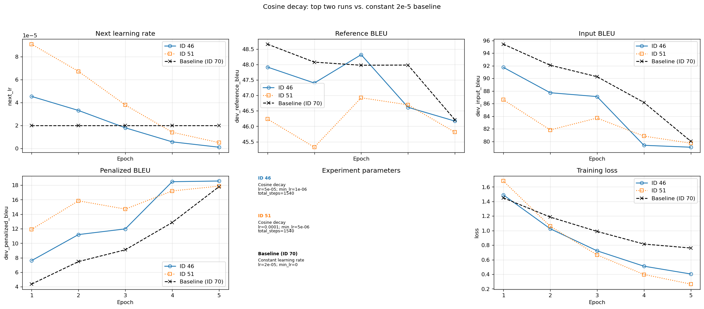

##### Observations

These are the first scheduled runs to improve somewhat over the baseline on `penalized_bleu`. Their average learning rate is approximately `2e-5`, which may explain why their behavior remains similar to the constant `2e-5` baseline.

#### Linear Decay

Source: [run_5epoch_results.csv](paraphrase_generation/run_5epoch_results.csv), filtered to `Linear decay`. Sorted by descending `penalized_bleu` (ties by ascending ID). BLEU scores are rounded to four decimal places.

|     ID |     LR | Min LR | Total updates | `reference_bleu` | `input_bleu` | `penalized_bleu` |
| -----: | -----: | -----: | ------------: | ---------------: | -----------: | ---------------: |
| **38** | _1e-4_ | _2e-6_ |        _1540_ |        _34.8555_ |    _64.0708_ |        _24.0833_ |
|     39 |   1e-4 |   5e-6 |          1540 |          46.2525 |      79.3179 |          18.3962 |
|     34 |   5e-5 |   1e-6 |          1540 |          46.4726 |      81.7165 |          16.3400 |
|     37 |   1e-4 |   1e-6 |          1540 |          46.3186 |      81.8649 |          16.1537 |
| **33** | _2e-5_ | _5e-6_ |        _1540_ |        _47.6035_ |    _82.7402_ |        _15.8005_ |
|     35 |   5e-5 |   2e-6 |          1540 |          46.6066 |      84.8960 |          13.5374 |
|     32 |   2e-5 |   2e-6 |          1540 |          47.4143 |      85.3911 |          13.3206 |
|     30 |   1e-5 |   5e-6 |          1540 |          48.2923 |      87.5470 |          11.5651 |
|     36 |   5e-5 |   5e-6 |          1540 |          47.6811 |      87.6650 |          11.3105 |
|     31 |   2e-5 |   1e-6 |          1540 |          48.1090 |      88.4786 |          10.6593 |
|     28 |   1e-5 |   1e-6 |          1540 |          48.8003 |      91.3644 |           8.1042 |
|     29 |   1e-5 |   2e-6 |          1540 |          48.4397 |      91.3266 |           8.0796 |

**Training dynamics.** IDs 38 and 33 are compared with the ID 70 baseline.

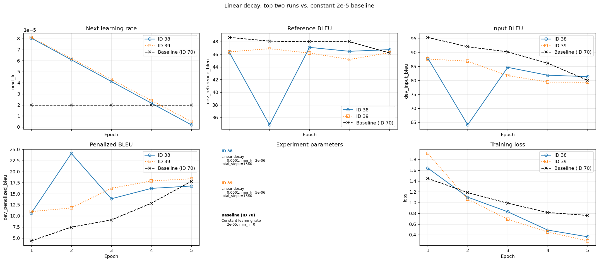

##### Observations

1. Model 38 achieved its peak `penalized_bleu` after epoch 2 because it had the lowest `input_bleu`, despite its poor `reference_bleu`. We therefore consider it an outlier.
2. Model 33 outperformed the baseline on `reference_bleu`, although its `input_bleu` was slightly worse.

#### Inverse-Square-Root Decay

Source: [run_5epoch_results.csv](paraphrase_generation/run_5epoch_results.csv), filtered to `Inverse square root`. Sorted by descending `penalized_bleu` (ties by ascending ID). BLEU scores are rounded to four decimal places.

|     ID |     LR | Min LR | Total updates | Warmup updates | `reference_bleu` | `input_bleu` | `penalized_bleu` |
| -----: | -----: | -----: | ------------: | -------------: | ---------------: | -----------: | ---------------: |
| **54** | _2e-5_ | _5e-6_ |        _1540_ |            _0_ |        _39.4848_ |    _75.2960_ |        _18.7583_ |
| **63** | _1e-4_ | _5e-6_ |        _1540_ |            _2_ |        _48.4320_ |    _92.5608_ |         _6.9287_ |
|     61 |   1e-4 |   2e-6 |          1540 |              2 |          48.6123 |      92.7174 |           6.8082 |
|     58 |   5e-5 |   5e-6 |          1540 |              0 |          48.4654 |      93.2922 |           6.2518 |
|     62 |   1e-4 |   5e-6 |          1540 |              0 |          48.6915 |      93.4709 |           6.1137 |
|     60 |   1e-4 |   2e-6 |          1540 |              0 |          48.5754 |      94.5559 |           5.0855 |
|     57 |   5e-5 |   2e-6 |          1540 |              2 |          48.6221 |      94.5981 |           5.0510 |
|     59 |   5e-5 |   5e-6 |          1540 |              2 |          48.1402 |      94.6291 |           4.9722 |
|     55 |   2e-5 |   5e-6 |          1540 |              2 |          48.3614 |      95.5488 |           4.1397 |
|     56 |   5e-5 |   2e-6 |          1540 |              0 |          48.6748 |      95.9534 |           3.7878 |
|     52 |   2e-5 |   2e-6 |          1540 |              0 |          48.7384 |      97.0412 |           2.7732 |
|     53 |   2e-5 |   2e-6 |          1540 |              2 |          48.9237 |      97.8553 |           2.0178 |

**Training dynamics.** IDs 54 and 63 are compared with the ID 70 baseline.


##### Observations

The inverse-square-root learning rates decreased very quickly, making these runs behave similarly to low constant-learning-rate runs.

#### Metric-Dependent Decay

Source: [run_5epoch_results.csv](paraphrase_generation/run_5epoch_results.csv), filtered to `Metric dependent`. Sorted by descending `penalized_bleu` (ties by ascending ID). BLEU scores are rounded to four decimal places.

|     ID |     LR | Min LR | Factor (CSV gamma) | Patience | Threshold | `reference_bleu` | `input_bleu` | `penalized_bleu` |
| -----: | -----: | -----: | -----------------: | -------: | --------: | ---------------: | -----------: | ---------------: |
| **91** | _9e-5_ |    _0_ |              _0.1_ |      _1_ |       _3_ |        _42.6154_ |    _73.2415_ |        _21.9293_ |
|     95 |   9e-5 |      0 |                0.2 |        1 |         3 |          42.6154 |      73.2415 |          21.9293 |
|     99 |   9e-5 |      0 |                0.5 |        1 |         3 |          42.6154 |      73.2415 |          21.9293 |
| **97** | _9e-5_ |    _0_ |              _0.5_ |      _0_ |       _3_ |        _44.9549_ |    _76.4521_ |        _20.3576_ |
|     98 |   9e-5 |      0 |                0.5 |        0 |         4 |          44.9549 |      76.4521 |          20.3576 |
|    100 |   9e-5 |      0 |                0.5 |        1 |         4 |          44.3306 |      76.1777 |          20.3088 |
|     96 |   9e-5 |      0 |                0.2 |        1 |         4 |          44.8140 |      77.1246 |          19.7142 |
|     92 |   9e-5 |      0 |                0.1 |        1 |         4 |          45.2885 |      77.6968 |          19.4246 |
|     79 |   2e-5 |      0 |                0.1 |        1 |         3 |          46.2204 |      79.9772 |          17.7973 |
|     80 |   2e-5 |      0 |                0.1 |        1 |         4 |          46.2204 |      79.9772 |          17.7973 |
|     83 |   2e-5 |      0 |                0.2 |        1 |         3 |          46.2204 |      79.9772 |          17.7973 |
|     84 |   2e-5 |      0 |                0.2 |        1 |         4 |          46.2204 |      79.9772 |          17.7973 |
|     87 |   2e-5 |      0 |                0.5 |        1 |         3 |          46.2204 |      79.9772 |          17.7973 |
|     88 |   2e-5 |      0 |                0.5 |        1 |         4 |          46.2204 |      79.9772 |          17.7973 |
|     93 |   9e-5 |      0 |                0.2 |        0 |         3 |          45.6294 |      80.8587 |          16.7963 |
|     94 |   9e-5 |      0 |                0.2 |        0 |         4 |          45.6294 |      80.8587 |          16.7963 |
|     85 |   2e-5 |      0 |                0.5 |        0 |         3 |          46.2492 |      81.6392 |          16.3302 |
|     89 |   9e-5 |      0 |                0.1 |        0 |         3 |          44.8785 |      82.0905 |          15.4568 |
|     90 |   9e-5 |      0 |                0.1 |        0 |         4 |          44.8785 |      82.0905 |          15.4568 |
|     81 |   2e-5 |      0 |                0.2 |        0 |         3 |          47.2718 |      83.8035 |          14.7238 |
|     77 |   2e-5 |      0 |                0.1 |        0 |         3 |          47.9883 |      86.8995 |          12.0898 |
|     86 |   2e-5 |      0 |                0.5 |        0 |         4 |          47.9820 |      88.3039 |          10.7923 |
|     82 |   2e-5 |      0 |                0.2 |        0 |         4 |          48.3951 |      90.1885 |           9.1313 |
|     78 |   2e-5 |      0 |                0.1 |        0 |         4 |          48.6880 |      91.7971 |           7.6805 |

**Training dynamics.** IDs 91 and 97 are compared with the ID 70 baseline.


##### Observations

1. Models 95 and 99 have identical results because their threshold and patience settings prevented the learning rate from changing substantially.
2. Some models, such as IDs 79 and 80, match the baseline because their patience and threshold settings leave the learning rate effectively unchanged.
3. These runs further illustrate the trade-off between `reference_bleu` and `penalized_bleu`.

# Results

## Quora Question Pairs (QQP)

### Model Variant Comparison

| Stage | Model variant | Pair representation | Head | Dropout | Epoch budget | Early stopping | Best QQP dev accuracy |
| --- | --- | --- | --- | ---: | ---: | --- | ---: |
| Course reference/baseline | Default setup with simple task head | $[u, v]$ | Linear | — | — | — | approx. 0.765 |
| Earlier local baseline | Original pair representation | $[u, v]$ | Linear | 0.3 | 3 | No | 0.785 |
| Improvement 1 | Sentence-pair interaction features | $[u, v, \lvert u-v \rvert, u \odot v]$ | Linear | 0.3 | 3 | No | 0.850 |
| Improvement 2 | Same pair features with MLP head | $[u, v, \lvert u-v \rvert, u \odot v]$ | MLP | 0.3 | 3 | No | 0.849 |
| Improvement 2 (altered training) | Same pair features and MLP head with lower dropout and longer training | $[u, v, \lvert u-v \rvert, u \odot v]$ | MLP | 0.1 | 7 | Yes, patience 2 | **0.868** |

The first improvement, sentence-pair interaction features with a linear head, improved development accuracy to **0.850**. This shows that explicitly encoding dimension-wise difference and overlap was beneficial compared to the original $[u, v]$ representation.

The second improvement, replacing the linear head with an MLP head while keeping dropout at `0.3` and training for 3 epochs, reached **0.849**. This did not improve over the simpler linear-head pair-feature model.

The final configuration kept the same pair features and the same MLP head, but reduced dropout to `0.1` and trained for up to 7 epochs with development-based checkpoint selection. This reached the best observed QQP development accuracy of **0.868**.

This comparison does **not** isolate dropout alone because the stronger run also used a longer epoch budget and optional early stopping. It should therefore be interpreted as a combined training-configuration improvement rather than as a complete dropout hyperparameter optimization.

### Best Run: Epoch-Level Results

The strongest model used sentence-pair interaction features, an MLP head, `hidden_dropout_prob = 0.1`, and a maximum of 7 epochs with early stopping enabled.

| Epoch | Train loss | Train accuracy | Dev accuracy | Checkpoint status |
| ---: | ---: | ---: | ---: | --- |
| 1 | 0.440 | 0.864 | 0.830 | Saved |
| 2 | 0.305 | 0.927 | 0.857 | Saved |
| 3 | 0.218 | 0.954 | 0.858 | Saved |
| 4 | 0.153 | 0.972 | 0.858 | Saved |
| 5 | 0.110 | 0.986 | 0.865 | Saved |
| 6 | 0.083 | 0.991 | **0.868** | Saved, best checkpoint |
| 7 | 0.066 | 0.993 | 0.866 | Not selected |

The development accuracy peaked at epoch 6. In epoch 7, the training loss continued to decrease from `0.083` to `0.066`, and training accuracy increased from `0.991` to `0.993`, but development accuracy dropped from `0.868` to `0.866`. This indicates mild overfitting after epoch 6. The selected final model is therefore the best development checkpoint rather than the final epoch checkpoint.

### QQP Discussion

#### Research Question 1

**Does adding explicit sentence-pair interaction features improve QQP development accuracy compared to the original BERT-based pair representation $[u, v]$?**

Yes. The pair-feature linear-head model reached **0.850** development accuracy, compared to approximately **0.765** for the course/default reference and **0.785** in our earlier local baseline run with the original $[u, v]$ representation. This supports the hypothesis that explicit difference and overlap features are useful for QQP paraphrase detection.

#### Research Question 2

**Does a non-linear MLP classification head improve QQP development accuracy compared to a linear classification head on the same sentence-pair interaction representation?**

Not by itself. With the same pair representation, dropout `0.3`, and 3 training epochs, the MLP head reached **0.849**, while the linear head reached **0.850**. This suggests that simply adding a more expressive head is not automatically beneficial under the original training configuration.

#### Research Question 3

**Does lowering dropout from `0.3` to `0.1` and increasing the epoch budget to 7, combined with best-checkpoint selection and optional early stopping, improve QQP development accuracy for the MLP head?**

Yes, in our experiment. The MLP model with dropout `0.1` and a 7-epoch budget reached **0.868** development accuracy, improving over both the MLP run with dropout `0.3` and the linear-head pair-feature run. However, because dropout, epoch budget, and early stopping were changed together, this result should be interpreted as a successful combined training configuration, not as a fully isolated proof that `0.1` is the optimal dropout value.

### QQP Limitations

The comparison between the 3-epoch runs and the final 7-epoch run is limited because the shorter runs had not clearly converged. Both the pair-feature linear-head model and the MLP model with dropout `0.3` were still improving at epoch 3. Therefore, the final improvement to **0.868** cannot be attributed only to the lower dropout value or the MLP head. It may also partly result from the longer epoch budget. A stricter comparison would train all model variants with the same maximum epoch budget and the same early-stopping/checkpoint-selection protocol.

The value `hidden_dropout_prob = 0.1` was not selected through a full hyperparameter sweep. We only compared the default value `0.3` with one lower value, `0.1`. Therefore, the final setting should be interpreted as a targeted improvement rather than as an optimized hyperparameter choice.

The final comparison changes multiple factors at once: dropout is reduced, the epoch budget is increased, and early stopping is enabled. This means the improvement cannot be attributed to dropout alone.

All reported QQP experiments use the same random seed, `11711`. We therefore did not measure run-to-run variance across multiple random initializations and data orders.

The development set was used to compare model variants and training configurations. Therefore, the development accuracy should be interpreted as a model-selection metric, not as an independent estimate of final test performance.

We did not perform a complete dropout sweep over values such as `0.01`, `0.05`, `0.15`, or `0.2`. Such a sweep would be necessary to make a stronger claim about the optimal dropout value for this MLP head.

### QQP Conclusion

The results support the usefulness of explicit sentence-pair interaction features for QQP paraphrase detection. The original pair representation $[u, v]$ gives the classifier access to both question embeddings, but leaves the actual comparison mostly implicit. Adding $\lvert u-v \rvert$ and $u \odot v$ makes dimension-wise difference and overlap information directly available to the classifier.

The strongest single architectural improvement was the sentence-pair interaction representation. It improved the development accuracy to **0.850** while still using a linear head. This indicates that the representation itself already provides a much more useful input for the classifier.

The MLP head did not improve performance under the original dropout and epoch settings. The run with dropout `0.3` and 3 epochs reached **0.849**, slightly below the linear-head pair-feature model. This suggests that a more expressive classifier head alone is not sufficient and may require a better-matched training configuration.

The best result was achieved by keeping the MLP head but lowering dropout to `0.1` and training for up to 7 epochs. The training curve shows that the model continued to fit the training data throughout all epochs, while development accuracy peaked at epoch 6. This supports using development-based checkpoint selection.

Early stopping was added mainly as a practical compute-saving mechanism. Since the code already saves the best checkpoint based on development accuracy, early stopping does not fundamentally change which checkpoint is selected if all epochs are completed. Its main purpose is to stop future runs earlier when development accuracy no longer improves, avoiding unnecessary use of HPC (High Performance Cluster) compute budget.

For QQP, we select the model with sentence-pair interaction features, MLP head, `hidden_dropout_prob = 0.1`, and best-checkpoint selection over a 7-epoch budget to be included in our main branch that is to be submitted since it achieved the best development accuracy among our tested QQP variants.


## Stanford Sentiment Treebank (SST)

| Model variant | Development accuracy |
| --- | ---: |
| Part 1 baseline | 0.519 |
| Optimized learning rate and batch size | 0.523 |
| Multi-layer ReLU classifier | 0.523 |
| Multi-layer GELU classifier | **0.528** |
| Expressive pooling | 0.525 |
| Label smoothing (`0.01`) | 0.516 |
| Weight decay (`0.05`) | 0.517 |
| Warmup ratio (`0.1`) | **0.528** |

The selected SST model uses the multi-layer GELU classifier and reaches 0.528 development accuracy. Warmup does not increase the peak score, but it is retained for its more stable training curve. Expressive pooling, label smoothing, weight decay, and the inconclusive AllNLI implementation are not included in the final model.

## Semantic Textual Similarity (STS)

All reported values are development-set Pearson correlations shown to three decimal places.

### All runs

Every configuration evaluated, in experiment order. Sweeps are broken out one row per
setting rather than collapsed into ranges. Rows marked with a dagger are reference points
shared with an adjacent experiment and were not rerun.

| Exp | Configuration | Dev r |
| --- | --- | --- |
| — | Part 1 baseline: `[CLS]` pooler + concat + MSE | 0.379 |
| 1 | Mean pooling, concat head retained | 0.366 |
| 2 | Mean pooling + cosine head | 0.659 |
| 3 | Max pooling + cosine head | 0.463 |
| 4 | + cosine embedding loss (w = 0.5) | 0.677 |
| 5 | + MNRL (τ = 0.05, w = 0.5) | 0.804 |
| 6a | MNRL w = 0.3 | 0.794 |
| 6b | MNRL w = 1.0 | 0.798 |
| 6c | MNRL w = 2.0 | 0.782 |
| 7a | SimCSE unsupervised (w = 0.5) | 0.711 |
| 7b | SimCSE unsupervised (w = 0.1) | 0.696 |
| 7c | SimCSE only, no supervision | 0.651 |
| 8 | NLI pretraining — invalid, trained without NLI data | 0.689 |
| 8a | SNLI triplet pretraining, seed 11711 | 0.847 |
| 8b | SNLI triplet pretraining, seed 42 | 0.851 |
| 8c | SNLI triplet pretraining, seed 7 | 0.848 |
| 9a | MNRL τ = 0.01 | 0.746 |
| 9b | MNRL τ = 0.10 | 0.801 |
| 10 | Batch size 128 | 0.803 |
| 11 | LR warmup 10% + cosine decay | 0.803 |
| 12 | TF-IDF hard negatives mined from STS train | 0.834 |
| 13a | CoSENT (τ = 0.05, w = 1.0) | 0.490 |
| 13b | CoSENT (τ = 0.5, w = 0.1, MNRL off) | 0.660 |
| 13c | CoSENT (τ = 0.5, w = 0.1, MNRL on) | 0.800 |
| 14a | AnglE (w = 1.0) | 0.834 |
| 14b | AnglE (w = 0.1) | 0.830 |
| 15a | SMART (w = 10) | 0.833 |
| 15b | SMART (w = 100) | 0.832 |
| 16 | Cross-attention interaction layer | 0.828 |
| 19 | + symmetry augmentation | 0.831 |
| 20 | + warmup + gradient clipping (15 epochs) | 0.829 |
| 21 | + symmetry + warmup + clipping | 0.829 |
| 22† | Unregularised reference (= Exp 19) | 0.831 |
| 22a | Weight decay λ = 0.01 | 0.830 |
| 22b | Weight decay λ = 0.1 | 0.829 |
| 22c | Cross-attention dropout 0.3 | 0.829 |
| 22d | Weight decay λ = 0.01 + dropout 0.3 | 0.829 |
| 22e | Weight decay λ = 20 | 0.823 |
| 23 | PAWS hard-negative pretraining | 0.835 |
| 24† | Stock minBERT reference (= Exp 19) | 0.831 |
| 24a | Quora MNRL pretraining, 1 epoch | 0.840 |
| 24b | Quora MNRL pretraining, 2 epochs | 0.840 |
| 25a | QQP encoder initialisation | 0.830 |
| 25b | QQP encoder + Quora pretraining | 0.832 |
| 26a | Quora pretraining, seed 42 | 0.836 |
| 26b | Quora pretraining, seed 7 | 0.837 |

Two groups of rows are not training runs of their own. The daggered rows are reference
scores carried over from Exp 19. The whitening results below are transformations applied
to embeddings from a saved checkpoint, with the 0.830 of Exp 25a as their reference point.

| Configuration | Dev r |
| --- | --- |
| Whitening to 768 dimensions | 0.815 |
| Whitening to 384 dimensions | 0.829 |
| Whitening to 256 dimensions | 0.832 |
| Whitening to 128 dimensions | 0.835 |
| Whitening to 64 dimensions | 0.827 |

### Improvement progression

| Configuration | Pearson r |
| --- | --- |
| Baseline (`[CLS]` pooler + concat + MSE) | 0.379 |
| Improvement 1 — cosine head + mean pooling | 0.659 |
| Improvement 2 — + cosine embedding loss | 0.677 |
| Improvement 3 — + MNRL contrastive loss | 0.804 |
| Improvement 4 — + cross-attention layer | 0.828 |
| Improvement 5 — + symmetry augmentation | 0.831 |
| Improvement 6 — + teammate encoder init | 0.830 |
| **Improvement 7 — + SNLI triplet pretraining** | **0.849** |

Final dev Pearson r is 0.849, the mean of three seeds (0.847 / 0.851 / 0.848), an increase
of 0.470 over the Part 1 baseline.

Improvements 5 and 6 are inside the noise floor and are retained for the reasons given in
Experiments §4 and §5, not for their scores.

### Techniques retained

| Technique | Dev r |
| --- | --- |
| Cosine similarity head + mean pooling | 0.659 |
| Cosine embedding loss | 0.677 |
| MNRL contrastive (τ = 0.05, w = 0.5) | 0.804 |
| Cross-attention interaction layer | 0.828 |
| STS symmetry augmentation | 0.831 |
| Teammate QQP encoder initialisation | 0.830 |
| SNLI triplet pretraining | 0.849 |

Retained does not mean each of these improved dev r. Symmetry augmentation is kept for
convergence speed and the teammate encoder initialisation only so the reported run
reproduces exactly; both sit inside the noise floor on score. Four of the seven — the
cosine head, MNRL, cross-attention and SNLI pretraining — account for 0.450 of the 0.470
total improvement.

### Techniques evaluated and discarded

| Technique | Dev r |
| --- | --- |
| Part 1 baseline | 0.379 |
| Mean pooling, concat head kept | 0.366 |
| Max pooling (ablation) | 0.463 |
| MNRL weight sweep {0.3, 1.0, 2.0} | ≤ 0.798 |
| SimCSE unsupervised | 0.651–0.711 |
| MNRL τ sweep {0.01, 0.10} | 0.746 / 0.801 |
| Batch size 128 | 0.803 |
| LR warmup + cosine decay | 0.803 |
| CoSENT ranking loss | 0.490 / 0.800 |
| Warmup + gradient clipping | 0.829 |
| Weight decay {0.01, 0.1, 20} | 0.823–0.830 |
| Cross-attention dropout 0.3 | 0.829 |
| Quora MNRL pretraining (superseded by SNLI) | 0.838 |
| TF-IDF mined hard negatives | 0.834 |
| PAWS hard negatives | 0.835 |
| AnglE loss | 0.830 / 0.834 |
| SMART adversarial smoothness | 0.832 / 0.833 |
| Whitening post-processing | 0.815–0.835 |

Seventeen of the twenty-four techniques evaluated were discarded.

### Discussion of results

Three patterns hold across the 43 runs.

**Architecture and data moved the metric; losses and regularisation did not.** Of the four
techniques carrying the gain, two change what gets encoded (cosine head, cross-attention)
and two change what data the encoder sees (MNRL over real pairs, NLI pretraining). Ten
loss-function variants and five regularisation settings produced nothing outside the noise
floor. Once the model saturates a 5,719-pair dataset, reweighting the objective cannot add
information that is not present.

**The bi-encoder ceiling was structural, not a tuning problem.** Nine consecutive
experiments plateaued at 0.800–0.804 while varying temperature, batch size, LR schedule
and three different loss formulations. All shared the property that each sentence was
encoded independently, and the plateau broke only when that assumption changed.

**Small datasets defeat regularisation.** A train/dev gap of 0.978 against 0.831 reads as
overfitting, but no penalty setting improved dev r, while adding 149,145 external triplets
improved it by 0.019. The gap indicated a data shortage rather than an over-flexible
model.


## Paraphrase Type Detection (PTD)

All values in this **Paraphrase Type Detection (PTD)** section are historical preliminary results because the development examples were still present in the training data when these runs were made. The current code removes that overlap. Metric values are reported to three decimal places, and these preliminary values should not be interpreted as clean held-out performance.

### Model Variant Comparison

| Paraphrase Type Detection (PTD) | Comparison point | Development accuracy | Development MCC |
| --- | --- | ---: | ---: |
| Unweighted BCE | Accuracy-selected checkpoint (25-epoch run) | 1.000 | 0.962 |
| Aggressive Weighted BCE | Accuracy-selected checkpoint (25-epoch run) | 0.979 | 0.896 |
| Square-root Weighted BCE | Accuracy-selected checkpoint (25-epoch run) | 0.999 | 0.956 |
| Logarithmic Weighted BCE | Accuracy-selected checkpoint (25-epoch run) | 0.995 | 0.933 |
| Capped Weighted BCE (cap=20) | Accuracy-selected checkpoint (25-epoch run) | 0.988 | 0.920 |
| Focal $\gamma=0.87$ | Fixed epoch 25 (confirmatory run) | 1.000 | 0.960 |
| Focal $\gamma=1.1$ | Fixed epoch 25 (confirmatory run) | 1.000 | 0.961 |
| Focal $\gamma=1.15$ | Fixed epoch 25 (confirmatory run) | 1.000 | 0.961 |
| Focal $\gamma=1.25$ | Fixed epoch 25 (confirmatory run) | 0.999 | 0.959 |

### Experiment 1 Results: Aggressive Weighted BCE

#### Accuracy-Selected Checkpoints

| Model | Development accuracy | Development MCC |
| --- | ---: | ---: |
| Unweighted BCE | **1.000** | **0.962** |
| Aggressive Weighted BCE | 0.979 | 0.896 |

#### Selected Epochs

| Epoch | Unweighted BCE accuracy | Unweighted BCE MCC | Aggressive Weighted BCE accuracy | Aggressive Weighted BCE MCC |
| ---: | ---: | ---: | ---: | ---: |
| 1 | 0.910 | 0.037 | 0.556 | 0.046 |
| 5 | 0.956 | 0.461 | 0.708 | 0.219 |
| 10 | 0.994 | 0.832 | 0.879 | 0.584 |
| 15 | 0.999 | 0.959 | 0.947 | 0.790 |
| 20 | 1.000 | 0.960 | 0.975 | 0.890 |
| 25 | 0.999 | 0.959 | 0.974 | 0.893 |

Thus, aggressive Weighted BCE did not improve either reported metric. It eventually approached the baseline, but the unweighted objective remained stronger by 0.021 accuracy points and 0.066 MCC points.

#### Aggressive Weighted BCE Discussion

The weights range from 0.007 to 909.000, which is too extreme for naive inverse-frequency reweighting to be stable. For label 9, one positive loss term is multiplied by 909, but this estimate is based on only three positive examples. Labels 10, 15, and 13 are similarly unreliable: 8, 13, and 28 positive examples yield weights of 340.2500, 209.0000, and 96.5000, respectively. The ETPC dataset contains genuinely rare paraphrase types, so estimates and evaluation scores for these labels are inherently noisy.

Weighted BCE also changes the effective decision boundary. If $p$ is the unweighted posterior probability and $q$ is the probability learned under the weighted objective, the optimum satisfies

$$
q = \frac{w p}{w p + (1-p)}.
$$

Using the unchanged prediction rule $q > 0.5$ is therefore equivalent to

$$
p > \frac{1}{1+w}.
$$

For label 9, $w=909$, so an unweighted posterior as small as $1/910 \approx 0.0011$ is sufficient to predict the label as positive. In contrast, label 29 has $w=0.007$, so its posterior must exceed $1/1.007 \approx 0.993$ to be predicted as positive. Thus, raw weighting strongly encourages additional positive predictions for rare labels and strongly suppresses positive predictions for very frequent labels. With a fixed 0.5 threshold, this likely introduces many false positives for rare types; per-label precision and recall would be needed to confirm the error distribution.

For this reason, the weighted objective did not improve on unweighted BCE in our experiment. Its training loss must not be compared numerically with the BCE loss because the positive terms are rescaled; for example, a Weighted BCE loss of 0.0603 is not directly comparable to a BCE loss of 0.0073.

### Experiment 2 Results: Smoothed Weighted BCE

#### Accuracy-Selected Checkpoints

| Model | Development accuracy | Development MCC |
| --- | ---: | ---: |
| Unweighted BCE (reference) | **1.000** | **0.962** |
| Square-Root Weighted BCE | 0.999 | 0.956 |
| Logarithmic Weighted BCE | 0.995 | 0.933 |
| Capped Weighted BCE (cap=20) | 0.988 | 0.920 |

#### Selected Epochs

| Epoch | Baseline accuracy | Square-root accuracy | Logarithmic accuracy | Capped accuracy | Baseline MCC | Square-root MCC | Logarithmic MCC | Capped MCC |
| ---: | ---: | ---: | ---: | ---: | ---: | ---: | ---: | ---: |
| 1 | **0.910** | 0.907 | 0.873 | 0.654 | 0.037 | 0.043 | 0.047 | **0.100** |
| 5 | **0.956** | 0.944 | 0.935 | 0.873 | 0.461 | 0.685 | **0.745** | 0.577 |
| 10 | **0.994** | 0.987 | 0.977 | 0.963 | 0.832 | **0.906** | 0.880 | 0.825 |
| 15 | **0.999** | 0.993 | 0.982 | 0.974 | **0.959** | 0.936 | 0.907 | 0.891 |
| 20 | **1.000** | 0.998 | 0.991 | 0.980 | **0.960** | 0.954 | 0.923 | 0.908 |
| 25 | **0.999** | 0.997 | 0.995 | 0.984 | **0.959** | 0.945 | 0.933 | 0.914 |

Square-root weighting is the strongest smoothed variant, reaching 0.999 development accuracy and 0.956 MCC. It is much closer to the unweighted baseline than the aggressive Weighted BCE run (0.979 accuracy and 0.896 MCC), but it still does not improve on the baseline.

#### Smoothed Weighted BCE Discussion

The results illustrate the expected trade-off of label balancing: compared with unweighted BCE, the smoothed objectives generally sacrifice some accuracy in exchange for higher MCC during the early stages of training. MCC is useful supplementary evidence here because it captures minority-label decisions more informatively than accuracy alone.

During the first 10 epochs, all three smoothing techniques exceed the reused BCE reference in MCC and learn substantially faster than the aggressive objective. With additional training, unweighted BCE catches up and slightly surpasses the smoothed variants at their accuracy-selected checkpoints. The smoothed methods therefore do not improve final development performance over BCE in this preliminary run, although all three outperform aggressive weighting in both reported metrics. These findings must be retested on the corrected non-overlapping split.

### Experiment 3 Results: Focal Loss

#### Exploratory Sweep at Epoch 5

At original precision, $\gamma=1.15$ and $\gamma=1.25$ have the highest development accuracy (0.9577), while $\gamma=0.87$ has the highest MCC (0.5085). Relative to the separately run BCE reference, $\gamma=0.87$ changes accuracy from 0.9560 to 0.9563 and MCC from 0.4610 to 0.5085. Larger values, especially $\gamma=4$, substantially reduce both metrics. The unusually weak $\gamma=0.75$ run is retained rather than discarded; repeated clean-split runs are needed to determine whether it reflects variance or systematic optimization behavior.

| Focal-loss gamma | Development accuracy | Development MCC |
| ---: | ---: | ---: |
| Unweighted BCE reference ($\gamma=0$ equivalence; separate run) | 0.956 | 0.461 |
| 0.25 | 0.951 | 0.420 |
| 0.5 | 0.951 | 0.437 |
| 0.62 | 0.939 | 0.357 |
| 0.75 | 0.911 | 0.038 |
| 0.8 | 0.945 | 0.391 |
| **0.87** | 0.956 | **0.509** |
| 0.9 | 0.950 | 0.452 |
| 0.95 | 0.953 | 0.438 |
| 1 | 0.957 | 0.461 |
| 1.05 | 0.956 | 0.461 |
| **1.1** | **0.958** | 0.467 |
| **1.15** | **0.958** | 0.480 |
| **1.25** | **0.958** | 0.499 |
| 1.5 | 0.954 | 0.449 |
| 2 | 0.946 | 0.413 |
| 4 | 0.923 | 0.183 |

#### Confirmatory Run over 25 Epochs

The raw logs and checkpoints are no longer available. The retained values in `paraphrase_detection/plotter.py` are rounded to three decimals; selected epochs and smaller differences cannot be reconstructed at higher precision. The fixed-epoch values relevant to the temporal claim are:

| Model | Epoch 8 accuracy | Epoch 8 MCC | Epoch 9 accuracy | Epoch 9 MCC | Epoch 25 accuracy | Epoch 25 MCC |
| --- | ---: | ---: | ---: | ---: | ---: | ---: |
| Unweighted BCE | 0.987 | 0.732 | 0.989 | 0.744 | 0.999 | 0.959 |
| Focal $\gamma=0.87$ | 0.991 | 0.870 | **0.996** | 0.931 | **1.000** | 0.960 |
| Focal $\gamma=1.1$ | **0.992** | 0.894 | 0.995 | **0.932** | **1.000** | **0.961** |
| Focal $\gamma=1.15$ | **0.992** | **0.900** | 0.993 | 0.917 | **1.000** | **0.961** |
| Focal $\gamma=1.25$ | 0.991 | 0.885 | 0.994 | 0.918 | 0.999 | 0.959 |

At epochs 8 and 9, every focal variant exceeds the BCE reference in both stored metrics. No single gamma consistently dominates: $\gamma=1.15$ has the highest focal MCC at epoch 8, $\gamma=1.1$ has the highest MCC at epoch 9, and $\gamma=0.87$ has the highest epoch-9 accuracy. By epoch 25, the differences have mostly disappeared. Across all 25 stored epochs, BCE and every confirmatory focal run reach a rounded maximum accuracy of 1.000 and a rounded maximum MCC of 0.962. These overlapping-data observations motivate a clean-split convergence study but do not establish generalization.

#### Focal Loss Discussion

Focal loss stays much closer to the unweighted BCE baseline than Weighted BCE because it applies a smooth, confidence-dependent weight to each example-label decision. Weighted BCE assigns a fixed weight to every positive instance of a label, regardless of whether that instance is easy or difficult; for very rare labels, this can strongly alter the optimization trajectory and effective decision boundary. Focal loss instead gradually reduces an example's contribution as the model becomes confident. It is directly connected to the baseline: when $\gamma=0$, it is exactly BCE, while moderate values modify the objective without introducing extreme class-level weights.

The preliminary differences are primarily **temporal**, not evidence of a better final optimum. At a fixed early epoch, focal loss follows a different optimization path and reaches higher scores in the retained curves; with additional training, BCE catches up. Faster convergence would be practically valuable under a fixed compute budget or early stopping. However, because the development examples also occurred in training for these historical runs, the curves may partly measure how quickly each loss memorized repeated examples rather than how quickly it generalized. A clean-split rerun is necessary before attributing the higher early MCC to earlier learning of difficult or minority-label decisions.

Moderate focusing parameters are the most promising candidates for that rerun, while $\gamma=4$ suppresses easy decisions too aggressively in the preliminary sweep. The corrected experiment should predeclare a selection rule and compare epochs-to-target as well as fixed-epoch accuracy and MCC.


### PTD Model Selection

$\gamma=0.87$ is a promising focal-loss candidate because it had the strongest exploratory MCC and the highest retained epoch-9 accuracy. However, no focal setting consistently dominated across epochs or metrics. A final flagship model should be selected only after a clean-split rerun with a predeclared selection criterion.

### PTD Limitations and Threats to Validity

- **Historical train/development overlap:** The displayed results and archived class weights were produced from the unfiltered 2,730-row training data, which still contained the development examples. The current code filters this overlap, so the historical values are not clean held-out estimates and are not expected to be reproduced exactly by current reruns.
- **Single-seed evidence:** All reported values use seed 11711, so run-to-run variance is unknown.
- **Development-set hyperparameter search:** Many gamma values were screened on the same development data used for reporting. Final claims should separate exploratory selection from a predeclared confirmatory comparison where possible.
- **Rare-label uncertainty:** Several labels have fewer than 30 positive training examples. Their weights and per-label metrics are inherently noisy.

## Paraphrase Type Generation (PTG)

The compact Paraphrase Type Generation summary below reports representative selected runs with exactly three decimal places. The rationale column distinguishes the valid baseline, scheduler representatives, and the deliberately selected flagship.

| Paraphrase Type Generation (PTG) selection | `reference_bleu` | `input_bleu` | `penalized_bleu` | Selection rationale |
| --- | ---: | ---: | ---: | --- |
| Baseline constant (ID 70) | 46.220 | 79.977 | 17.797 | Valid leakage-corrected baseline |
| Tuned constant (ID 74) | 42.615 | 73.242 | 21.929 | Highest `penalized_bleu` in the constant-rate grid |
| Step decay (ID 16) | 42.157 | 73.128 | 21.785 | Representative of the tied top step-decay runs |
| Cosine decay (ID 46) | 46.169 | 79.077 | 18.577 | Highest `penalized_bleu` in the cosine-decay grid |
| Linear decay / flagship (ID 33) | 47.604 | 82.740 | 15.801 | Selected flagship rather than outlier ID 38 |
| Inverse-square-root decay (ID 54) | 39.485 | 75.296 | 18.758 | Highest `penalized_bleu` in the inverse-square-root grid |
| Metric-dependent decay (ID 91) | 42.615 | 73.242 | 21.929 | Representative of the tied top metric-dependent runs |

### Flagship model

Two scheduler runs came closest to improving on the baseline while retaining competitive values across both tracked BLEU metrics:

|           ID |       LR |  Min LR | `reference_bleu` | `input_bleu` | `penalized_bleu` |
| -----------: | -------: | ------: | ---------------: | -----------: | ---------------: |
| **Baseline** | **2e-5** | **0.0** |      **46.2204** |  **79.9772** |      **17.7973** |
|       **46** |   _5e-5_ |  _1e-6_ |        _46.1692_ |    _79.0771_ |        _18.5768_ |
|       **33** |   _2e-5_ |  _5e-6_ |        _47.6035_ |    _82.7402_ |        _15.8005_ |

**We selected Model 33 as the flagship** because it improves `reference_bleu` substantially while keeping the increase in `input_bleu` comparatively limited.


### Overall discussion

Scheduler tuning did not produce a clear improvement across both tracked metrics. One likely reason is that five epochs provide limited time for a schedule to have a meaningful effect; a longer training budget could make annealing more consequential. However, the short budget alone does not explain why improvements in `penalized_bleu` often coincide with substantially worse `reference_bleu`.

#### Output Exploration

To examine this metric trade-off, consider the following output from entry 9 of `etpc_dev_dataset`.

**Input:**

> Peterson was arrested near Torrey Pines Golf Course in La Jolla on April 18, the day DNA testing identified the bodies.

**Reference:**

> Peterson, 30, was arrested in La Jolla April 18 after the two bodies were identified through DNA tests.

**Annotations:** [ETPC type definitions](https://github.com/venelink/ETPC/blob/master/Corpus/paraphrase_types.xml)

- `6`: contextual same-polarity substitution — equivalent wording in context.
- `11`: synthetic/analytic substitution — a compact expression versus a more explicit construction.
- `14`: diathesis alternation — changing grammatical voice or argument structure.
- `25`: addition/deletion — adding or removing material.
- `29`: identity — retaining wording unchanged.

**Model baseline:** (added word highlighted)

> Peterson was arrested near Torrey Pines Golf Course in La Jolla on April 18, the **same** day DNA testing identified the bodies.

**Model 33:**

> Peterson was arrested near Torrey Pines Golf Course in La Jolla on April 18, the **same** day DNA testing identified the bodies.

We can observe the following:

1. Both outputs closely copy the source: they add only “same” to the input.
2. The reference includes information absent from the source, such as Peterson’s age (“30”). That detail cannot be inferred from the supplied input alone. This explains why data leakage had a profound effect on both `reference_bleu` and `penalized_bleu`.

#### Conflicting metrics

Because the reference contains information that cannot be recovered from the input, the available metrics can encourage the model to copy the input rather than make unsupported changes.

This creates a metric pitfall: increasing `reference_bleu` often means copying the input. Slightly deviating from the input can reduce `reference_bleu`, but it may double or triple the `100 - input_bleu` component and thereby increase `penalized_bleu`.

A related limitation is discussed by Jin et al.,[^16] who note that, in text style transfer, “simply copying the input can result in high BLEU scores.” This supports the general concern that BLEU can reward copying, although it does not establish the specific changes in `penalized_bleu` described here.

# Hyperparameter Optimization

## Quora Question Pairs (QQP)

The value `hidden_dropout_prob = 0.1` was **not** selected by an exhaustive hyperparameter sweep. We compared the original default value `0.3` with one targeted lower value, `0.1`. We did not test additional values such as `0.01`, `0.05`, `0.15`, or `0.2`.

Therefore, this should be interpreted as a targeted training-configuration experiment rather than complete hyperparameter optimization. In addition, the lower-dropout run increased the epoch budget from 3 to 7 and enabled early stopping, so the observed improvement cannot be attributed to dropout alone. A stricter follow-up would compare dropout values under the same epoch budget, early-stopping protocol, and multiple random seeds.

## Stanford Sentiment Treebank (SST)

Hyperparameters were tuned sequentially to limit compute cost:

1. learning rate and batch size;
2. warmup ratio and weight decay;
3. classifier dropout and label smoothing.

The selected configuration is:

```sh
--lr 2e-5 \
--batch_size 16 \
--warmup_ratio 0.1 \
--weight_decay 0.0 \
--label_smoothing 0.0 \
--classifier_dropout 0.3
```

Warmup ratios 0 and 0.1 had similar peak accuracy; 0.1 was selected because it remained stronger across more epochs. Weight decay and label smoothing were set to zero because neither improved development accuracy.

## Semantic Textual Similarity (STS)

We did not run automated search (Ray Tune, Optuna). With runs at 6–19 minutes and a noise
floor of 0.004, a random search would mostly have sampled noise, and could not have
distinguished a real effect from a lucky seed without repeated runs per configuration.
Instead each hyperparameter was swept individually, with a stated hypothesis, on top of
the best configuration available at the time.

| Parameter | Values tried | Chosen | Result |
| --- | --- | --- | --- |
| Pooling | CLS, mean, max | mean | 0.379 / 0.659 / 0.463 |
| Similarity head | concat+linear, cosine | cosine | 0.379 / 0.659 |
| MNRL weight | 0.3, 0.5, 1.0, 2.0 | 0.5 | 0.794 / 0.804 / 0.798 / 0.782 |
| MNRL temperature τ | 0.01, 0.05, 0.10 | 0.05 | 0.746 / 0.804 / 0.801 |
| CoSENT temperature | 0.05, 0.5 | dropped | 0.490 / 0.800 |
| Batch size | 64, 128 | 64 | 0.804 / 0.803 |
| Hidden dropout | 0.1, 0.3 | 0.3 | see confound note below |
| Warmup ratio | 0.0, 0.1 | 0.0 | 0.804 / 0.803 |
| Weight decay λ | 0, 0.01, 0.1, 20 | 0 | 0.831 / 0.830 / 0.829 / 0.823 |
| Cross-attention heads | 8 | 8 | not swept |
| Cross-attention dropout | 0.1, 0.3 | 0.1 | 0.831 / 0.829 |
| Epochs | 4–15 | 4–5 | peak moved 9 → 4 → 3 as initialisation improved |
| SNLI pretrain epochs | 1, 2 | 1 | same result, two minutes cheaper |

Two findings from this sweep are worth more than the values themselves.

**Temperature is not a free parameter.** Both τ = 0.01 in MNRL and τ = 0.05 in CoSENT
produced catastrophic failures for the same underlying reason, an exponential term
overwhelming the rest of the loss. Sweeping τ blindly and reading only the final scores
would have recorded two bad methods instead of one numerical bug and one genuine
redundancy.

**A carried-over default silently confounded eight experiments.** We lowered dropout from
0.3 to 0.1 for the SimCSE experiments, where dropout is the augmentation. That setting
then persisted through seven further experiments, exaggerating overfitting in all of them.
It was caught only when a CoSENT rerun with dropout restored scored 0.140 higher than the
same configuration at dropout 0.1. Every run afterwards passes `--hidden_dropout_prob 0.3`
explicitly rather than relying on the default.

## Paraphrase Type Detection (PTD)

The 16 focal gamma values formed a motivated 5-epoch exploratory sweep of focusing strength. Based on the development accuracy and MCC scores, four moderate values ($\gamma=0.87$, $1.1$, $1.15$, and $1.25$) were selected for the 25-epoch confirmatory run. Moderate values were the most promising, while $\gamma=4$ was too aggressive and substantially reduced both metrics.

For capped Weighted BCE, `cap=20` was the predefined capped-weighting setting; it was not a broad or random parameter search.

Many gamma values were screened and the confirmatory values were selected using the same overlapping development data used for historical reporting. This reuse is a validity limitation, and final claims should use a corrected non-overlapping split with a predeclared selection rule where possible.

## Paraphrase Type Generation (PTG)

This is a motivated Cartesian grid of 100 runs across the six scheduler types and their parameters, with the changes and hypotheses recorded in the methodology table. Space-separated option values in each command form a Cartesian product, while non-scheduler settings remain fixed for controlled comparisons.

As discussed in the [Scope of interest](#scope-of-interest), `batch_size` was not jointly tuned because the experiments stay close to the baseline and compare learning rates under the fixed baseline configuration. Different `lr` values might benefit from changing the `batch_size`, so jointly tuning learning rate, effective batch size, and the learning-rate schedule remains future work.

# Visualizations

## Quora Question Pairs (QQP)

### Train and Development Accuracy

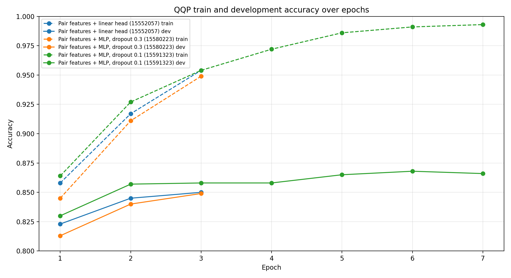

The development accuracy of the strongest run peaked at epoch 6. In epoch 7, training accuracy continued to increase, but development accuracy dropped from `0.868` to `0.866`. This indicates mild overfitting after epoch 6 and supports selecting the best development checkpoint rather than the final epoch checkpoint.

### Training Loss

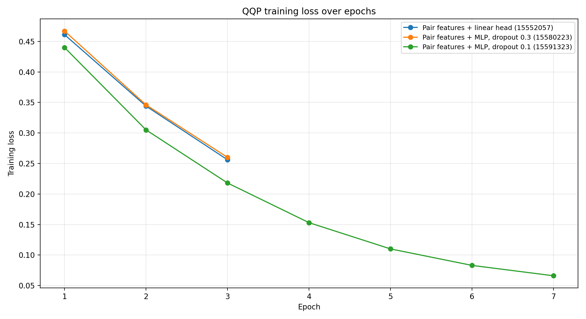

The training curves show that the strongest model continued to fit the training data throughout all epochs, while development accuracy peaked at epoch 6. The pair-feature linear-head model and MLP model with dropout `0.3` were also still improving at the end of their 3-epoch budgets, which limits direct attribution of the final gain to dropout or the MLP head alone.

## Stanford Sentiment Treebank (SST)

### Baseline hyperparameter tuning


Tuning slightly improves development accuracy but increases overfitting.

### Classifier architecture

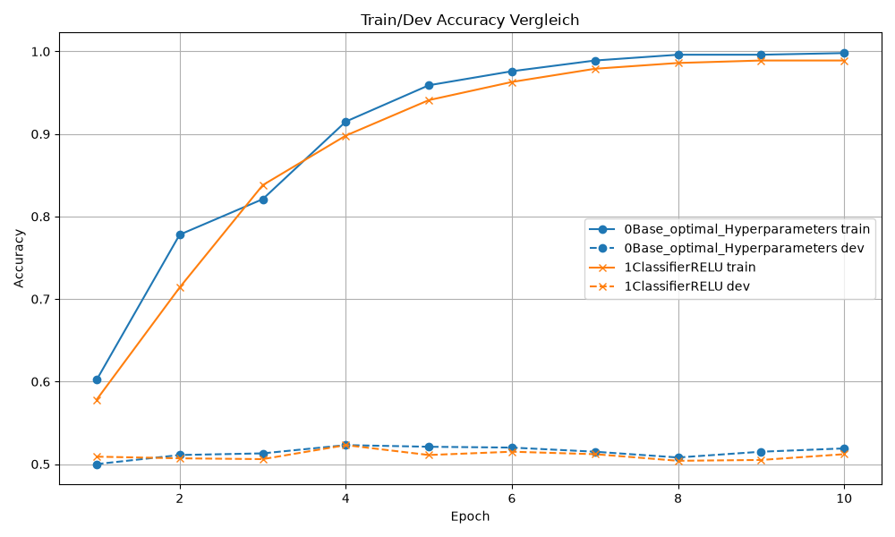

The multi-layer classifier preserves peak accuracy while reducing the train–development gap.

### GELU activation


GELU raises development accuracy from 0.523 to 0.528.

### Expressive pooling


Adding mean and max pooling lowers development accuracy, so the change is discarded.

### Label smoothing

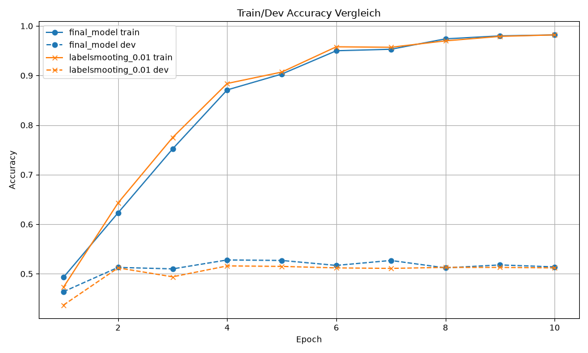

Label smoothing of 0.01 performs worse than the unsmoothed configuration.

### Weight decay

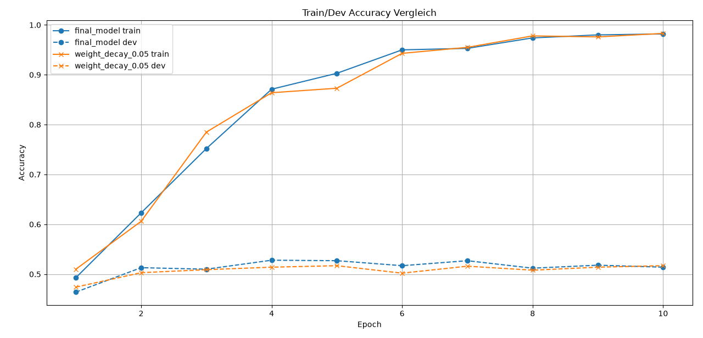

Weight decay of 0.05 reduces accuracy and makes training less stable.

### Warmup ratio

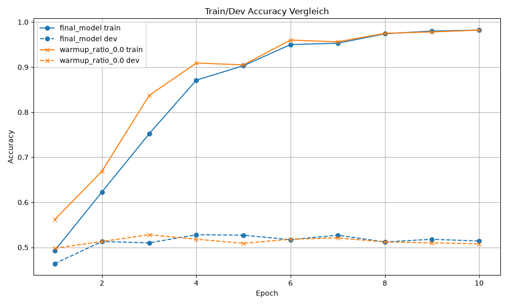

Warmup does not improve peak accuracy but produces a more stable curve across epochs.

## Semantic Textual Similarity (STS)

The following figures summarize STS training behavior, transfer results, attention weights, and prediction errors.

Two conventions apply throughout. First, `evaluation.py` computes Pearson correlation
only, so per-epoch dev *loss* was never logged and cannot be reconstructed without
rerunning all 43 experiments; we plot dev Pearson r in its place, which is the task metric
and the quantity model selection actually used. Second, where a figure shows a derived
quantity rather than a logged one, the transformation is stated in the text below it.

### Dev performance per epoch

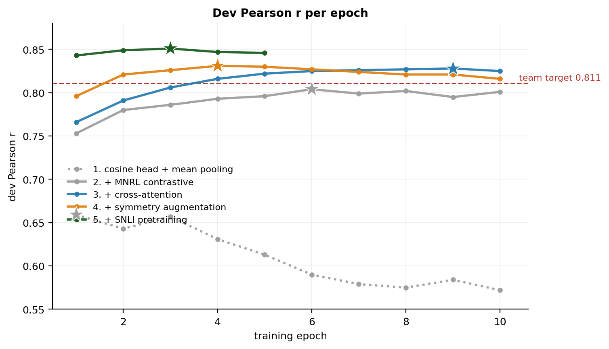

One curve per improvement stage; the star marks the epoch whose checkpoint was saved.

The cosine-head run (grey, dotted) peaks at 0.657 in epoch 3 and then falls steadily to
0.572 by epoch 10, the only configuration whose dev score degrades over training. Adding
MNRL (grey, solid) removes that decline and holds 0.79–0.80 from epoch 4 onward without
ever exceeding 0.804. Cross-attention (blue) passes that level at epoch 4 and continues
rising to 0.828 at epoch 9. Symmetry augmentation (orange) reaches a comparable level four epochs
earlier and then drifts down. SNLI pretraining (green) opens at 0.843 in epoch 1, above
every other configuration's best score at any epoch, and needs only five epochs in total.

### Convergence speed

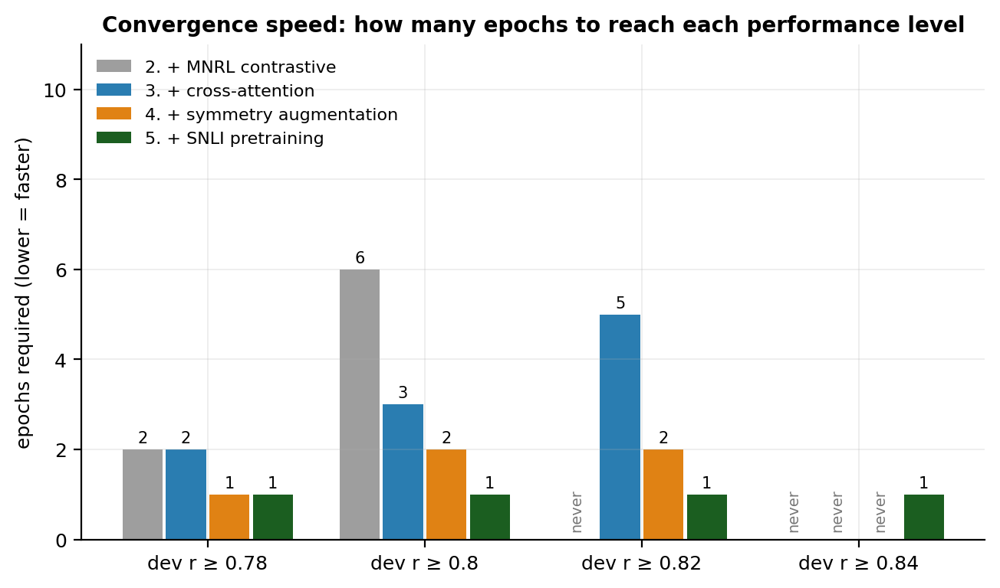

For each configuration and each dev-r threshold, the bar height is the first epoch at which
that threshold was reached; "never" means the run finished below it. Lower is faster.

Reaching r ≥ 0.80 takes MNRL six epochs, cross-attention three, symmetry augmentation two,
and SNLI pretraining one. At r ≥ 0.82 the bi-encoder never arrives, and at r ≥ 0.84 only
SNLI does.

The 0.82 column also shows the converse case: symmetry augmentation gets there in two
epochs where cross-attention alone needs five, yet cross-attention overtakes it by epoch 6
and finishes higher (v1). Faster convergence and better final performance are separate
properties, and symmetry augmentation buys the first without the second.

### Overfitting dynamics

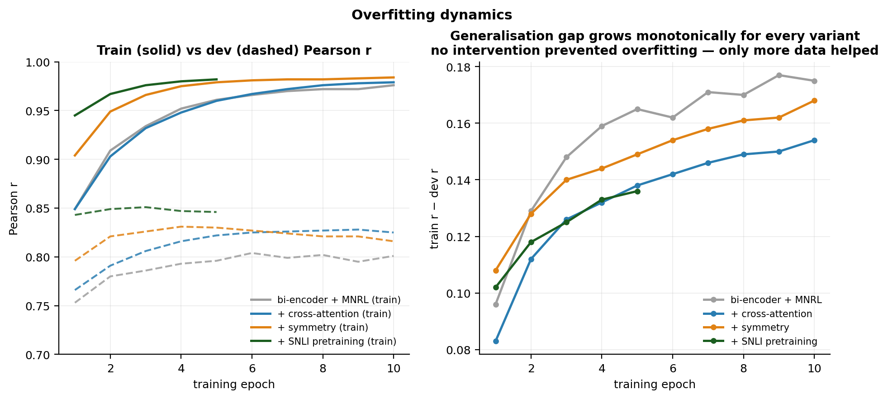

Left: train (solid) against dev (dashed) Pearson r. Right: the generalisation gap, computed
as train r minus dev r at the same epoch.

Every variant's gap grows monotonically, from roughly 0.08–0.11 at epoch 1 to 0.14–0.17 by
the end. No intervention flattened it. Cross-attention holds the smallest gap of the
ten-epoch runs at every epoch, so its dev gain does not come at the cost of extra
memorisation. SNLI pretraining starts at the highest train r of any run, 0.945 in epoch 1,
yet its gap grows more slowly than the others over the epochs it shares with them,
consistent with the interpretation that the additional data, rather than any penalty term,
is what constrains the model.

### Training loss

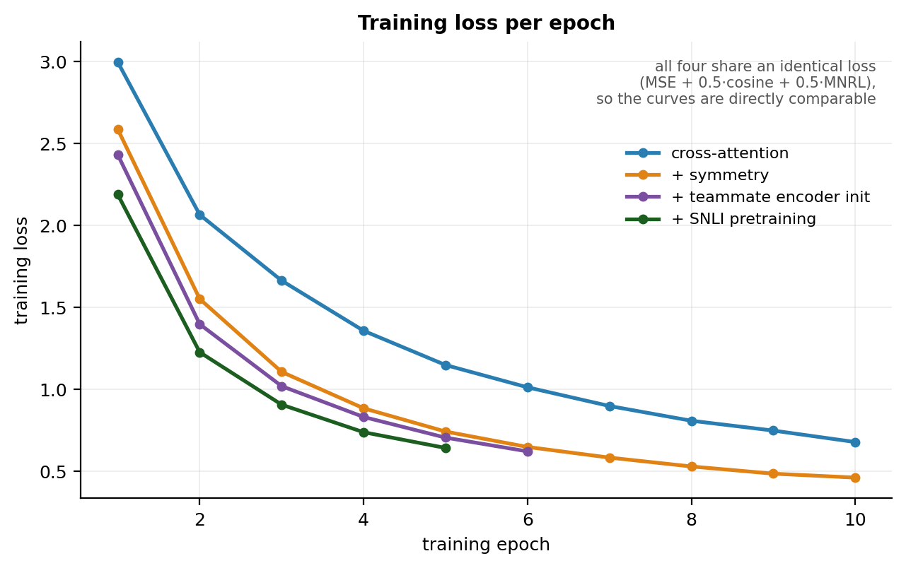

Restricted to four runs sharing an identical loss composition
(`MSE + 0.5·cosine + 0.5·MNRL`). Loss is not comparable across runs with different terms,
since adding a term mechanically raises the total.

Epoch-1 loss orders exactly by quality of initialisation: 2.99 for cross-attention from
stock weights, 2.58 with symmetry augmentation, 2.43 with the teammate encoder, 2.19 after
SNLI pretraining. Better-initialised runs also descend faster. The symmetry run reaches
the lowest final loss of the four while scoring 0.018 below the SNLI run on dev, a
reminder that within this family the training loss ranks the runs differently from the
metric we select on.

### Failure modes visible during training

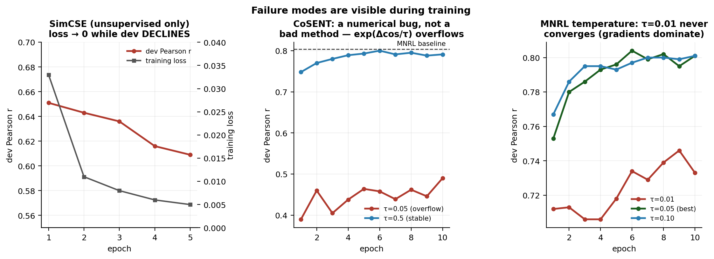

Left: SimCSE's training loss falls from 0.033 to 0.005 while dev r declines from 0.651 to
0.608, the signature of a model solving the pretext task rather than learning semantics.
Middle: CoSENT at τ = 0.05 oscillates between 0.39 and 0.49 with no upward trend, while
τ = 0.5 climbs smoothly to just under the MNRL baseline; the difference between a bad
method and an overflowing one is visible here but not in the final scores. Right: MNRL at
τ = 0.01 never exceeds 0.75, whereas τ = 0.05 and τ = 0.10 both converge into the 0.80
band and are nearly indistinguishable from each other.

### Seed variance

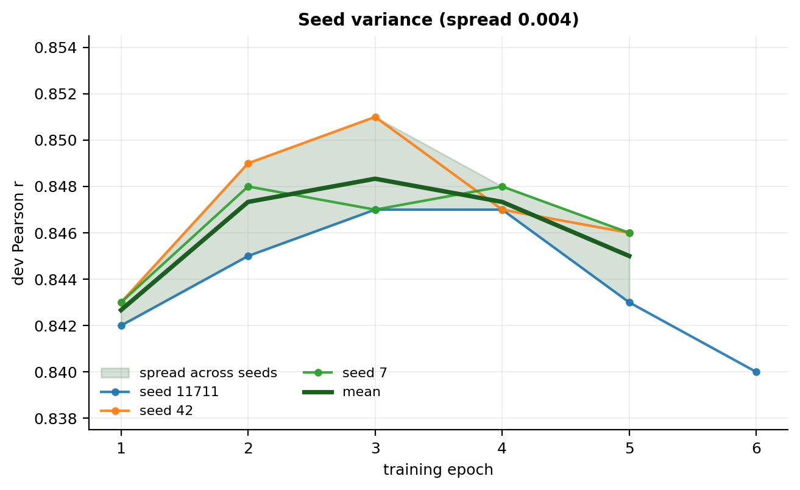

The same configuration under three seeds; the shaded band is the full spread across seeds
at each epoch, and the heavy line is their mean.

Best scores span 0.847 to 0.851, a spread of 0.004, which is the reference for every
"within noise" claim in this write-up. The spread is narrowest at epoch 1 and widens as
training proceeds, so late-epoch comparisons are the least reliable ones. All three seeds
peak between epochs 2 and 4 and decline afterwards, which is the direct evidence behind
the 4–5 epoch setting in the final recipe.

### Transfer sources

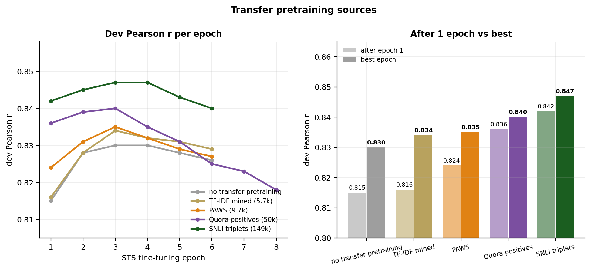

Left: dev r during STS fine-tuning for each pretraining source. Right: dev r after one
fine-tuning epoch (faded) against the best epoch (solid).

The epoch-1 scores order the sources exactly by corpus size, and SNLI's epoch-1 score of
0.842 already exceeds every other source's best. The distance between the faded and solid
bars also shrinks as the source grows, from 0.015 with no transfer to 0.005 for SNLI:
better-pretrained encoders have less left to learn from the 5,719 STS pairs. Note that
corpus size and negative-label type covary across these four sources, so this figure
cannot attribute SNLI's advantage to either alone.

### Regularisation

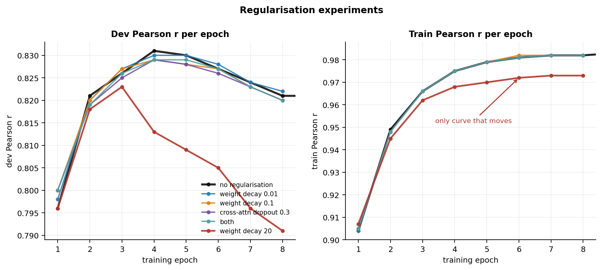

Five regularisation settings against the unregularised baseline. Left: dev r. Right: train
r, which is what a regulariser is supposed to move first.

Four of the five dev curves are visually inseparable from the baseline across all eight
epochs. Only λ = 20 separates, and it lowers both panels: its dev peak is 0.823 at epoch 3
against the baseline's 0.831 at epoch 4, and it then collapses to 0.791 by epoch 8. The
right panel is the more informative one, since it shows that four settings left the
training fit completely untouched. An intervention that does not change how well a model
fits its training data has not been tested, whatever its dev score says.

### Cross-attention weights

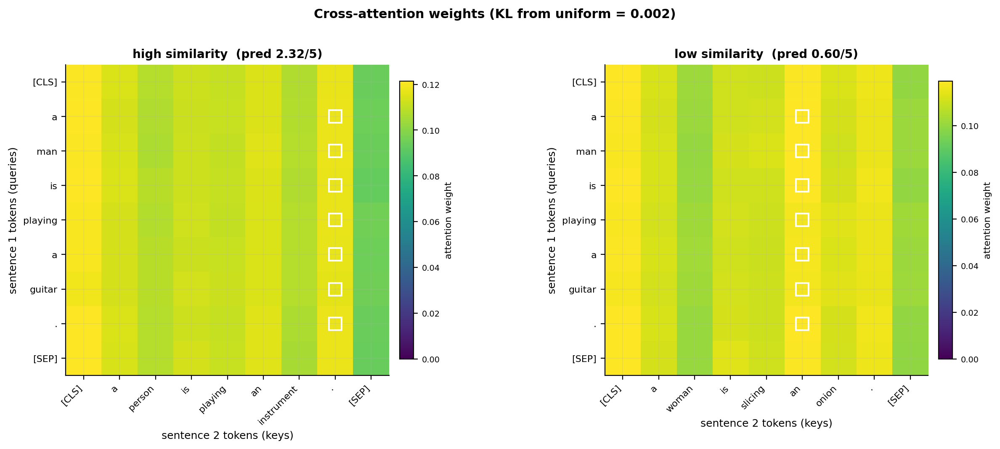

Attention weights extracted from the trained model (`models/sts_exp08_seed42.pt`) for two
dev pairs, one with a high gold score and one unrelated. Rows are sentence 1 tokens acting
as queries, columns are sentence 2 tokens acting as keys, each row sums to one, and the
map is averaged over the eight heads. White squares mark the per-row argmax.

Cross-attention was the largest architectural gain in the project, so we inspected what
the layer had learned on these two examples. For these examples, it did not learn token
alignment. Both sentences here have nine
tokens, so the uniform weight is 1/9 = 0.111, and the observed weights span 0.071–0.130.
KL divergence from uniform is 0.0022 averaged over heads and 0.0096 for the most selective
single head, against a maximum of ln 9 = 2.20 for a nine-way distribution: the learned
distributions sit at roughly a tenth of a percent of the way from uniform to fully peaked.
No head is selective on these examples. The token *guitar* shows no preference for
*instrument*, and within
each panel every content-token row places its argmax in the same key column, so the
distribution barely depends on which token is querying. The argmax column does differ
between the two pairs, which is the only sense in which the weights respond to content.

If the weights are near-uniform then the attention output is
`Σⱼ aᵢⱼ·W_V·h2ⱼ ≈ W_V·mean(h2)` for every query position i, and after the output
projection the sublayer computes `h1_cross ≈ LayerNorm(h1 + W·mean(h2))` with
`W = W_O W_V` a learned linear map. The layer therefore conditions each sentence's
representation on a single global summary of its partner before pooling, rather than
aligning tokens between them.

The performance gain remains real and reproducible at 0.024, six times the seed-noise
floor. What this measurement rules out is our original explanation of it. The natural
follow-up, which we did not have time to run, is to replace the attention sublayer with
`LayerNorm(h1 + W·mean(h2))` directly: if that matches 0.828, the eight heads are
redundant and the same benefit is available at a fraction of the cost. Note that the
ablation must keep the learned projection, since the collapse is to a projected mean and
not to the raw mean.

Two limitations apply. This is two hand-picked pairs from a single seed's checkpoint, so
the KL figures characterise these examples rather than the model in general; computing the
same statistic over all 1,430 dev pairs would settle it and requires only a forward pass.
Separately, the left pair carries a high gold score but is predicted at 2.32 out of 5,
which is the range compression documented in the error analysis below appearing in a
single worked example.

### Error analysis

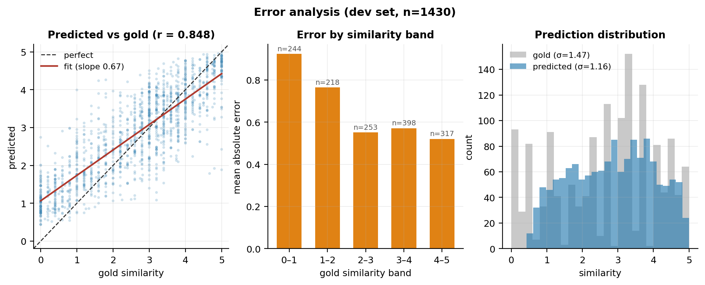

Left: predicted against gold similarity for all 1,430 dev pairs, with an ordinary
least-squares fit. Middle: mean absolute error within each gold-similarity band. Right:
distributions of gold and predicted scores.

The model compresses the output range. The fitted slope is 0.67 rather than 1.0, predicted
σ is 1.16 against gold σ of 1.47, and predictions essentially never fall below 0.4 even
though gold scores reach 0.0. Error is correspondingly worst at the dissimilar end, with a
mean absolute error of 0.93 in the 0–1 band against 0.52 in the 4–5 band, and the middle
bands sitting near 0.55.

Pearson r is invariant to affine rescaling, so this costs nothing on our metric, but it
would matter under Spearman ρ or MSE, and it would matter for any downstream use of the
raw scores. It is expected behaviour for a cosine head, whose output is squashed toward the
middle of the rescaled range. Calibrating the output range, by fitting a linear correction
on the training set or by training against standardised targets, is the clearest remaining
improvement we did not pursue.

## Paraphrase Type Detection (PTD)

The PTD plots visualize the same historical preliminary runs with overlapping development data described in the results section.

### Aggressive Weighted BCE

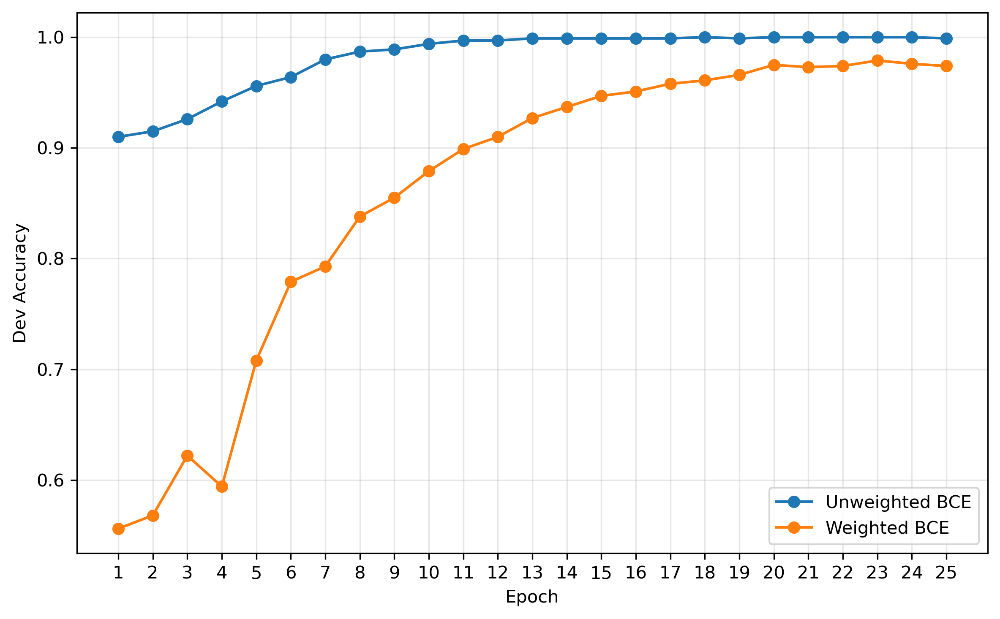

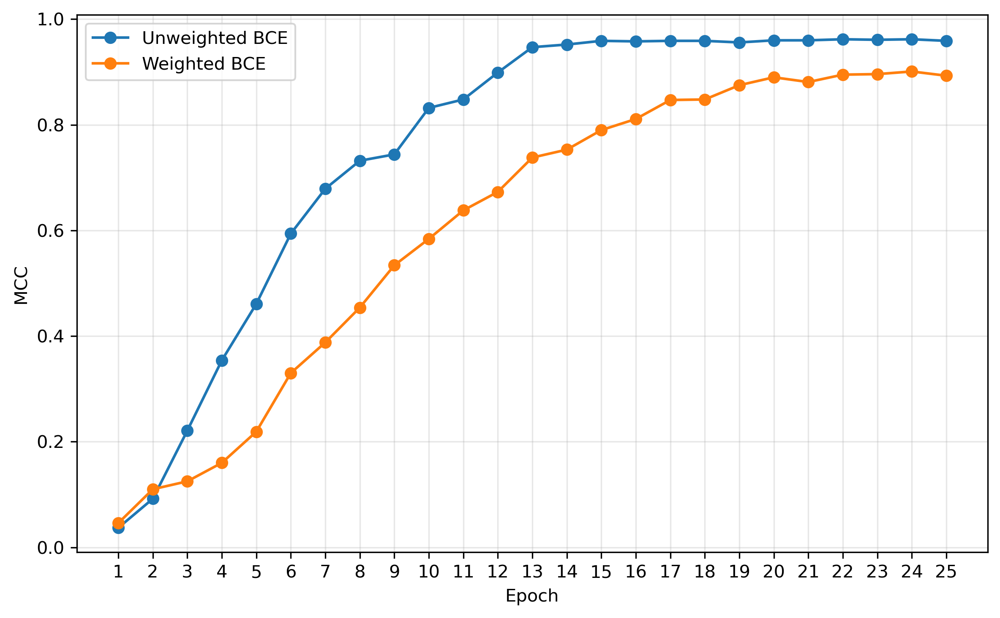

These curves show the aggressive objective eventually approaching the baseline, while remaining worse at the reported accuracy-selected checkpoints.

### Smoothed Weighted BCE

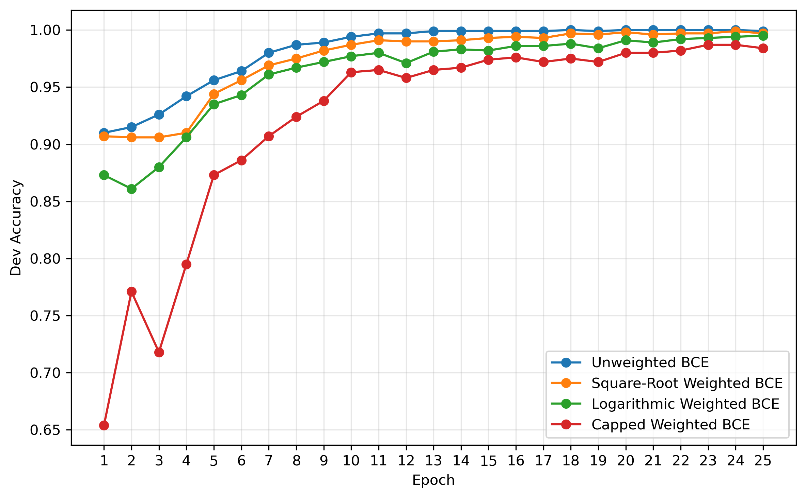

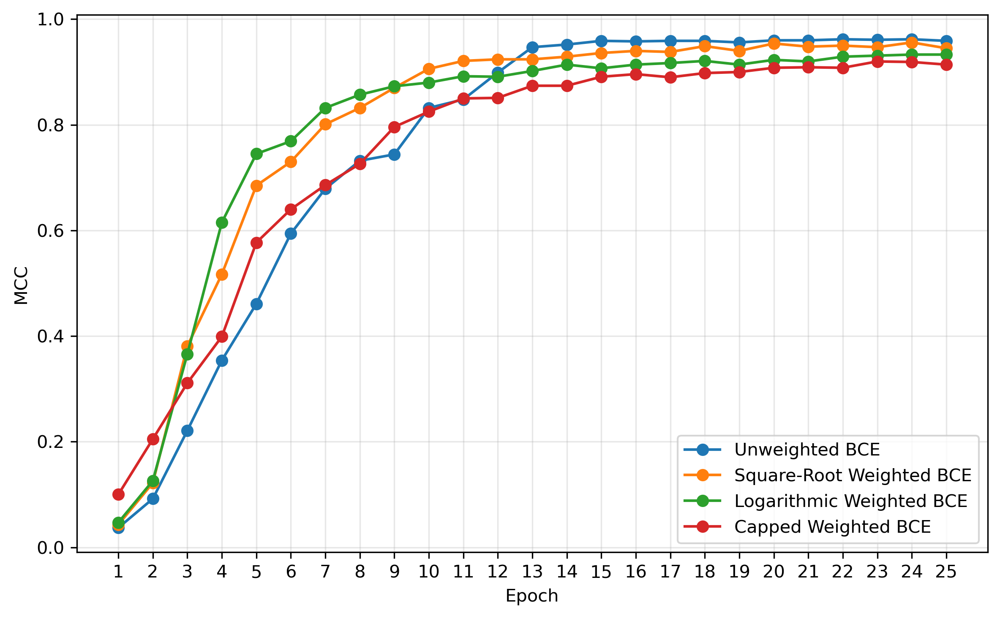

These curves show the smoothed objectives' early MCC advantage and the unweighted BCE baseline catching up and slightly surpassing them with additional training.

### Focal Exploratory Sweep

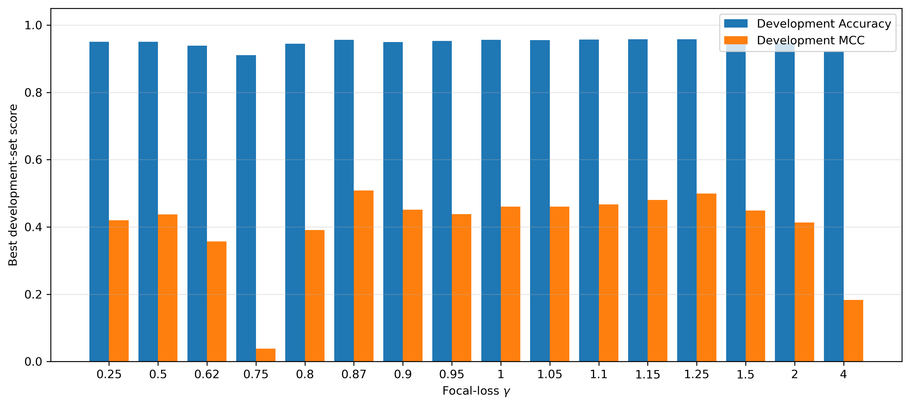

The exploratory plot shows the stronger moderate gamma values at epoch 5 and the degradation from the aggressive $\gamma=4$ setting.

### Confirmatory Focal Run

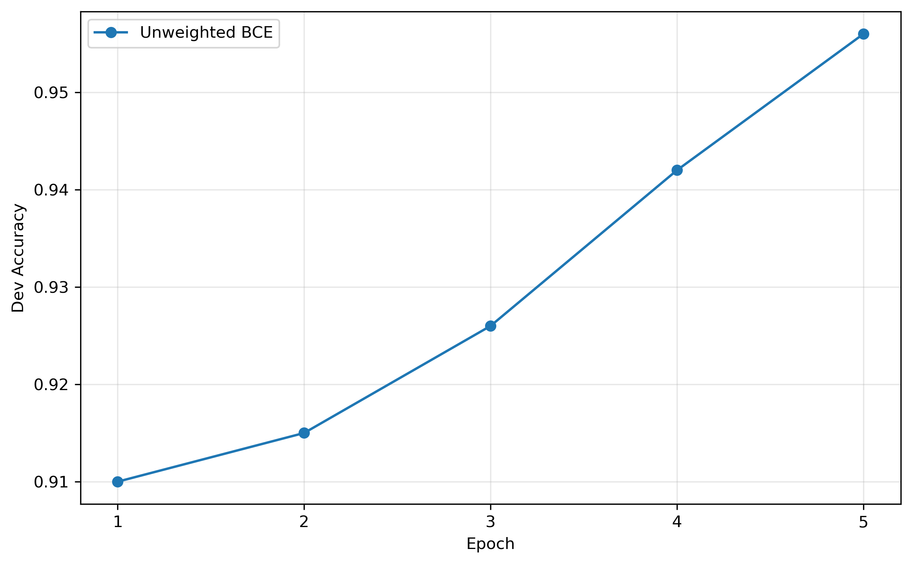

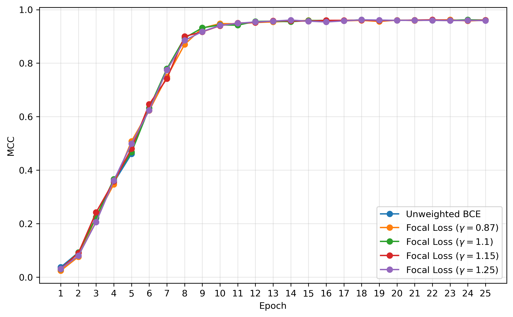

The difference plots show each focal run relative to the separately obtained BCE curve:

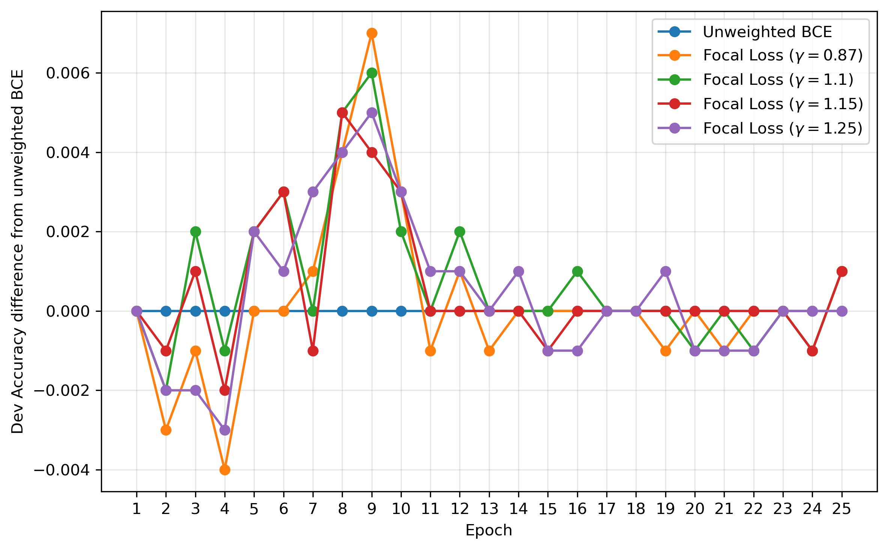

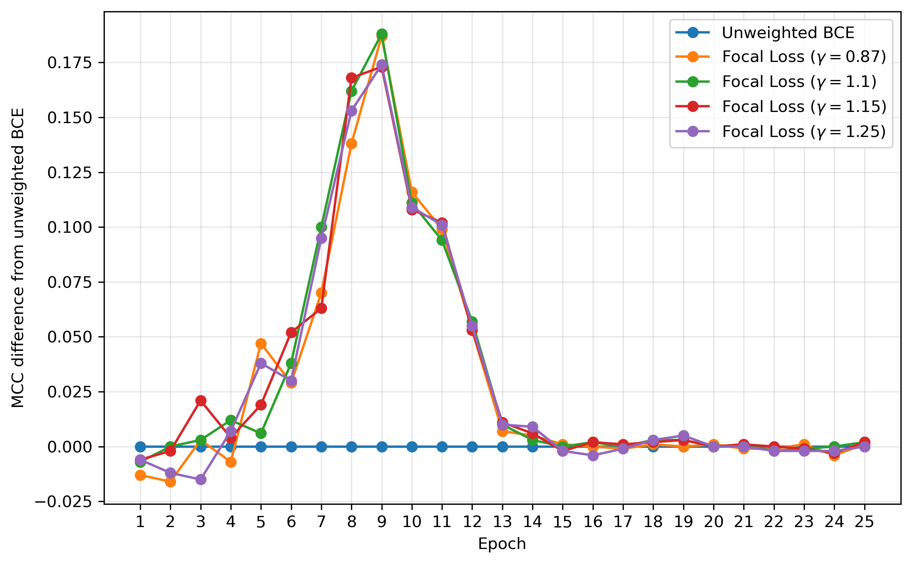

The confirmatory curves show focal loss ahead at the reported early epochs and the differences mostly disappearing by final convergence at epoch 25.

## Paraphrase Type Generation (PTG)

Scheduler-specific training plots are shown with each scheduler experiment above without duplicating them here.

### Reference/Penalized BLEU vs Loss

We examine how `reference_bleu` and `penalized_bleu` relate to the loss.

The following plot shows checkpoint values from different epochs after excluding failed experiments with extremely low BLEU scores; about 87% of the data remains.

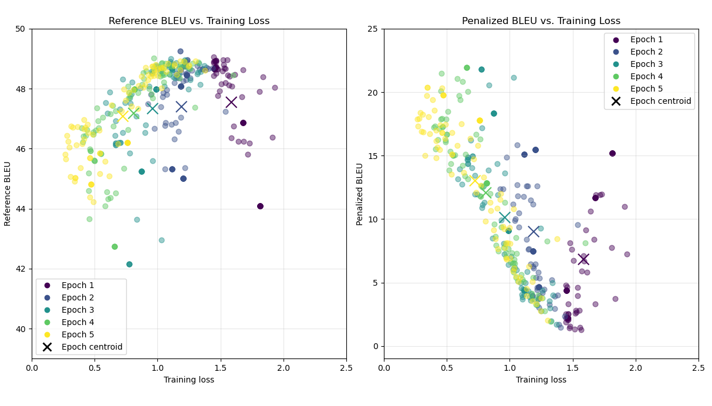

Further filtering to `reference_bleu <= 46.5` and `penalized_bleu <= 10` leaves the successful checkpoints (about 17% of the data):

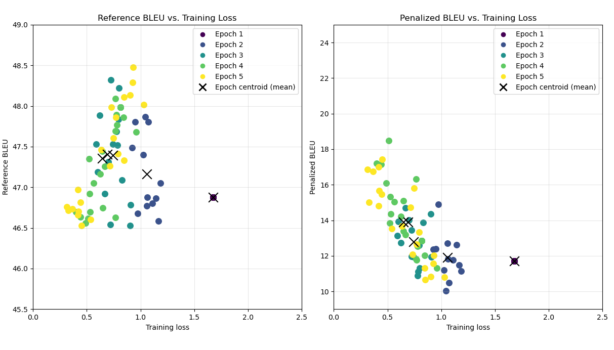

Lower loss correlates with better `penalized_bleu`, while `reference_bleu` shows no clear correlation and may even have a slight negative relationship.

# Members Contribution

- Andrii Demydenko ("andruhus"): implemented all experiments for PTD and PTG + code review for QQP/SST/STS
- Simon Pummer ("GOESTERN-1159210"/SimonP): implemented all experiments for SST + code review for PTG
- Thorben Neitzke ("thorbenN2"): implemented all experiments for QQP + code review for PTD
- Mohd Uwaish: implemented all experiments for STS + prepared the submission for Part01

# AI-Usage Card


Artificial Intelligence (AI) aided the development and restructuring of this project report. Four project-specific [AI-Usage Cards](https://ai-cards.org/) are stored in `ai_cards/`:

1. **Andrii Demydenko — PTD and PTG:** [AI-Usage Card](ai_cards/ai-usage-card-andrii.docx)
2. **Simon Pummer — SST:** [AI-Usage Card](ai_cards/ai-usage-card-pummer.pdf)
3. **Thorben Neitzke — QQP:** [AI-Usage Card](ai_cards/ai-usage-card_qqp_pp_detect_Neitzke_Thorben.pdf)
4. **Mohd Uwaish — STS:** [AI-Usage Card](ai_cards/ai-usage-card-Uwaish-STS.pdf)

### Acknowledgement

The project description, partial implementation, and scripts were adapted from the default final project for the Stanford [CS 224N class](https://web.stanford.edu/class/cs224n/) developed by Gabriel Poesia, John Hewitt, Amelie Byun, John Cho, and their (large) team (Thank you!)

The BERT implementation part of the project was adapted from the "minbert" assignment developed at Carnegie Mellon University's [CS11-711 Advanced NLP](http://phontron.com/class/anlp2021/index.html), created by Shuyan Zhou, Zhengbao Jiang, Ritam Dutt, Brendon Boldt, Aditya Veerubhotla, and Graham Neubig (Thank you!)

Parts of the code are from the [`transformers`](https://github.com/huggingface/transformers) library ([Apache License 2.0](./LICENSE)).

Parts of the scripts and code were altered by [Jan Philip Wahle](https://jpwahle.com/) and [Terry Ruas](https://terryruas.com/).

The project was modified by [Niklas Bauer](https://github.com/ItsNiklas/) and [Tolga Ermis](https://github.com/Tollgaermis/) for the 2026 DNLP course at the University of Göttingen.

# References

[^1]: Reimers, N., & Gurevych, I. (2019). [Sentence-BERT: Sentence embeddings using Siamese BERT-networks](https://aclanthology.org/D19-1410/). *Proceedings of the 2019 Conference on Empirical Methods in Natural Language Processing and the 9th International Joint Conference on Natural Language Processing*.

[^2]: Conneau, A., et al. (2017). [Supervised learning of universal sentence representations from natural language inference data](https://aclanthology.org/D17-1070/). *Proceedings of the 2017 Conference on Empirical Methods in Natural Language Processing*.

[^3]: Srivastava, N., et al. (2014). [Dropout: A simple way to prevent neural networks from overfitting](https://www.jmlr.org/papers/v15/srivastava14a.html). *Journal of Machine Learning Research*.

[^4]: Prechelt, L. (1998). [Automatic early stopping using cross validation: Quantifying the criteria](https://pubmed.ncbi.nlm.nih.gov/12662814/). *Neural Networks*.

[^5]: Henderson, M., et al. (2017). [Efficient natural language response suggestion for smart reply](https://arxiv.org/abs/1705.00652). *arXiv preprint arXiv:1705.00652*.

[^6]: Gao, T., Yao, X., & Chen, D. (2021). [SimCSE: Simple contrastive learning of sentence embeddings](https://arxiv.org/abs/2104.08821). *Proceedings of the 2021 Conference on Empirical Methods in Natural Language Processing*.

[^7]: Bowman, S. R., et al. (2015). [A large annotated corpus for learning natural language inference](https://arxiv.org/abs/1508.05326). *Proceedings of the 2015 Conference on Empirical Methods in Natural Language Processing*.

[^8]: Lewis, M., et al. (2020). [BART: Denoising sequence-to-sequence pre-training for natural language generation, translation, and comprehension](https://arxiv.org/abs/1910.13461). *Proceedings of the 58th Annual Meeting of the Association for Computational Linguistics*.

[^9]: PyTorch Contributors. (n.d.). [`BCEWithLogitsLoss` documentation](https://pytorch.org/docs/stable/generated/torch.nn.BCEWithLogitsLoss.html). *PyTorch documentation*.

[^10]: Lin, T.-Y., et al. (2017). [Focal loss for dense object detection](https://arxiv.org/abs/1708.02002). *Proceedings of the IEEE International Conference on Computer Vision*.

[^11]: Popel, M., & Bojar, O. (2018). [Training tips for the Transformer model](https://arxiv.org/abs/1804.00247). *arXiv preprint arXiv:1804.00247*.

[^12]: Huang, X., et al. (2024). [CoSENT: Consistent sentence embedding via similarity ranking](https://ieeexplore.ieee.org/document/10380768). *IEEE/ACM Transactions on Audio, Speech, and Language Processing*.

[^13]: Li, X., & Li, J. (2024). [AnglE-optimized text embeddings](https://arxiv.org/abs/2309.12871). *Proceedings of the 62nd Annual Meeting of the Association for Computational Linguistics*.

[^14]: Jiang, H., et al. (2020). [SMART: Robust and efficient fine-tuning for pre-trained natural language models through principled regularized optimization](https://arxiv.org/abs/1911.03437). *Proceedings of the 58th Annual Meeting of the Association for Computational Linguistics*.

[^15]: Su, J., et al. (2021). [Whitening sentence representations for better semantics and faster retrieval](https://arxiv.org/abs/2103.15316). *arXiv preprint arXiv:2103.15316*.

[^16]: Jin, D., Jin, Z., Hu, Z., Vechtomova, O., & Mihalcea, R. (2022). [Deep learning for text style transfer: A survey](https://doi.org/10.1162/coli_a_00426). *Computational Linguistics, 48*(1), 155–205.

[^17]: Xing, J., Xue, C., Luo, D., & Xing, R. (2024). [Comparative analysis of pooling mechanisms in LLMs: A sentiment analysis perspective](https://arxiv.org/abs/2411.14654). *arXiv preprint arXiv:2411.14654*.

[^18]: Sentence Transformers. (n.d.). [Natural language inference](https://www.sbert.net/examples/sparse_encoder/training/nli/README.html). *Sentence Transformers documentation*.

[^19]: Si, Y., & Gao, X. (2023). *Revisiting the role of label smoothing in enhanced text sentiment classification*. Semantic Scholar.

[^20]: Devlin, J., Chang, M.-W., Lee, K., & Toutanova, K. (2018). [BERT: Pre-training of deep bidirectional transformers for language understanding](https://arxiv.org/abs/1810.04805). *arXiv preprint arXiv:1810.04805*.

