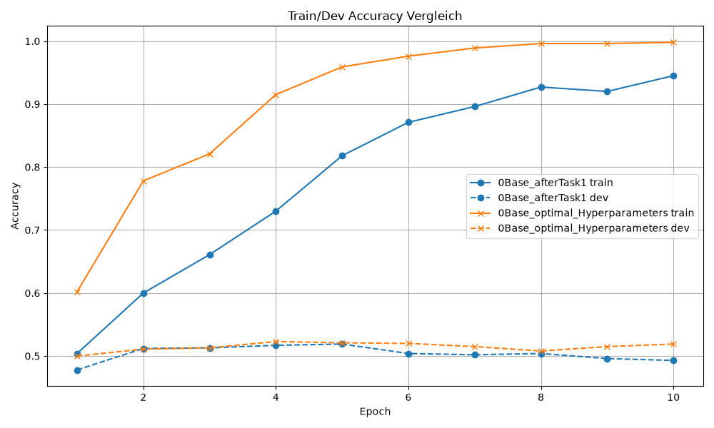
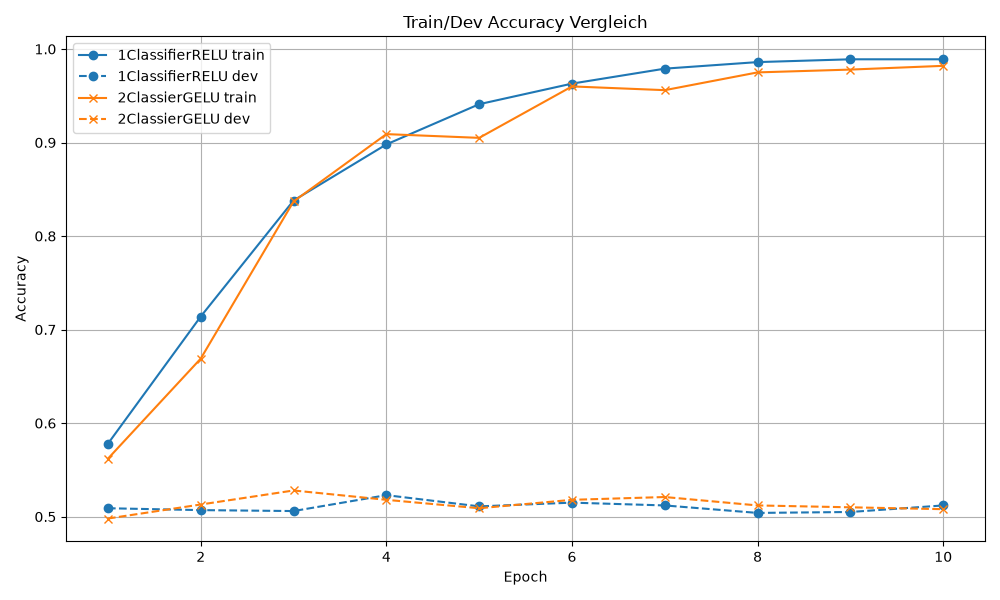
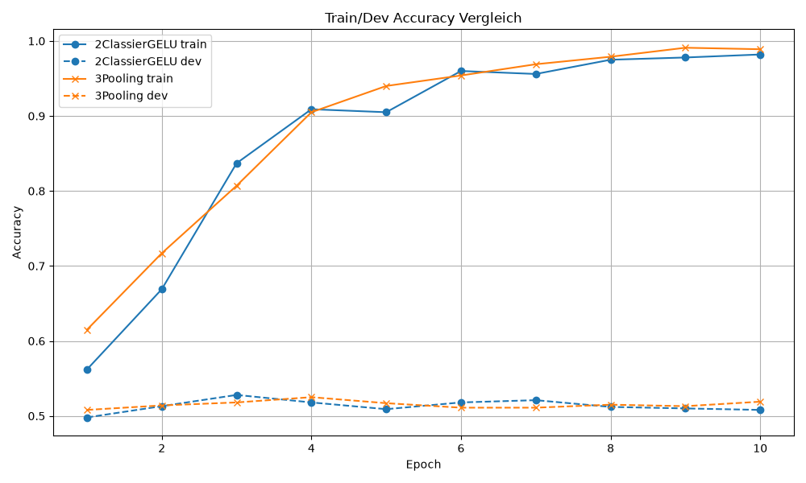

# DNLP SS23 Final Project - Multitask BERT

  

<b> Group Name </b>  

Member A  

Member B  

Member C  

  

## Setup Instructions

  

matplotlib
pathlib
tabulate

  

### [Sentiment Classification on Stanford Sentiment Treebank (SST-5)](https://paperswithcode.com/sota/sentiment-analysis-on-sst-5-fine-grained)

## Introduction  
The Stanford Sentiment Treebank (SST‑5) represents a fine‑grained and challenging benchmark in sentiment analysis. Unlike binary or ternary sentiment datasets, SST‑5 requires the model to distinguish between five nuanced sentiment categories, ranging from *highly negative* to *highly positive*. This fine granularity increases the complexity of the task substantially, as the model must capture subtle emotional cues, contextual dependencies, and linguistic ambiguity within short movie review snippets.

For this project, the SST‑5 task serves as the central evaluation ground for all architectural adjustments and hyperparameter experiments. The dataset’s structure makes it particularly suitable for investigating overfitting behavior, classifier expressiveness, and the impact of regularization techniques. Since SST‑5 is relatively small and highly subjective in its labeling, the model’s ability to generalize beyond the training data becomes a critical factor. This motivates the exploration of both non‑hyperparameter‑regulated adjustments**, such as changes in classifier architecture or pooling strategies, and hyperparameter‑regulated adjustments, such as label smoothing or warmup scheduling.

Overall, the SST‑5 task provides a controlled yet demanding environment in which improvements to the model architecture, training dynamics, and regularization can be evaluated systematically. It highlights the strengths and weaknesses of each adjustment and offers a clear reference point for comparing different stages of model development.

## Methodology
### Starting Point and evaluation
The reference point to which new adjustments where compared can be divided into two groups:

**1. Non-hyperparameter regulated adjustments:**

These include innovations, that did not lead to new hyperparameter settings. 
In this section they are called "complexer classifier", "GELU activation function", "Expressive Pooling" and "Pretraining on Allnli Dataset".
They where tested in the described order and as reference point for discussion, the last present state of the model performance was used.
So every new innovation did not had to improve the baseline, which was the state after task 1 with optimal number of epochs and learning rate,
but also the present model, with the respective accepted innovations.
In this way the model was in a more favorable state in which the following parameters could be tested extensively.
The main goal for there parameters was to reduce overfitting, which is hypothesized to be the main problem in the baseline model.

**2. Hyperparameter regulated adjustments:**

The remaining innovations could be adjusted in their degree in which they affect the model training. As baseline for discussion the model state of the end of the project was used.
All existing parameters, except the one regulating the discussed adjustment where set to the optimum.
For comparing the results, namely the training accuracy of the train- and dev-dataset, the file logdiff.py was used.

Logfiles for initial experimentation are located in logs/old_logs. Here the optimal hyperparameters where not yet determined.
Logfiles that build the basis for the following discussion are located in /logs.

---
### **1. Non-hyperparameter regulated adjustments**
### Complexer Classifier
#### Idea
The Classifier of the baseline only consists of one layer.
This might limit the learning capacity of the model since one layer is not enough to represent nonlinear patterns.
A good embedding is not enough, when there is not enough potential in the classifier to untangle the complexity.
Dropout included to limit overfitting.
#### Expectation
The expactation is that overall accuracy will be increased. The overfitting behavior will be an interesting topic.
The limiting learning potential might induce overfitting on the one hand.
On the other hand overfitting could also be increased if the classifier is over-complex for to task. 
### GELU activation function
#### Idea
As discussed in the lecture, ReLU, which is currently used in the classifier, is in many cases not the optimal activation function.
As an alternative GELU will be tested, since it enables a smoother learning process and reduces the chance of dead neurons.
(GELU does not deactivate the neuron strictly at values <0)
#### Expectation
A generally smother, more direct learning curve is expected as well as faster convergence.
This notion is caused in a more effective learning process with introduction of GELU.
### Expressive Pooling
#### Idea
This adjustment deals with the last state of the embedding of the base model, the so called [CLS] token.
The current classifier is operation solely based on this token.
Especially in sentiment analysis, single words can have very high informative value. (words such as "recommend")
The information of these single words could not be emphasized enough in the CLS token.
Based on ideas from research mean and max pooling was added to the CLS token.
The idea was adapted from Xing et al. (2024).
#### Expectation
The introduction of pooling layers might reduce the overfitting problem. 
Single words "signal-words" can have strong influence on the class. With additional pooling layers,
the classifier, whose expressiveness was increased in the last step, could get more sensitive signals to those "signal-words".
All in all, there will be more experimentation needed to investigate the effect of different pooling layers on the training.
### Pretraining on Allnli Dataset
#### Idea
AllNLI provides many positive pairs (entailment) and meaningful negative pairs (contradiction). 
(https://www.sbert.net/examples/sparse_encoder/training/nli/README.html)
Through this, the model learns to recognize semantic similarity, distinguish opposing meanings, and handle ambiguous or partially related statements.
The idea is to equipt the model with broad semantic abilities before it is trained on the small, fine‑grained sentiment dataset.

#### Expectation
Pretraining on the ALLNLI Dataset could bring the model in a state where more effective learning is possible.
When the ability of semantic understanding is enhanced before the training on the original dataset, generalization might be improved and overfitting reduced.

---
### **2. Hyperparameter regulated Adjustments** 

### Label smoothing
#### idea
This adjustment is supposed to reduce overfitting.
Since there are 5 sentiment classes in the dataset it can be assumed, that labeling of the training-dataset is highly subjective.
If a one sample is labeled as 4 or as 3, for example, might in many cases be ambiguous.
To account for this uncertainty noise was added to the labels. 
The idea was adapted from Si und Gao (2023).
#### expectation
Overfitting is expected to shrink, since training on discrete labels is less strict.
Overall accuracy may also reduced since noise is introduced to the training data.

### Weight decay
#### Idea
A common way to improve learning performance and overfitting is regularization.
Here weight decay is introduced in the model, which penalizes big parameter updates.
The idea was adapted from Devlin et al. (2018).
#### Expectation
The expectation here is obviously reduced overfitting.
Overall accuracy might increase as well, since the learning process is more controlled.

### Warumup Ratio
#### Idea
This adjustment also can possibly control the learning process.
Here learning rates increase linearly in the beginning of the training.
The idea is to reduce weight updates, when gradients are not stabilized yet.
So it can be seen as a form of regularization in the beginning of the training.
The idea was adapted from Devlin et al. (2018).
#### Expectation 
The model may converge in later epochs, but find a better optimum in the end.

---

  

## Experiments
### **1. Non-hyperparameter regulated adjustments**   
### 1.1 Hyperparameter Optimization
After hyperparameter optimization on dev accuracy the model showed higher overfitting behavior.
Here only batch size and learning rate was optimized.
Has a higher chance to explore are local minimum better that a larger one, since smaller steps lead to lower update and hence lower overshoot over the minimum.

Plot 1.0: Base after Task1 -> Base with optimized hyperparameters

### 1.2 ReLU Classifier
This result where interesting, since accuracy was not improved as expected.
Nevertheless, this adjustment was not in vain, since overfitting decreased.
The fact that more the more expressive model has a similar performance on the optimal epoch but still generalizes better is counterintuitive.
More expressiveness should either result in better performance, since complexer patterns can be learned more effectively,
or over fitting should increase since the model is over-complex. (So patterns that are only based on randomness are learned.)

Plot 1.1: Base with optimized hyperparameters -> Classifier RELU

### 1.3 GELU Classifier
Performance increased with this adjustment as expected. The learning process was not smother though.
After rethinking my expectation this makes sence. In GeELU generally more signal can be expected to be passed.
This signal can on the one and contain meaningful information, on the other hand it can also be quite noisy.
This notion would explain the training result.

Plot 1.2: Classifier RELU -> Classifier GELU

### 1.4 Expressive Pooling
The result of adjusting the Pooling was quite disappointing. Performance dropped in all regards.
To fix this issue there was the idea to include a more complex classification layer, to increase the capacity of learning. (there should be more to learn from a more complex pooling-token)
the success was very limited. overall performance dropped slightly. (see logs/old_logs/3.1.1pooling_complex_classifier_normalizaiton.log)
Therefore the overall idea was dropped and hence not integrated in the model.
It seems that the more expressive pooling does not contain enough useful information to counteract additional overfitting, which can be expected when additional data of low value is added.

Plot 1.3: Classifier GELU -> Extendet Pooling

### 2.1 Label Smoothing
Label smoothing, here implemented in a very low rate to emphasize the sensibility of this factor, does also not improve performance.
It yields in higher overfitting and lower overall dev-accuracy. This issue increases when label smoothing is increased.
This is quite counterintuitive. At least overfitting should be limited by adding noise to training data.
It would be interesting to search here for suitable explanations, unfortunately this question remains open.

Plot 2.1: Label smoothing (0 vs 0.01)

### 2.2 Weight Decay
Here no improvement can be seen as well. Training is getting more unstable with weight decay.
Since learning rate was optimized first, irrespective of the effect of weight decay,
the learning rate might be small enough to make more regularization unnecessary.
With higher learning rates, positive effects of weight decay still is expected.

Plot 2.2 Weight decay (0 vs 0.05)

### 2.3 Warmup Ratio
Even though the warmup ratio did not impove the overall dev accuracy over all epochs,
it still results in more stable training with less overfitting behavior.
It can be clearly seen that learning beginns slower, but seems to find a more stable optimum,
is more stable over the epochs. It is reasonable to assume that this improvement can improve test accuracy.

Plot 2.3: Warmup ratio (0 vs 0.2)

### AllNLI Dataset
Unfortunately pretraining on this Dataset did not improve the model performance.
This result has to be relativiced, since model performance did not recover when the bert-uncased model was chosen as the model prestate again.
Since the original code had to be adjusted in different files, the error could not be found. Reasonable discussion is therefore not possible.

Since the original code had to be adjusted in multiple files

## Results
### Hyperparameter search
All Models where run with the best hyperparameters found.
Parameters where tested step by step to avoid high computation time and cost.
Parameters with bigger expected influence on training where optimized first.
For the search following order was followed and the Hyper_optimizer.py file was used:
1. Learning Rate and Batch Size
2. Warmup Ratio and Weight Decay
3. Classifier Dropout and Label Smoothing
- Workflow: Optimize first based on common suggestions, then optimize again with values around the best result
- For initial experimentation label_smoothing and weight_decay was set 0, because it resulted in higher accuracy
- for warmup 0 and 0.1 was optimal, 0.1 was chosen since accuracy was higher over more epochs. This indicates more stable training
- weight decay does not improve performance. so it is set as 0
- Finale Hyperparameter: --lr 2e-05 --batch_size 16 --warmup_ratio 0.1 --weight_decay 0.0 --label_smoothing 0.0 --classifier_dropout 0.3

| Model / Variant                                                                                                                                                                                                                                                                                                                                                               | DEV-Accuracy |
|-------------------------------------------------------------------------------------------------------------------------------------------------------------------------------------------------------------------------------------------------------------------------------------------------------------------------------------------------------------------------------|--------------|
| **1.0 Base after Task 1**                                                                                                                                                                                                                                                                                                                                                     | 0.519        |
| **1.1 Base (optimized hyperparameters)**                                                                                                                                                                                                                                                                                                                                      | 0.523        |
| **1.2 Classifier – ReLU**                                                                                                                                                                                                                                                                                                                                                     | 0.523        |
| **1.3 Classifier – GELU**                                                                                                                                                                                                                                                                                                                                                     | 0.528        |
| **1.4 Expressive Pooling**                                                                                                                                                                                                                                                                                                                                                    | 0.525        |
| **2.1 Label Smoothing**                                                                                                                                                                                                                                                                                                                                                       | 0.516        |
| **2.2 Weight Decay**                                                                                                                                                                                                                                                                                                                                                          | 0.517        |
| **2.3 Warmup Ratio**                                                                                                                                                                                                                                                                                                                                                          | 0.528        |
All results were obtained using optimal hyperparameters. For the *1.x models*, this refers to tuning learning rate and batch size. For the *2.x models*, all hyperparameters were set to their optimal values except for the specific parameter being investigated; if adjusting that parameter did not improve performance, the baseline optimal configuration was retained.

  

## AI-Usage Card
A personal AI usage card can be found in the repository.
## References
Devlin, J., Chang, M.‑W., Lee, K., & Toutanova, K. (2018). BERT: Pre-training of Deep Bidirectional Transformers for Language Understanding. arXiv:1810.04805.

Si, Y., & Gao, X. (2023). Revisiting the Role of Label Smoothing in Enhanced Text Sentiment Classification. Semantic Scholar.

Xing, J., Xue, C., Luo, D., & Xing, R. (2024). Comparative Analysis of Pooling Mechanisms in LLMs: A Sentiment Analysis Perspective. arXiv:2411.14654.

ALLNLI Dataset: https://www.sbert.net/examples/sparse_encoder/training/nli/README.html